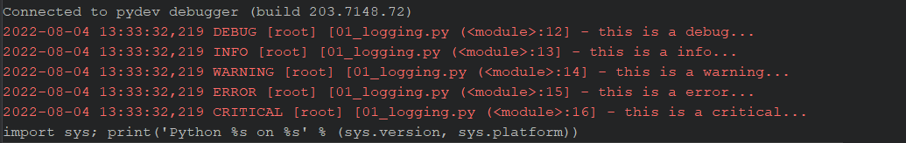

# logging

## 设置日志级别

```python
logging.basicConfig(level=logging.DEBUG)
```

## 日志格式化

```python
m = "%(asctime)s %(levelname)s [%(name)s] [%(filename)s (%(funcName)s:%(lineno)d] - %(message)s"
logging.basicConfig(level=logging.DEBUG, format=fm)
```



## 常见的日志输出级别

```python
logging.debug("this is a debug...")
logging.info("this is a info...")
logging.warning("this is a warning...")
logging.error("this is a error...")
logging.critical("this is a critical...")
```

## 将日志输出到指令文件

```python
fm = "%(asctime)s %(levelname)s [%(name)s] [%(filename)s (%(funcName)s:%(lineno)d] - %(message)s"
logging.basicConfig(level=logging.DEBUG, format=fm, filename="./log/log01.log")
```


## 日志推荐使用方式

```python
import logging.handlers

class GetLogger:
    logger = None

    @classmethod
    def get_logger(cls):
        if cls.logger is None:
            # 获取 日志器
            cls.logger = logging.getLogger()
            # 设置 日志器 级别
            cls.logger.setLevel(logging.INFO)

            # 获取处理器 控制台
            sh = logging.StreamHandler()
            # 获取处理器 文件-以时间分隔
            th = logging.handlers.TimedRotatingFileHandler(filename="./log/log02.log",
                                                           when="midnight",
                                                           interval=1,
                                                           backupCount=30,
                                                           encoding="utf-8")
            # 设置格式器
            fmt = "%(asctime)s %(levelname)s [%(name)s] [%(filename)s (%(funcName)s:%(lineno)d] - %(message)s"
            fm = logging.Formatter(fmt)
            # 将格式器添加到 处理器 控制台
            sh.setFormatter(fm)
            # 将格式器添加到 处理器 文件
            th.setFormatter(fm)
            # 将处理器添加到 日志器
            cls.logger.addHandler(sh)
            cls.logger.addHandler(th)
        return cls.logger

if __name__ == '__main__':
    logger = GetLogger().get_logger()
    logger.info("info信息被执行")
    logger.error("error信息被执行")

```
