# Seleniium换件搭建

## 浏览器需要的驱动

### 谷歌浏览器

* 查看版本号

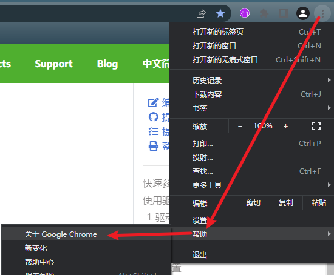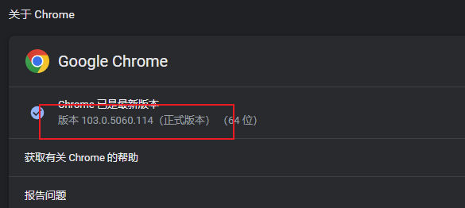

* 下载版本最接近的驱动

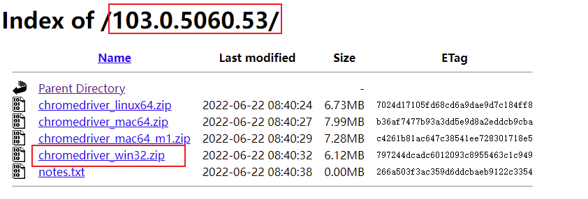

### 火狐浏览器

* 查看版本号

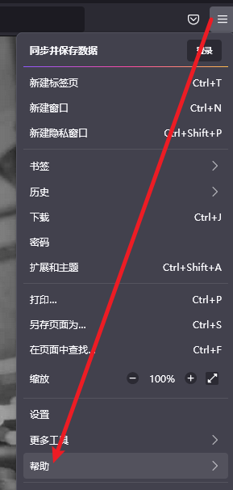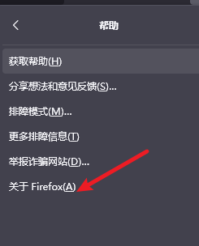

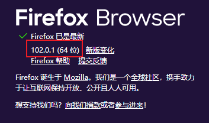

* 下载版本最接近的驱动

### Edge浏览器

* 查看版本号

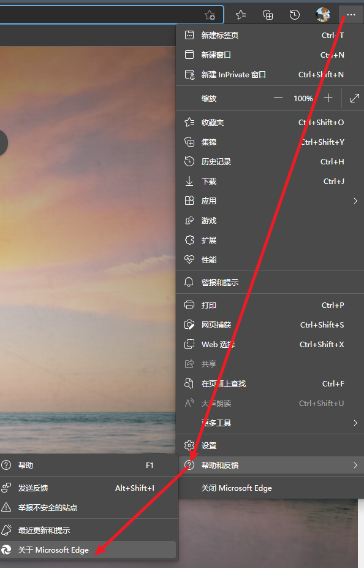

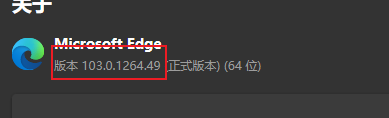

* 下载版本最接近的驱动

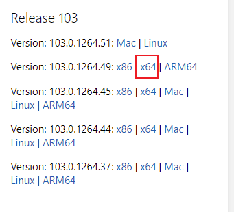

## 创建环境变量

### 创建目录存储驱动文件

> 将下载的驱动文件放在一个目录下 E:\DevelopmentServer\WebDriver\bi

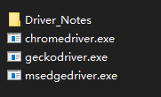

### 配置path

> 系统环境变量

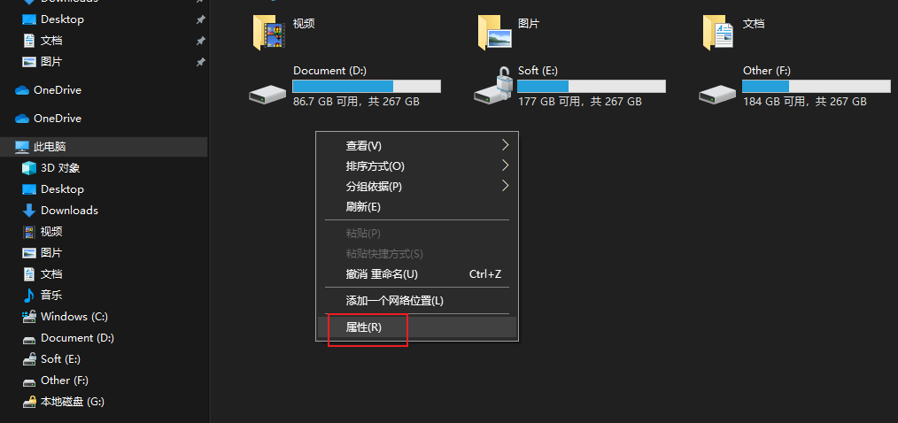

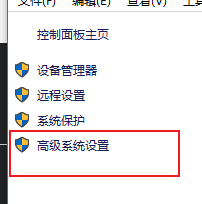

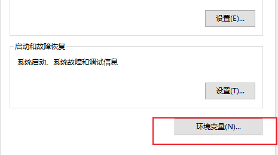

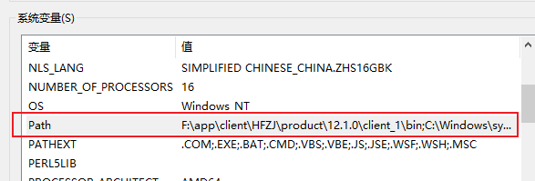

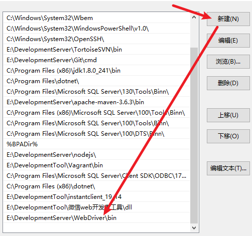

### 验证环境变量

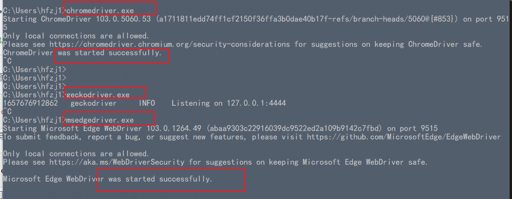

## FireFox版本

Selenium 版本到3.5
安装驱动 0.20.1

安装浏览器版本55 -60之间

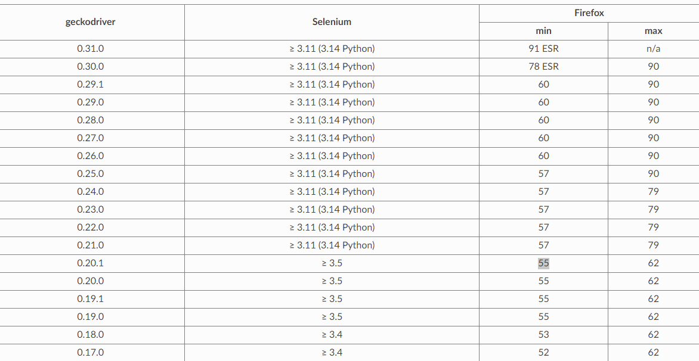

https://github.com/mozilla/geckodriver/releases

https://firefox-source-docs.mozilla.org/testing/geckodriver/Support.html

http://ftp.mozilla.org/pub/firefox/releases/

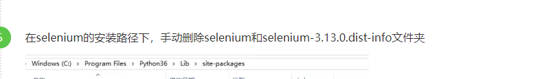

pip install selenium==2.48.0
