# 使用Jmeter玩转接口测试

## 环境搭建

### 下载

[Jmeter](http://archive.apache.org/dist/jmeter/binaries/)

### 运行

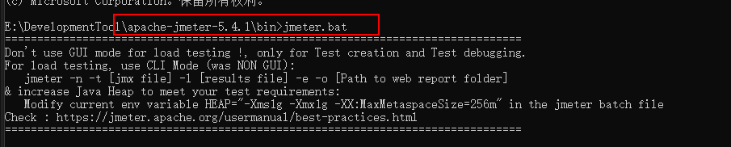

### 主界面

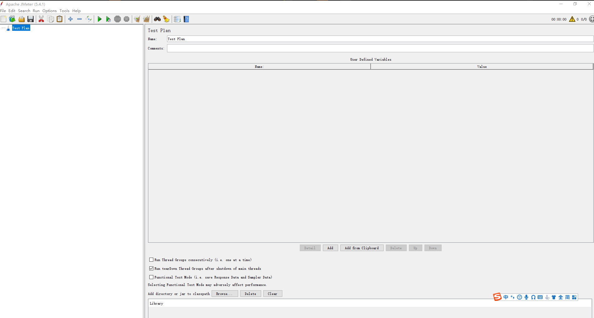

### 设置语言

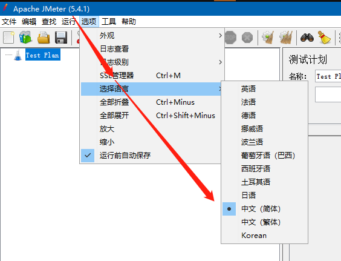

## 使用场景

> 通常都会有接口文档，才方便测试，但是如果没有测试文档也是可以测试的， 可以利用抓包进行测试

### 简易测试结构

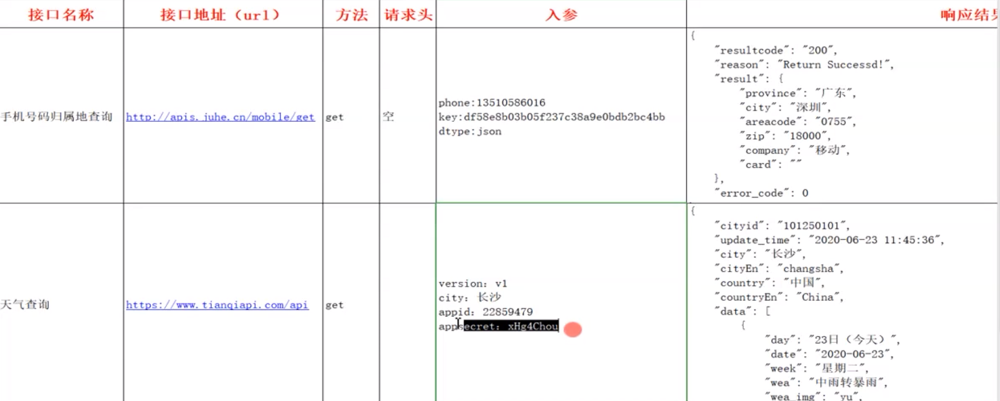

### jmeter使用

* **【Test Plan】- 【Add】 - 【Threads】 - 【Thread Group】**

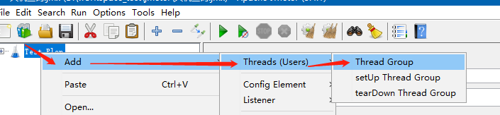

* **【线程组】 - 【Add】 - 【Sampler】 - 【HTTP Request】**

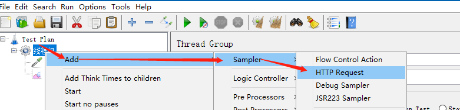

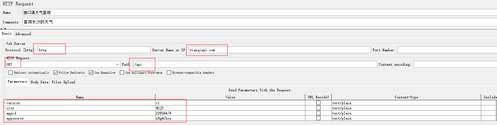

* **【线程组】 - 【Add】 - 【Listener】 - 【View Results Tree】**

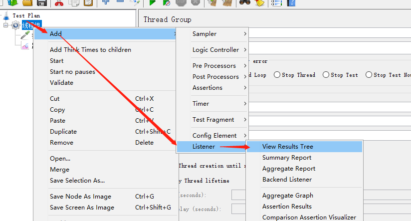

* **发送请求**

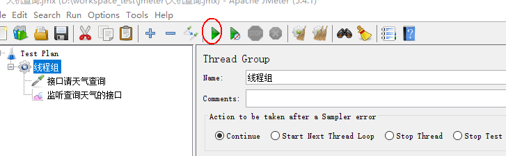

* **发送请求必须有监听器才能查看请求结果**

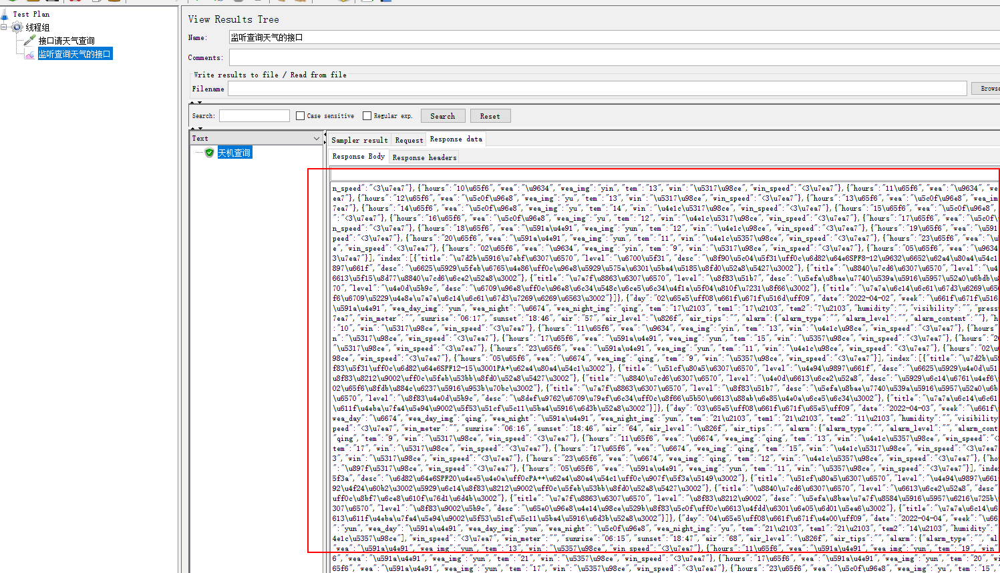

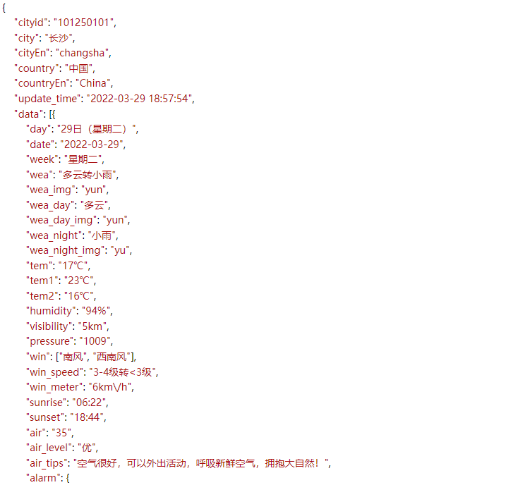

##
