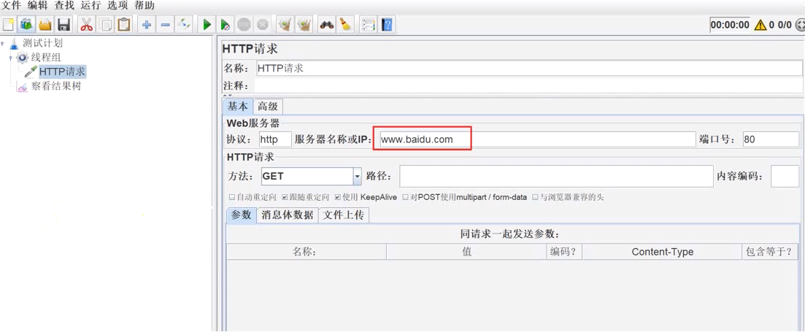
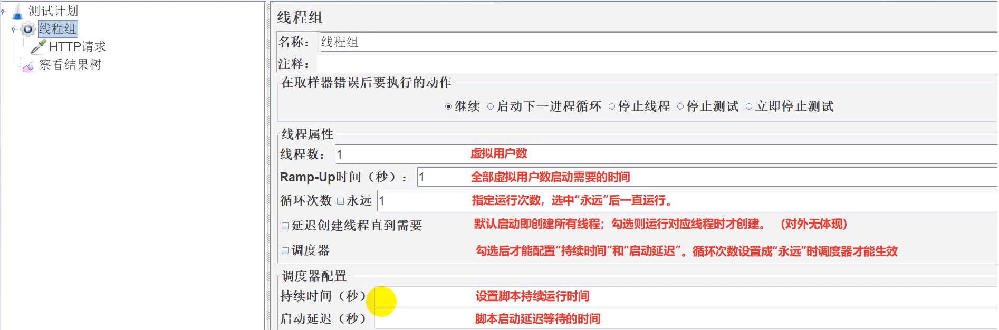

# Jmeter使用示例

## 第一个案例

> 需求： 使用JMeter访问百度首页接口，并查看请求和响应信息

```bash
1. 启动JMeter

2. 在【测试计划】下添加【线程组】

3. 在【线程组】下添加【HTTP请求】 取样器

4. 填写【HTTP请求】的相关请求参数

5. 在【线程组】添加【察看结果树】监听器

6. 点击【启动】按钮运行，并查看结果
```




## 线程组

```bash
模拟用户，支持多用户操作

多个线程组可以串行执行，也可以并行执行


```


## 线程组参数




### 线程组练习

> 要求:
> 模拟10个用户并行执行:
>
> 模拟10个用户5s内启动完成:
>
> 模拟z个用户各循环3次:
>
> 模拟2个用户运行30s:
>
> 模拟2个用户等待10s后开始执行


* 模拟10个用户并行执行
