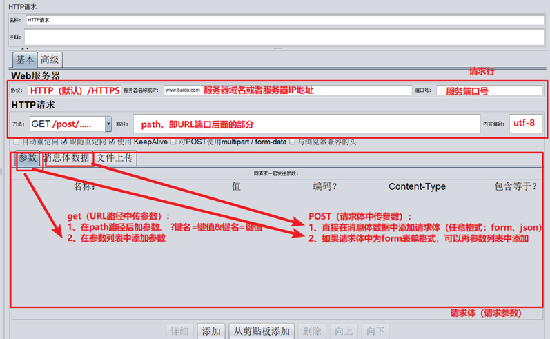

# Jmeter元件

## 元件

## HTTP请求

### 练习

> 案例一（使用HTTP请求路径来传递get请求参数）：
> （1）使用1个线程组，添加HTTP请求（百度），路径为：/S
> 使用HTTP协议，GET请求方法，路径中添加参数为: wd = test，运行观察结果
>
> 案例二（使用参数列表来传递get请求的参数）：
> 使用HTTPS协议，GET请求方法，路径中添加参数为: wd = test，运行观察结果
>
> 案例三（使用参数列表来传递POST请求的form格式参数）：
> 使用HTTPS协议，POST请求方法，消息体数据中添加参数为： wd = test，运行观察结果
>
> 案例四：
> 使用HTTP协议，POST请求方法，消息体数据中添加参数为: wd = test，运行观察结果
