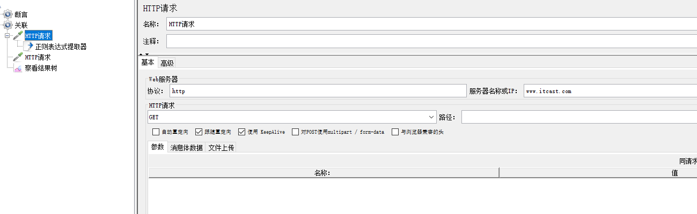
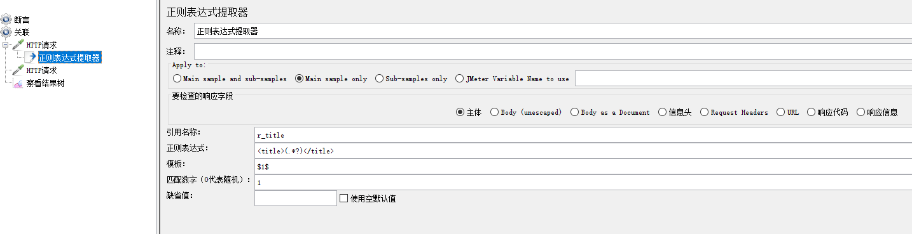
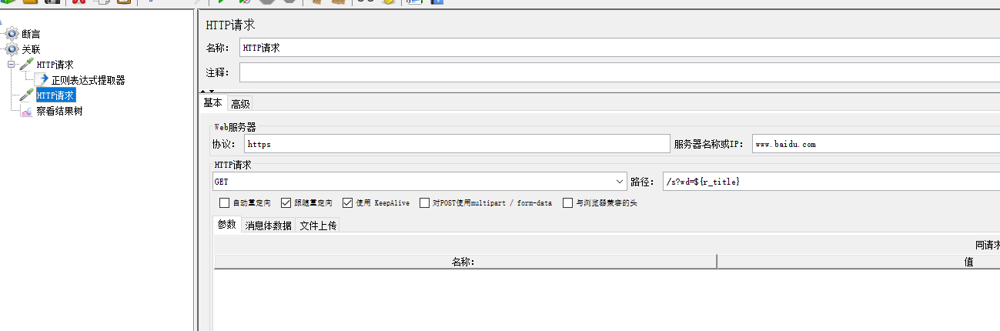

# Jmeter关联

> 定义：请求之间有依赖关系，一个请求的响应数据作为另一个的请求参数来传递
>
> 正则表达式提取器：提取任意格式的响应数据
>
> Xpath提取器：提取HTML格式的响应数据
>
> JSON提取器： 提取JSON格式的响应数据

## 正则表达式

> 正则表达式：就是一个公式，或者说一套规则，使用这套规则可以从任意字符串中提取出想要的数据内容

```
公式格式：左边界 (匹配符号) 右边界：可以提取出想要获取的数据内容
 .  是通配符，可以代表任意字符（除换行回车）
 *  代表前面的字符出现0次或者多次
 .* 匹配规则：找到左边界值后，往右查找有边界，找到最后面的右边界，中间的所有数据都被记录下来
 ?  代表非贪婪匹配，找到左边界后，往右查找匹配右边界，只要有匹配的右边界就停止继续查找；再次查找


左边界和右边界
公式格式：左边界(.*?)右边界
<title>百度一下，你就知道</title><title>百度一下，你就知道</title>
<title>(.*?)</title>
```

## 正则提取器

> 任意格式的响应数据，都可以使用正则表达式提取器进行提取







### 练习

> 获取传智播客首页的地址，把第5个校区地址作为参数传递（span为地址的校区）

## Xpath提取器

> //a : 找出所有的a标签
> //a[@id='kw']： 在HTML页面中，找出a标签（有一个属性为id，且id的值为kw）
> //b[@name='kw']： 在HTML页面中，找出b标签（有一个属性为name，且name的值为kw）
> 案例2：获取itcast中的title标签，
> 使用：//title


## JSON提取器
