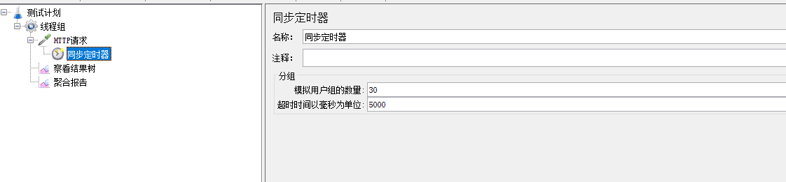
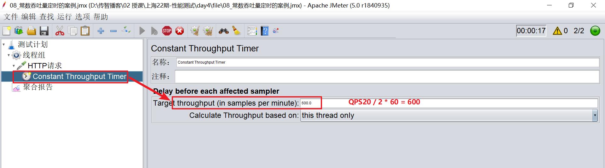
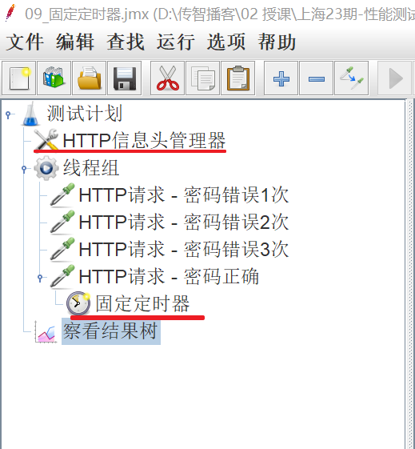
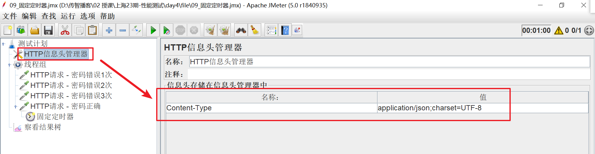

# Jmeter定时器

## 同步定时器

> 阻塞线程(累积一定的请求)，当在规定的时间内达到一定的线程数量，这些线程会在同一个时间点一起释放，瞬间产生很大的压力。
>
> 什么场景使用？ 当并发数要在同一时间请求时使用。

【HTTP请求】-【定时器】-【同步定时器】

- Number of simulated Users to Group by:模拟用户的数量，即指定同时释放的线程数数量。

  - 若设置为0，等于设置为线程组中的线程数量
- Timeout in mil1iseconds:超时时间，即超时多少毫秒后同时释放指定的线程数，

  - 如果设置为0，该定时器将会等待线程数达到了设置的线程数才释放，若没有达到设置的线程数会一直死等.
  - 如果大于0，那么如果超过Timeout in milliseconds中设置的最大等待时间后还没达到设置的线程数Timer将不再等待，释放已到达的线程。默认为0

## 常数吞吐量定时器

> 什么时候用？ 当要求多少并发数时使用
>
> 公式： 每分钟发送的请求数  =  QPS/并发数*60秒

### 练习

> 2个用户针对 （服务器的QPS要求：20QPS (20 次/s)） 的频率访问百度首页，持续一段时间，统计运行情况
>
> Target throughput 每分钟的请求数

## 固定定时器

> 固定定时器，必须添加在需要等待的HTTP请求的子节点下
> 在HTTP信息头管理器中，修改HTTP请求的头域
>
> 什么时候用？ 在特定的请求中需要等待固定时间才请求时使用

