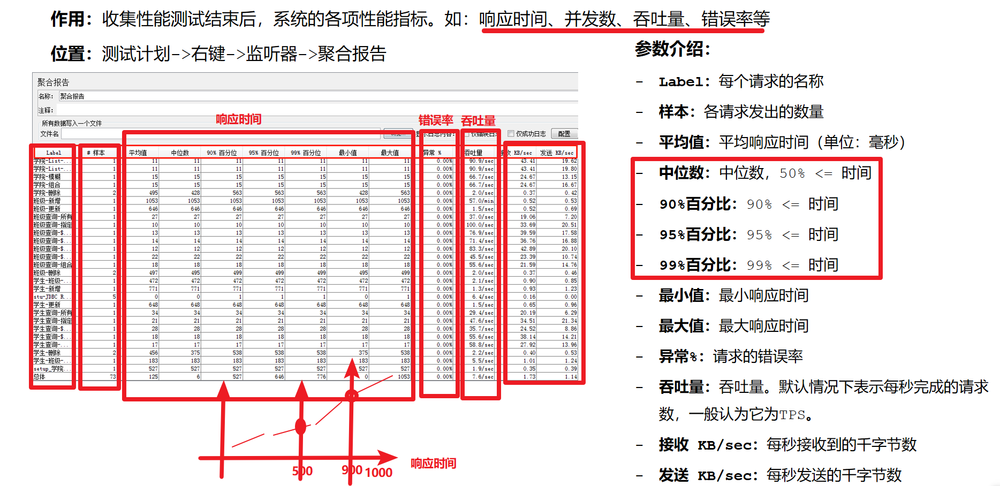

# Jmeter报告

## 聚合报告

> 收集性能测试结束后，系统的各项性能指标。如:响应时间、并发数、吞吐量、错误率等。
>
> 【测试计划】->右键->【监听器】->【聚合报告】 

补充：
正常情况下，响应时间的结果取平均值
当响应时间最大值特别高（超出平均水平特别多），导致平均值不能代表正常/大部分水平时，可以使用百分比时间

### 练习
> 1、 请求：https://www.baidu.com
> 2、模拟5个用户并发，控制服务器QPS为20，运行时长设置为10分钟
> 3、添加聚合报告，收集系统性能指标：响应时间、吞吐量、错误率、网路速率

## HTML报告

