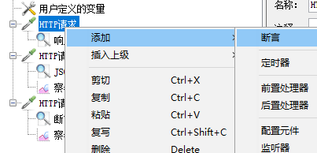
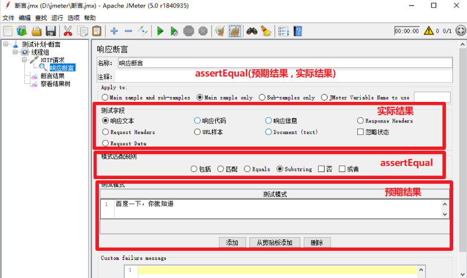
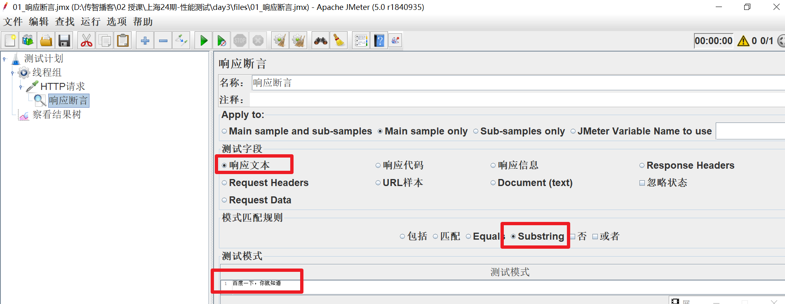
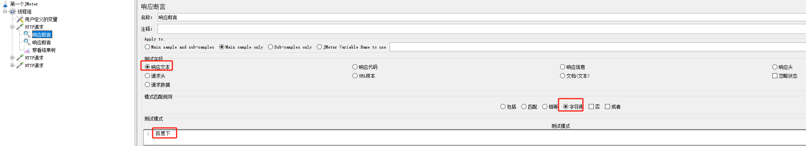
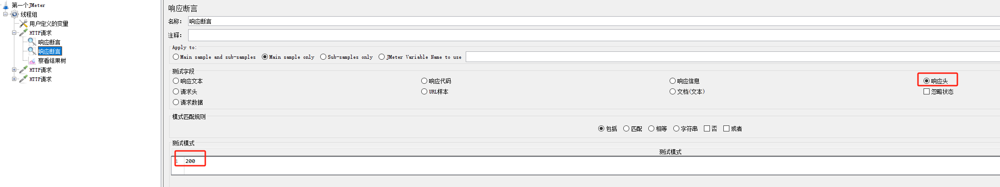
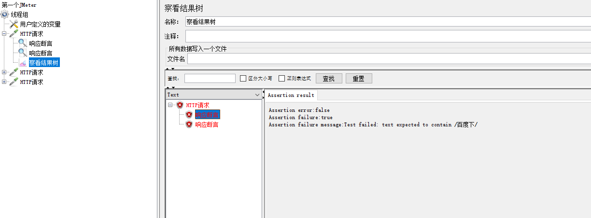
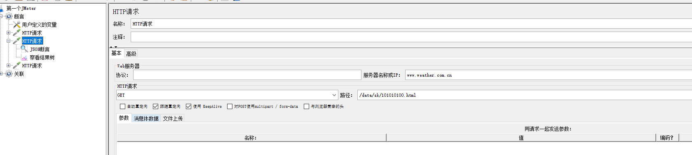
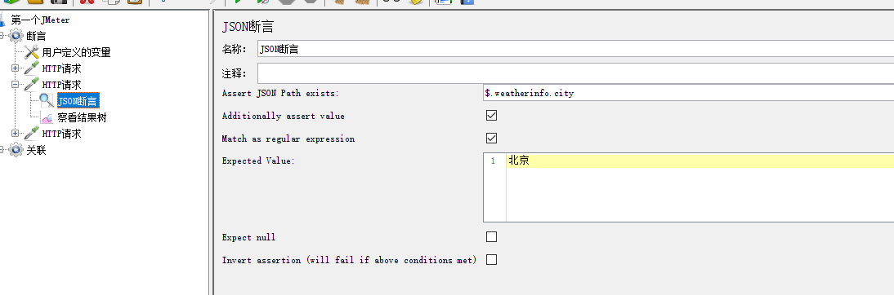
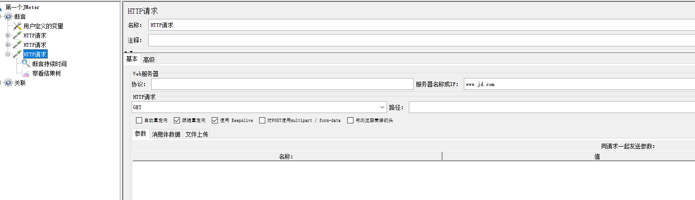
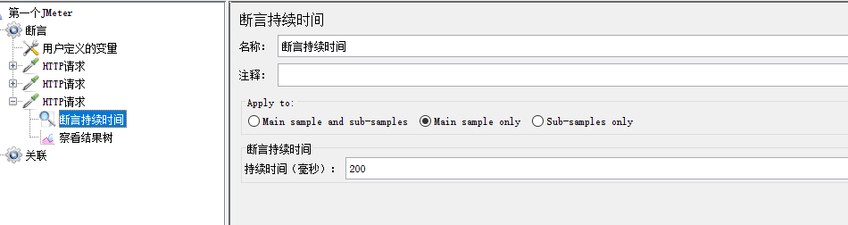

# Jmeter断言

> 定义：检查实际的返回结果是否与预期结果保持一致
> 自动校验机制：自动判断响应状态码（2xx：成功，4xx/5xx：失败）

> Jmeter断言：
> 响应断言：对任意格式的响应数据进行断言
> json断言：对json格式的响应数据进行断言
> 持续时间断言：对响应时间进行断言

## 响应断言

> 对任何HTTP请求都可以使用响应断言

### 参数配置详细介绍

#### 测试字段:要检查的项（实际结果)

> -响应文本:来自服务器的响应文本，即主体
>
> 响应代码:响应的状态码，例如:200
>
> 响应信息:响应的信息，例如:OK
>
> Response Headers:响应头部
>
> Request Headers:请求头部
>
> Request Data:请求数据
>
> -URL样本:请求URL
>
> Document(text):响应的整个文档
>
> -忽略状态:忽略返回的响应状态码

#### 模式匹配规则:比较方式

> 包括:文本包含指定的正则表达式
>
> 匹配:整个文本匹配指定的正则表达式
>
> Equals:整个返回结果的文本等于指定的字符串(区分大小写)
>
> substring:返回结果的文本包含指定字符串(区分大小写)
>
> 否:取反
>
> 或者:如果存在多个测试模式，勾选代表逻辑或(只要有一个模式匹配，则断言就是oK)，不勾选代表逻辑与(所有都必须匹配，断言才是oK)
>
> -注意: Equals和substring模式是普通字符串，而包括和匹配模 式是正则表达式

#### 测试模式:预期结果

> -即填写你指定的结果（可填写多个),按钮【添加】、【删除】是进行指定内容的管理

### 练习

> 检查百度首页的接口响应中包含“百度一下,你就知道”

> 响应断言中，有多个待校验的测试数据

## JSON断言

> HTTP响应结果为JSON时，就可以使用JSON断言

**参数介绍:**

* Assert JsoN Path exists:用于断言的JSON元素的路径(实际结果)
* Additionally assert value: 如果您想要用某个值生成断言，请选择复选框
* Match as regular expression:使用正则表达式断言
* Expected value:期望值(期结果)
* Expect nu11:如果希望为空，请选择复选框
* Invert assertion(will fail if above conditionsmet):反转断言(如果满足以上条件则失败)

### 练习

## 断言持续时间

> 持续时间是指不能超过这个时间

### 练习

