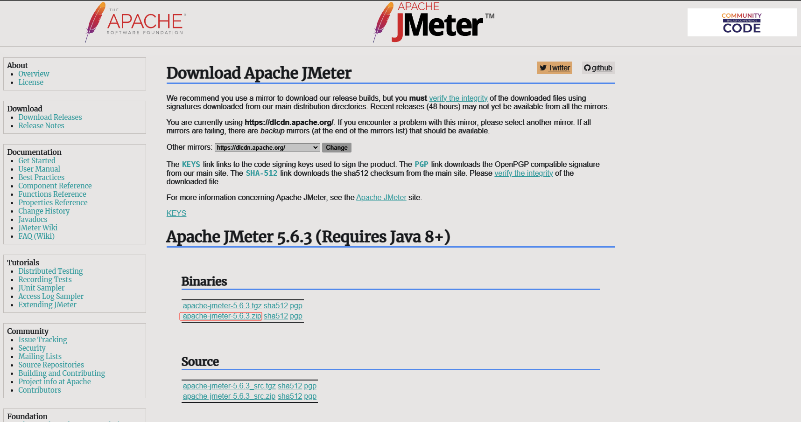
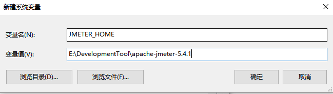
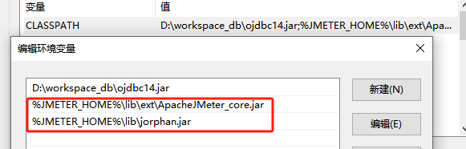
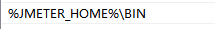
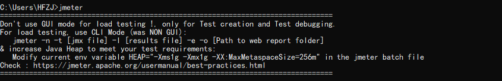
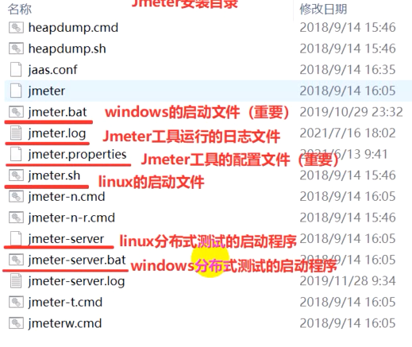
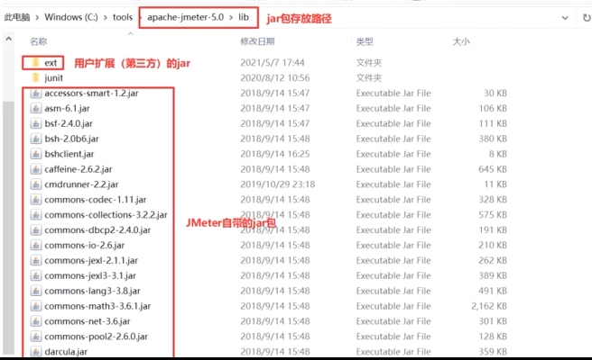
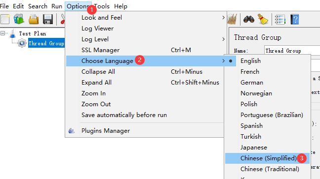

# Jmeter入门

## 简介

> Apache JMeter是Apache组织开发的基于Java的压力测试工具，是一款开源软件，并且是100%的纯java开发，可以在window和linux止面运行。

## 下载

[Jmeter下载地址](https://jmeter.apache.org/download_jmeter.cgi)



## 安装jdk

> 因为Jmeter是java开发的，需要JRE来支持

## 配置Jmeter环境变量

* JMETER_HOME



* CLASSPATH



* path



## 验证



## 目录介绍

> apache-jmeter-5.xxx

### bin目录



### docs目录

### printable_docs目录

> 用户

### lib



## 修改语言

### 方式一

> 只对当前窗口有有效



### 方式二 （推荐）

> 重启后永久有效
>
> jmeterHome/bin/jmeter.properties

```properties
language=zh_CN
```
