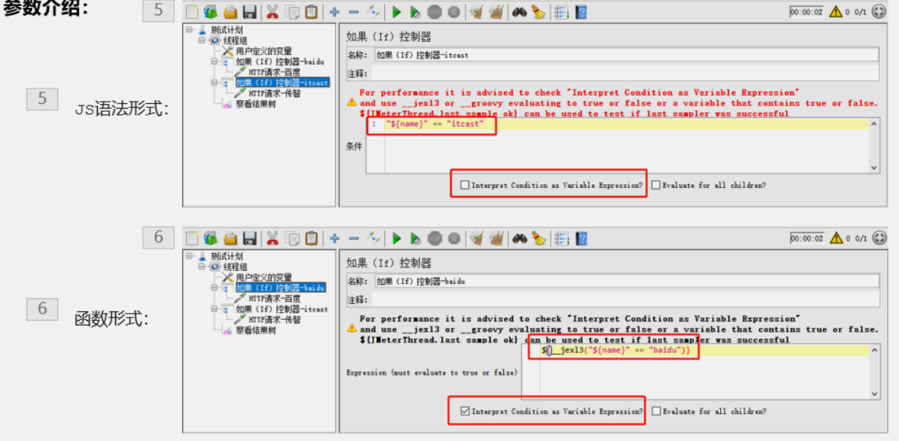
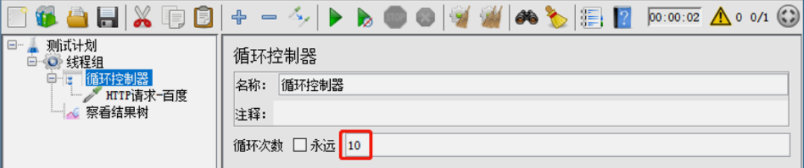
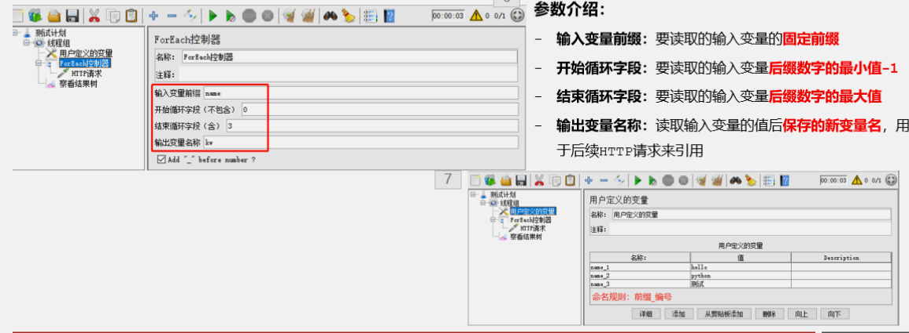

# Jmeter逻辑控制器

## 如果（If）控制器

> 作用：If控制器用来控制它下面的测试元素是否运行
> 【测试计划测试计划】-->【线程组】-->(右键添加)【逻辑控制器】-->【如果(If)控制器】

### 练习

## 循环控制器

## ForEach控制器

> 作用： 一般和用户自定义变量或者正则表达式提取器一起使用，读取返回结果中一系列相关的变量值。该控制器下的取样器都会被执行一次或多次，每次读取不同的变量值，
>
> 【测试计划】-->【线程组】-->(右键添加)【逻辑控制器】-->【ForEach控制器】

### 练习

> 1. 有一组关键字 [hello,python,测试]，使用用户定义的变量存储
> 2. 要依次取出关键字，并在百度搜索，例如：https://www.baidu.com/s?wd=hel
