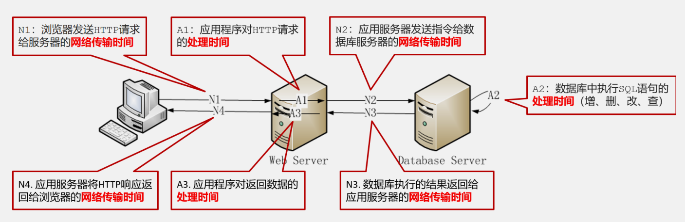
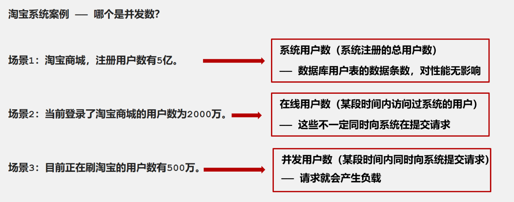
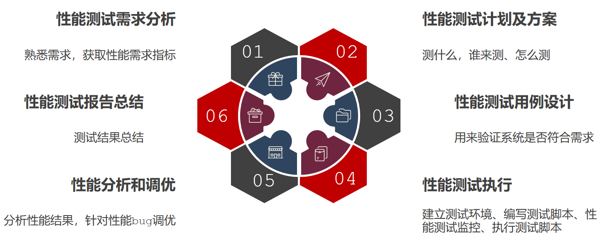
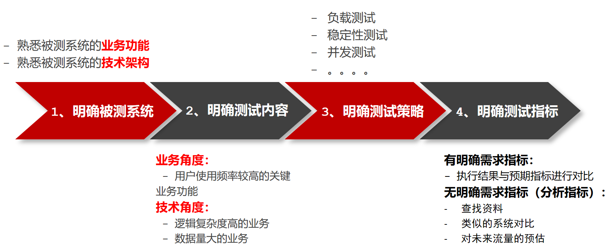
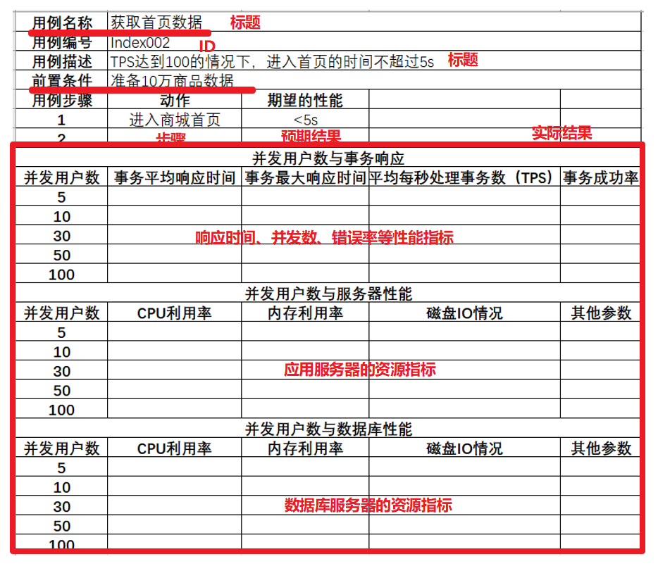

# 性能测试理论

## 测试指标

> 响应时间
> 并发用户数
> 吞吐量 TPS  QPS
> 点击数
> 错误率
> 资源利用率

### 响应时间

> 用户向服务端发送请求好，服务器将响应结果返回给用户， 这区间的时间称之为响应时间

### 并发用户数

> 某一时刻同时向服务器发送请求的用户数

### 吞吐量QPS TPS

> 指的是单位时间内处理的客户端请求数量，直接体现软件系统的性能承载能力。TPS(每秒事务数)， QPS(每秒请求数)

### 点击数

> 所有的页面元素的请求总数量

### 错误率

> 指的是系统在负载情况下， 失败业务的概率

### 资源利用率

> 系统各种资源的使用情况
>
> 资源的使用量/总的资源可用量* 100%

## 性能测试流程

> 需求分析
> 性能测试计划
> 性能测试用例
> 性能测试执行
> 性能测试分析和调优
> 性能测试报告

### 需求分析

### 性能测试计划

* 测试的目的和范围
* 测试人员和分工
* 测试时间安排
* 测试的方法

### 性能测试用例

### 性能测试执行

* 搭建性能环境
* 编写性能测试脚本
* 配置性能测试监控指标
* 执行脚本

### 性能测试分析和调优

> 测试人员负责针对性能的测试结果进行分析是否存在bug，由开发人员进行问题分析和调优
>
> 注意：
> 在性能测试的回归过程中，可能需要进行多轮

### 性能测试报告

* 性能测试的过程
* 性能测试的缺陷分析和调优
* 性能测试的结果
* 经验总结
