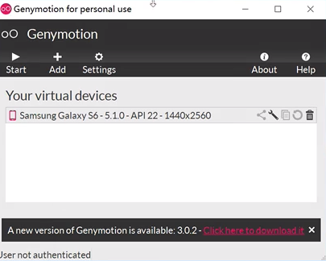
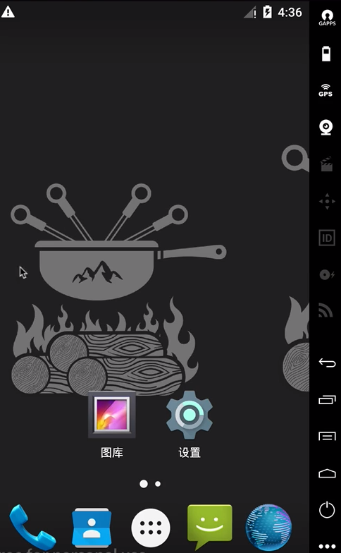

# 移动端环境搭建

## Java环境

### Windows

* 安装jdk
* 配置环境变量

```bash
# 环境变量
JAVA_HOME = E:\DevelopmentServer\jdk8

# path
%JAVA_HOME%\bin;
```

* 验证环境变量

```bash
cmd


java -version
```


### Mac


## Android SDK

### Windows

* 将SDK解压到指定目录，该目录不能有中文路径
* 配置环境变量

```bash
# 环境变量
ANDROID_HOME = E:\DevelopmentServer\android-sdk

# path
%ANDROID_HOME%\platform-tools;%ANDROID_HOME%\tools;
```

* 验证环境变量

```bash
cmd

adb
```

### Mac

## Android模拟器

### Windows

* 安装Genymotion

> 一个程序集合， 里面包含 genymotion , virtualbox , 直接双击安装即可

* 导入镜像

> 打开Virtualbox 导入虚拟电脑
>
> 点击文件选择 手机的镜像 下一步进行安装
>
> 重新初始化所有网卡的MAC地址

* 启动模拟器

> 点击Genymotion 开始运行





### Mac

### 虚拟机支持安装APK

> 将zip文件直接拖到模拟器即可安装
