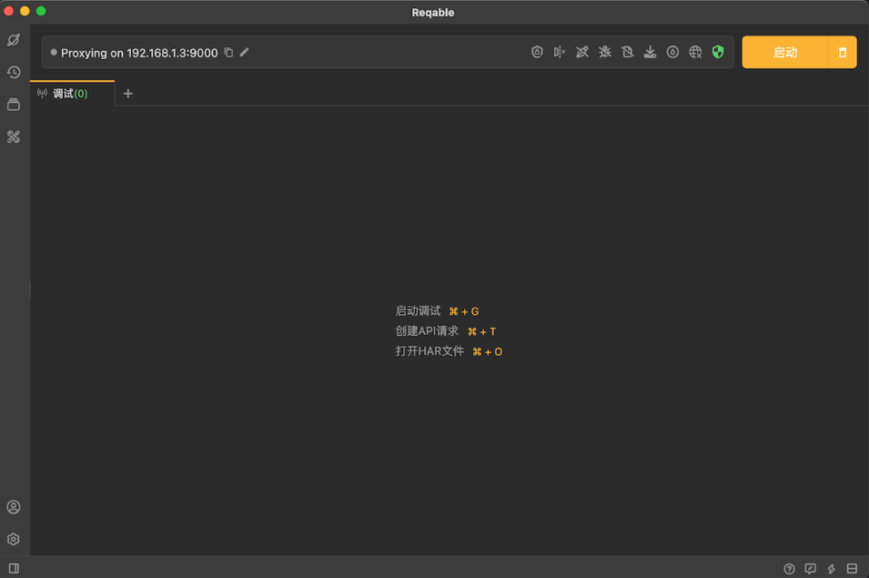
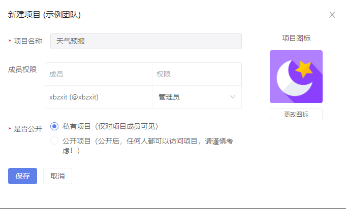
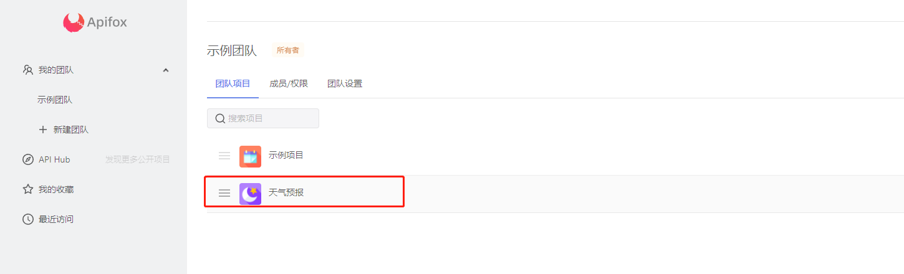
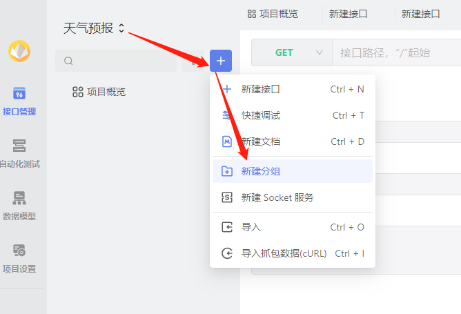
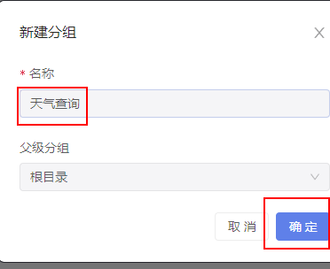
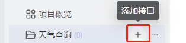

# Apifox入门

## 介绍

### 优势

* 兼容postman所有语法
* 兼容jmeter
* 支持SOAPUI  webservice
* swager

### 缺点

* 只能在线使用，必须注册登录
* 数据都保存在服务器

## 环境搭建

### 下载

[下载Apifox](https://cdn.apifox.cn/download/Apifox-windows-latest.zip)

### 安装

## 入门案例

### 新建项目

* 注册好，打开的主界面  点击 【新建】

* 填写 项目名称  选择项目图标 是否公开开情况而定，点击【保存】

* 选择创建的项目点击进入项目

### 新建接口

* 新建分组

* 添加接口

* 选择请求方式 url ，填写接口名称，分组，状态 负责人 ，如果url后面带了参数 apifox 会自动解析到parms列表中
* 选择环境 点击发送查看响应结果
* 点击三条横杠 - 新建环境 -填写环境名称 写默认url - 保存
