# Postman参数化

> 大白话： 将接口需要的数据写入的文件中，使用Postman读取该改文件

## 导入文件的格式

### CSV

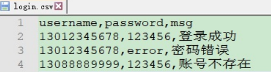

* 优点

  * 数据组织形式简单，适用于大量数据的场合。
* 缺点

  * 不支持 bool类型数据。（数据被 postman读入后，自动添加 “” 包裹bool值。）
  * 不支持 多参、少参、无参、错误参数 的接口测试。
  * 不支持复杂数据类型。（如 嵌套字典、列表等）

### JSON

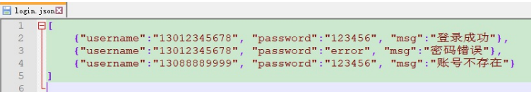

* 优点

  * 支持 bool 类型。
  * 支持 多参、少参、无参、错误参数。
  * 支持复杂数据类型。
* 缺点

  * 对于相同数据量，json数据文件大小远大于 CSV文件。

## CSV文件

> 创建xxx.csv文件
>
> 第一行写入数据对应的字段
>
> 第二开始写对应的数据，数据之间用英文逗号分隔，每行数据使用换行符分隔

* 创建CSV文件

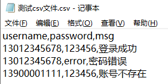

* 文件使用UTF-8格式保存

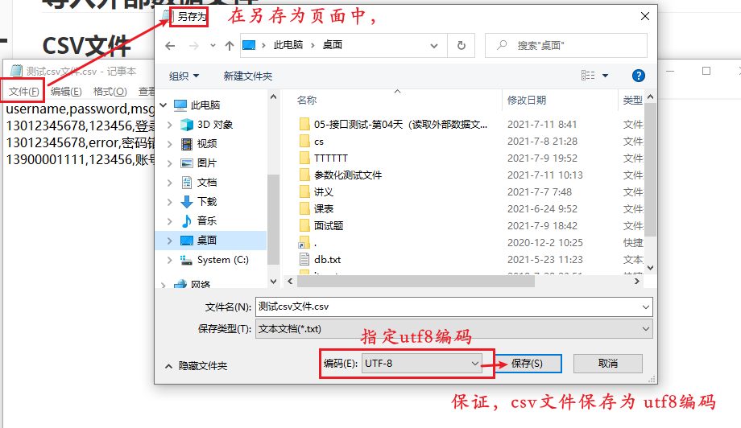

* 将创建的文件导入Postman

> 点击用例集使用Run 按钮，进入"Runner" 页面
>
> 使用 "Select File" 选择 创建的CSV文件
>
> 点击预览按钮校验文件的正确性

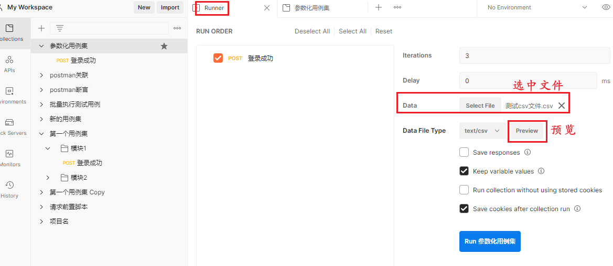

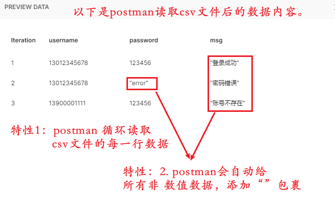

## JSON文件

> 创建xxx.json文件
>
> 数据内容的最外层，必须是 [ ]
>
> 内部所有的数据用 {} 存储
>
> [json.cn](https://json.cn)

* 将创建的文件导入Postman

> 点击用例集使用Run 按钮，进入"Runner" 页面
>
> 使用 "Select File" 选择 创建的CSV文件
>
> 点击预览按钮校验文件的正确性

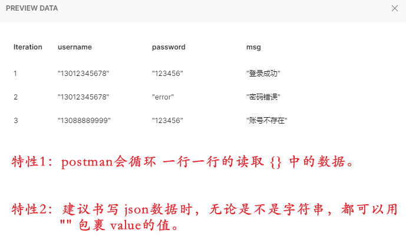

## 小案例

> 需求：批量查询手机号归属地、所属运营商，校验运营商数据正确性
>
> 接口： http://cx.shouji.360.cn/phonearea.php?number=13012345678
>
> 测试数据：
>
> ```
> 手机号: 13012345678 	运营商: 联通
> 手机号: 13800001111 	运营商: 移动
> 手机号: 18966778899 	运营商: 电信
> ```

* 测试单个接口，工作中 参数和 响应体 数据对应关系。

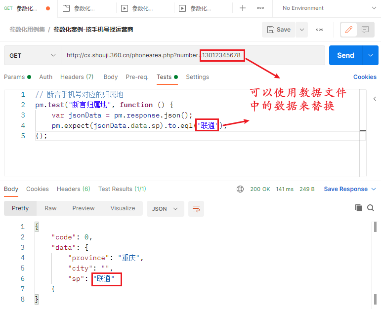

* 写好数据文件，按 csv 或 json 对应语法的语法格式组织数据

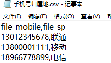

* 替换手持机号和运营商

  > 归属地：在 代码中。 用 data.字段名 替换;    手机号：在 查询参数中。 用 {{字段名}} 替换。
  >

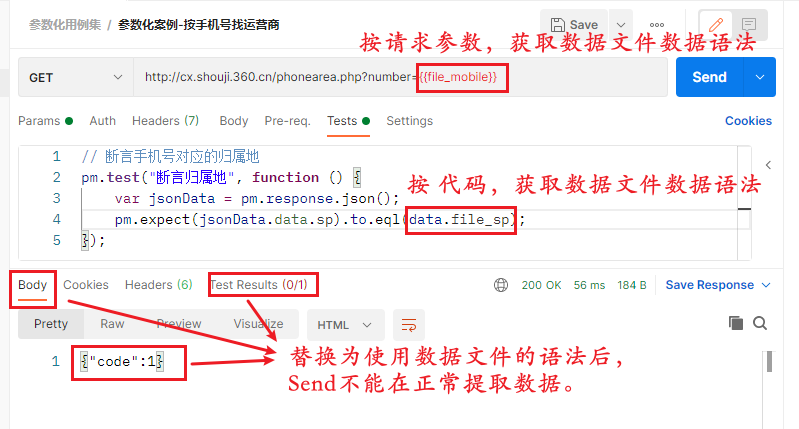

* 导入数据文件运行

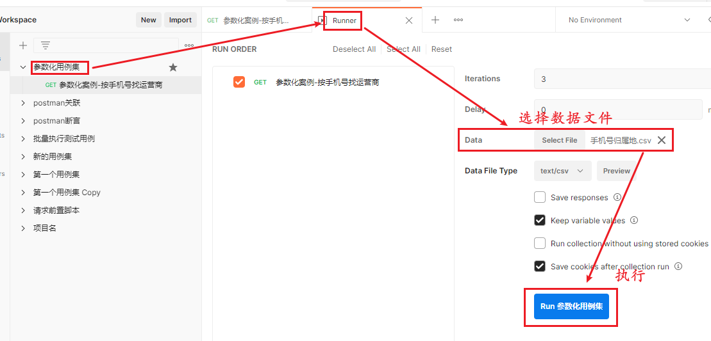

* 使用postman查看异常

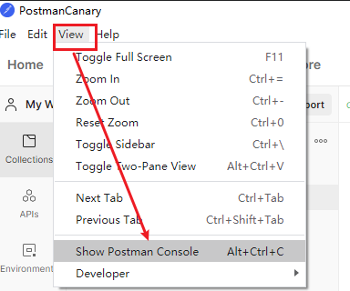

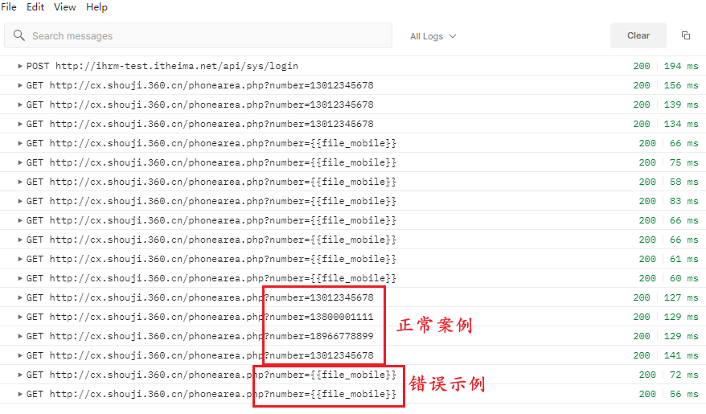

* 生成测试报告

> 批量执行测试用例（借助数据文件）
>
> 导出 测试用例集 （建议与 数据文件 放在一起）
>
> 执行生成测试报告的命令

```
newman run 用例集名称.json -d 数据文件名.csv/.json -r html --reporter-html-export  报告名称.html
```
