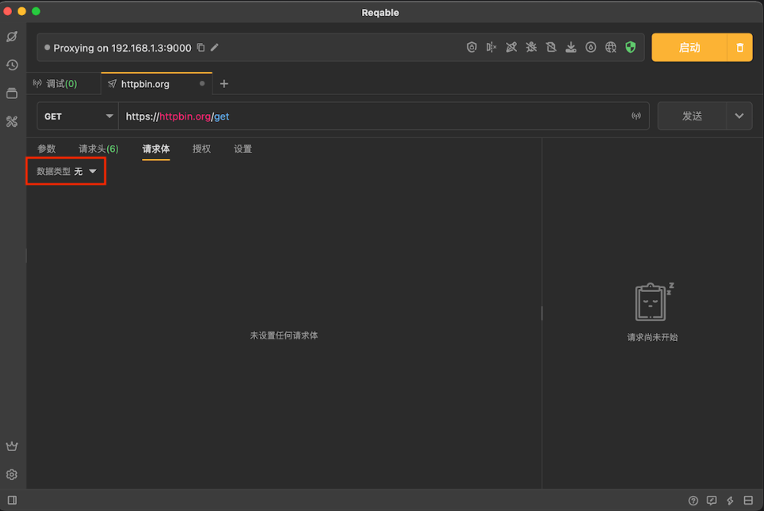

# Reqable之API测试


## 请求方法

> Reqable支持使用内置请求方法和自定义请求方法，其中内置的9个请求方法如下：


## 请求头部

> Reqable可以编辑HTTP的请求头部，提供了表格编辑模式和文本编辑模式。


### 表格模式

> 表格模式是HTTP请求头部的默认编辑模式，此模式的优点是支持查看[内置请求头](https://reqable.com/zh-CN/docs/rest/header#builtin-headers)以及输入自动填充功能，缺点是无法批量操作请求头。


### 文本模式

> 点击右上角文本按钮，可以切换到文本编辑模式，此模式的优点是支持对请求头进行快速和批量编辑。


### 内置请求头

> Reqable默认隐藏了部分必要的但无需开发者关心的请求头部，称之为内置请求头。在表格模式下点击右上角的眼镜按钮，可以切换是否显示内置请求头部。


常见内置请求头说明：

* **[Reqable-Id](https://reqable.com/zh-CN/docs/rest/request_id)** 请求唯一ID标志符，可以在设置中禁用。
* **Host** 请求头中自动添加的域名信息，注意在HTTP2和HTTP3协议中使用 `:authority` 表示。
* **User-Agent** 默认使用Reqable的应用版本号。
* **Connection** 连接保持或关闭，注意在HTTP2和HTTP3协议中无效。
* **Content-Length** 如果使用请求体，发送请求时会自动计算此值。
* **Content-Type** 如果使用请求体，将会自动追加类型（MIME）到内置请求头部列表中。
* **[Cookie](https://reqable.com/zh-CN/docs/rest/cookie)** 启用Cookie时，将会在自动追加到内置请求头部列表中。
* **[Authorization](https://reqable.com/zh-CN/docs/rest/authorization)** 启用授权时，将会在自动追加到内置请求头部列表中。


## 请求体

> Reqable支持编辑多种类型的请求体，包括[JSON](https://reqable.com/zh-CN/docs/rest/body#json)、[文本](https://reqable.com/zh-CN/docs/rest/body#text)、[XML](https://reqable.com/zh-CN/docs/rest/body#xml)、[表单](https://reqable.com/zh-CN/docs/rest/body#urlencode)、[Multipart](https://reqable.com/zh-CN/docs/rest/body#multipart)和[文件](https://reqable.com/zh-CN/docs/rest/body#binary)。使用不同类型的请求体，会自动在[内置请求头](https://reqable.com/zh-CN/docs/rest/header#builtin)中自动追加相应的 `Content-Type` 请求头。




### JSON

> JSON类型请求体自带语法高亮和格式化功能：


> JSON类型会在[内置请求头](https://reqable.com/zh-CN/docs/rest/header#builtin)中自动追加 `Content-Type: application/json` :


### 文本

> 最简单的请求体类型：


### XML

> XML类型请求体自带语法高亮和格式化功能：


XML类型会在[内置请求头](https://reqable.com/zh-CN/docs/rest/header#builtin)中自动追加 `Content-Type: application/xml` 。

### 表单

> 表单类型（urlencode）是一组键值对拼接成如下格式：
>
> ```
> foo=bar&hello=reqable
> ```


表单类型会在[内置请求头](https://reqable.com/zh-CN/docs/rest/header#builtin)中自动追加 `Content-Type: application/x-www-form-urlencoded` 。


### Multipar

> Multipart支持三种分部类型： **单行文本** 、**多行文本**和 **文件** ：


点击右侧的更多按钮可以打开分部操作菜单，包括改变类型、移动位置、编辑头部和删除等等。


多行文本需要点击展开编辑弹窗进行修改：


Reqable还支持编辑每个分部的头部信息：


Multipart类型会在[内置请求头](https://reqable.com/zh-CN/docs/rest/header#builtin)中自动追加 `Content-Type: multipart/form-data` 。

### 文件

> 文件类型支持选择一个文件作为请求体，为了简化操作，Reqable提供了文件拖拽的功能，直接将文件拖入虚线框内即可。


## 协议版本

## 请求ID

> Reqable支持在每次请求发送的时候自动创建唯一ID标志符，通过 `Reqable-Id` 可以方便开发者配合服务端协作对请求溯源。自动创建的ID格式如下：
>
> ```
> reqable-id-{UUID}
>
> 例如：  reqable-id-aee9bdc1-ad01-11ed-ace8-ade55d424a3d
> ```


### 获取ID值

> 请求成功时，可以在**性能**选项卡中获取或复制本次请求的ID值：


> 请求失败时，可以在响应右上角复制本次请求的ID值：


## Cookie

## 授权

## 代理

## 重定向

## 历史

## 集合

## 设置

## 性能指标

## cURL支持
