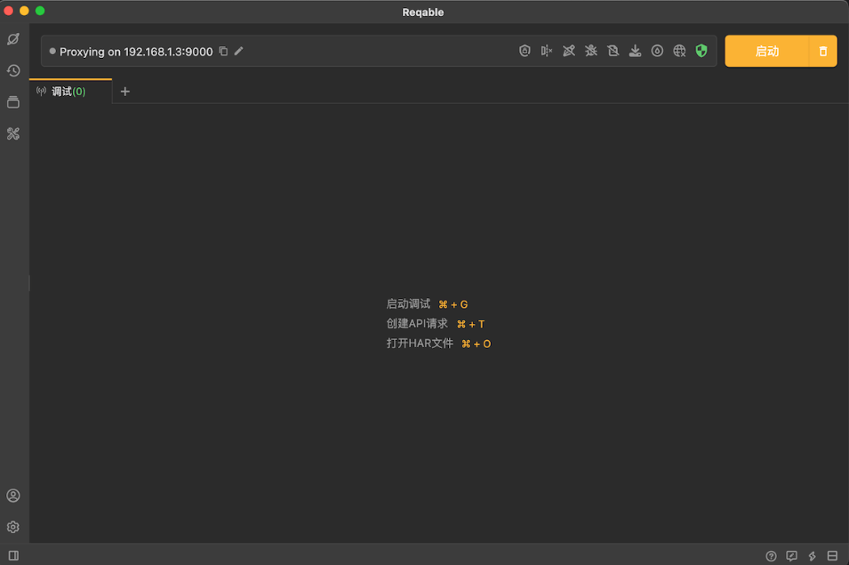

# Reqable介绍

> Reqable是一款跨平台的专业HTTP开发和调试工具，在全平台支持HTTP1、HTTP2和HTTP3(QUIC)协议，简单易用、功能强大、性能高效，助力程序开发和测试人员提高生产力！
>
> 本产品需要一定的网络基础知识，适合开发、测试、网络、安全、爬虫等工程专业人员使用，或者在专业人员的指导下使用。

## 特新

> Reqable提供了两大基本功能：**[API调试](https://reqable.com/zh-CN/docs/introduction#capture)**和 **[API测试](https://reqable.com/zh-CN/docs/introduction#rest)** ，并打通了API调试和测试之间的壁垒，例如可以从抓包数据中创建API进行测试，也可以在API测试时进行流量抓包分析。
>
> 同时，Reqable还提供了一些常用的技术[辅助工具](https://reqable.com/zh-CN/docs/introduction#toolbox)，尽可能一站式完成接口生产相关工作。

### API调试

> Reqable采用经典的MITM代理方式进行流量分析，支持重写、脚本（Python）、断点和重放等功能。

* [X]  支持HTTP/1.x, HTTP2协议版本，HTTP3(QUIC)暂不支持。
* [X]  支持HTTP/HTTPS/Socks4/Socks4a/Socks5代理方式。
* [X]  支持HTTPS，TLSv1.1、TLSv1.2和TLSv1.3加密协议。
* [X]  支持基于IPv4和IPv6地址。
* [X]  支持基于HTTP1升级的WebSocket协议。
* [X]  支持HTTP/HTTPS二级代理（调试境外流量）。
* [X]  搜索筛选：提供书签、域名、快捷筛选栏和多条件等高级搜索方式。
* [X]  网关功能：对指定请求或响应进行屏蔽，挂起等操作。
* [X]  重写功能：预设规则对指定请求或响应进行重定向、替换或者修改。
* [X]  断点功能：对请求或响应进行实时断点操作，比如屏蔽，挂起或修改替换数据等。
* [X]  脚本功能：支持编写Python脚本处理实时请求或响应。
* [X]  镜像功能：对指定域名和端口配置镜像映射。
* [X]  测试联动：支持从调试列表创建API进行测试。
* [X]  历史记录：自动保存抓包的流量数据，方便回溯查看。
* [X]  重发回放：支持单个或多个请求进行回放测试。
* [X]  自动高亮：支持设定自定义规则对请求进行多种颜色高亮。
* [X]  HAR支持：自动关联HAR格式文件，并支持HAR导出和导入。

### API测试

> Reqable可以编辑和发送HTTP请求，用来测试API接口，同时还支持API集合存储和历史记录等功能。

* [X]  支持HTTP/1.1, HTTP2和HTTP3(QUIC)协议。
* [X]  多个会话：支持创建多个Tab进行API测试。
* [X]  集合导入：支持导入Postman、Hoppscotch、Apifox和ApiPost等API集合。
* [X]  批量编辑：支持批量编辑请求参数、请求头、表单等。
* [X]  授权设置：支持API KEY、Basic Auth和Bearer Token等授权方式。
* [X]  代理设置：支持自定义代理配置，系统代理和调试代理等。
* [X]  性能测试：可以查看请求在不同环节的耗时数据。
* [X]  Cookie管理：自动保存Cookie或在请求头中自动加入关联的Cookie。
* [X]  历史记录：自动保存发送的请求和响应数据，方便回溯查看。
* [X]  cURL支持：可以导入和导出cURL。

### 辅助工具

> Reqable提供了一些常用的辅助工具。

* [X]  Base64编解码。
* [X]  URL编解码。
* [X]  Md5计算。
* [X]  时间戳转换。
* [X]  JSON/XML查看器。
* [X]  二维码生成。
* [ ]  正则表达式测试。
* [ ]  接口数据Diff。

## 历史

Reqable的前身是HttpCanary（一款Android平台应用程序），但是我们推翻了所有的技术栈，并用C++和Flutter重写，只保留了logo和主题色，所以两者并没有太多关联。当然，Reqable的使命之一，就是完全替代HttpCanary。预计在2023年底，Reqable将会推出桌面端 + 移动端的多平台独立应用程序。
