# 小程序介绍

## 介绍

> 2017年1月7日发布小程序
> 优点： 取代一切不常用APP ，释放手机资源
> 特点： 用户的体验性（即用即走，清爽体验）
>
> 不足：
>
> - 微信小程序包大小不超过20M
> - 微信小程序不适用负责的业务处理
> - 微信小程序页面层级建议 实际设计不超过三级， 官方要求不超过5级

## 用户体验

[微信小程序官网](https://developers.weixin.qq.com/miniprogram/design/)

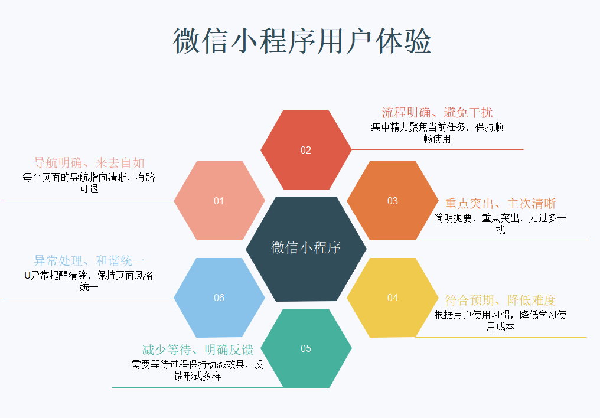

### 导航明确来去自如

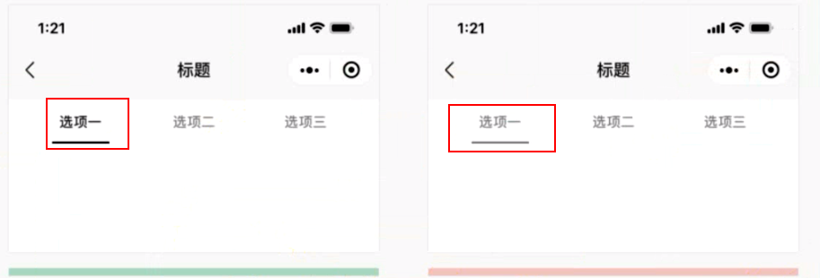

### 明确反馈形式多样

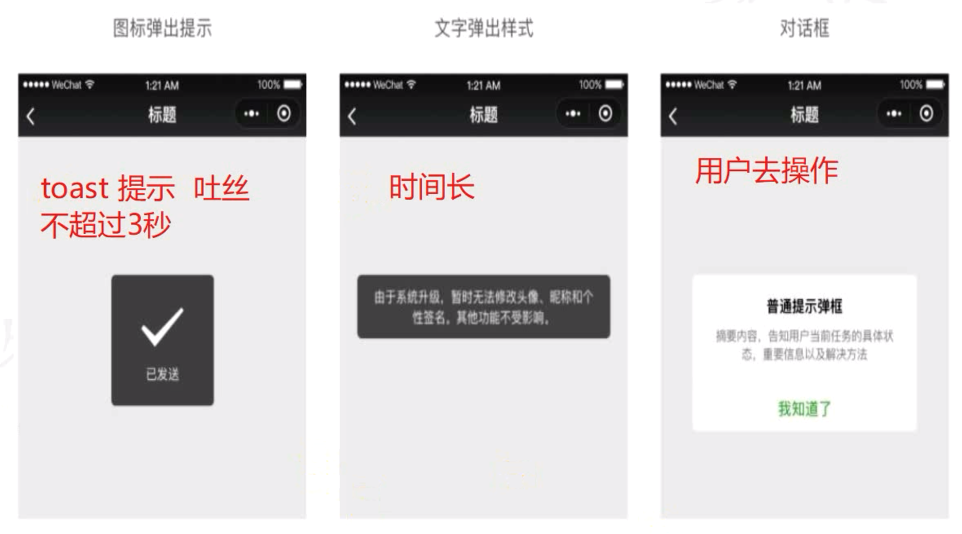

### 重点突出，主次清晰

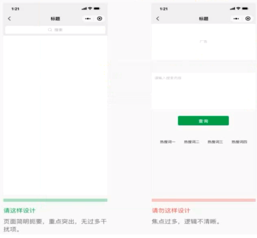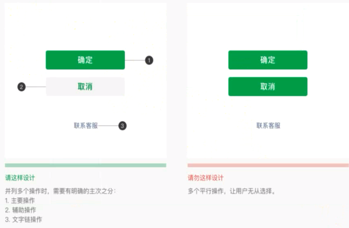

### 符合预期 降低难度

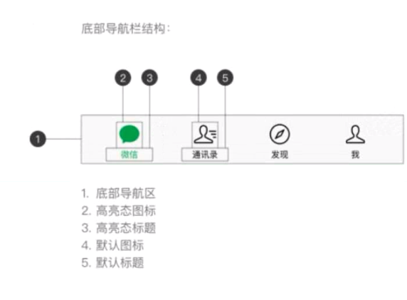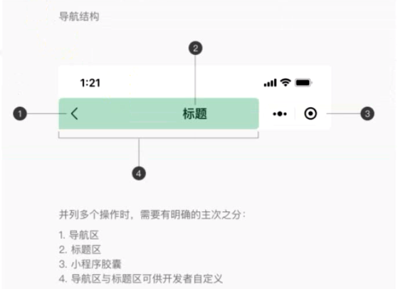

## 微信开发者工具

[微信开发者官网](https://developers.weixin.qq.com/miniprogram/dev/devtools/download.html)

### 下载

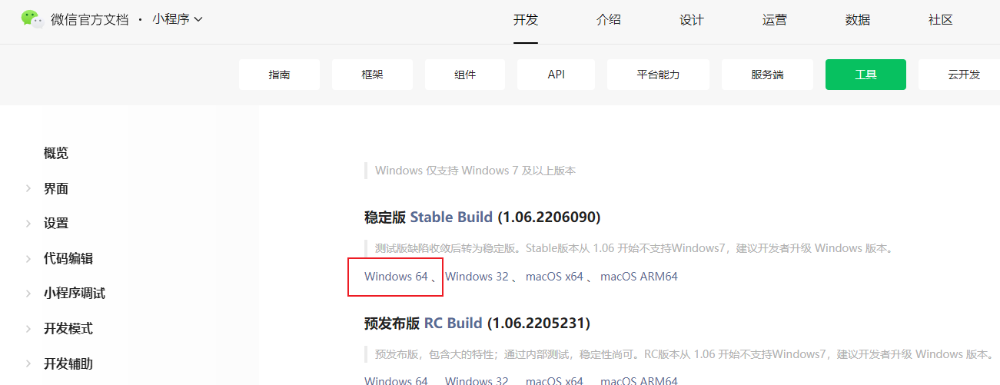


### 使用

* 选择【小程序】

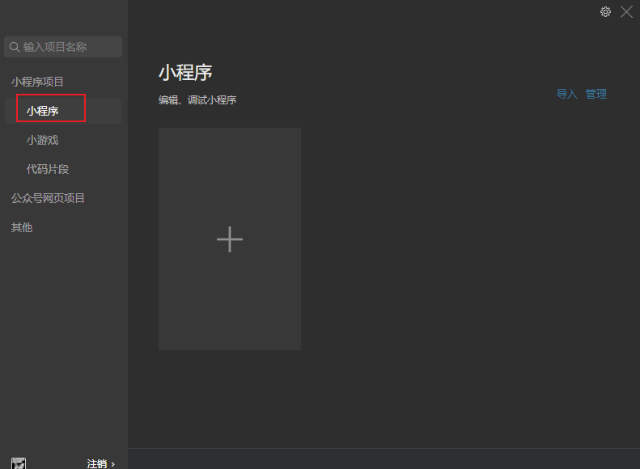

* 新建小程序（使用测试号）

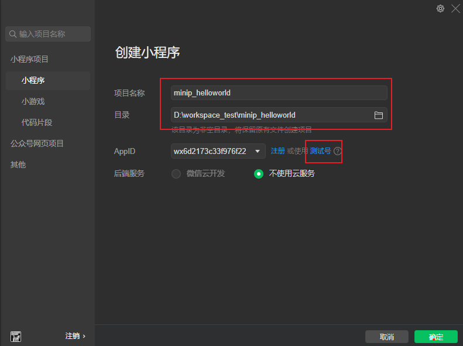


* 主界面

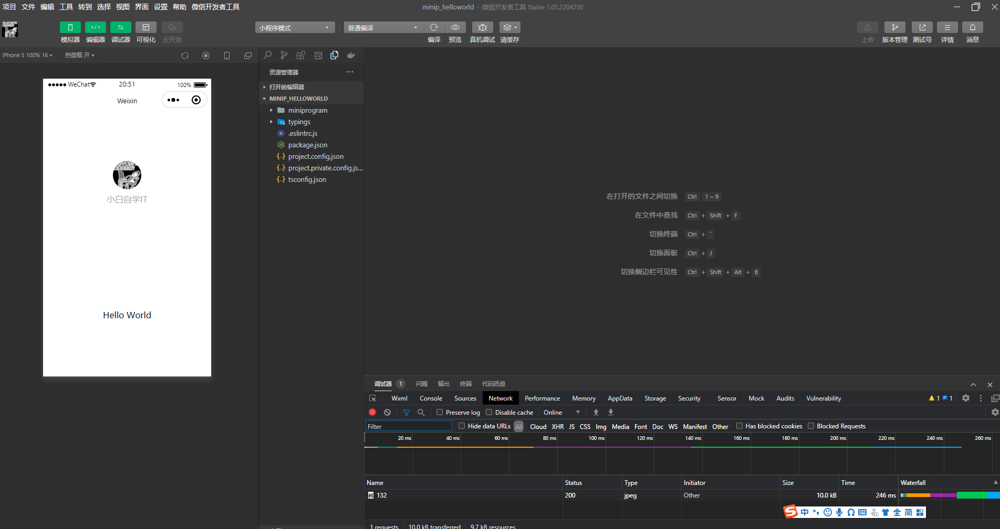


### 界面元素解释

* 模拟器  相当于手机模拟器

   

* 编辑器  写代码的地方

```
```

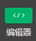

* 调试器  类似F12 审查元素

```
```


* 项目详情-项目配置

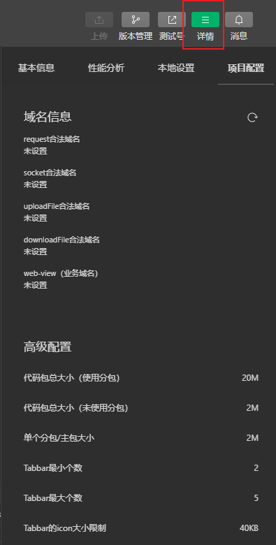


## 小程序项目文件

### 文件介绍

> web项目： HTML-CSS-JS
>
> 小程序项目： WXML(wei xin html)-WXSS(wei xin css)-JS
>
> .json  JSON配置文件
>
> .wxml  WXML模板文件
>
> .wxss  WXSS样式文件
>
> .js    JS脚本文件

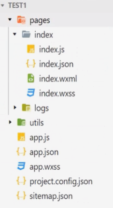


## 通讯模型

> 小程序不能直接访问服端，必须通过微信客户端才能访问

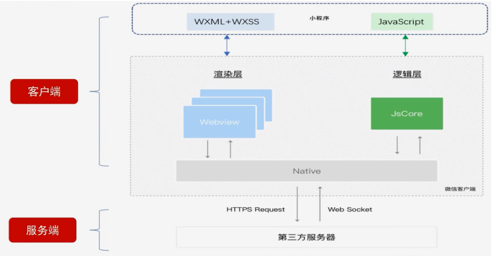
