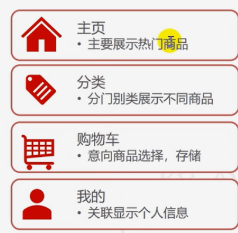
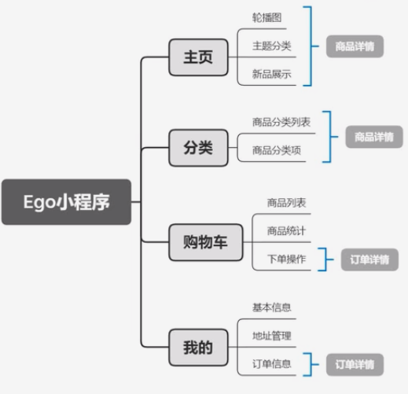
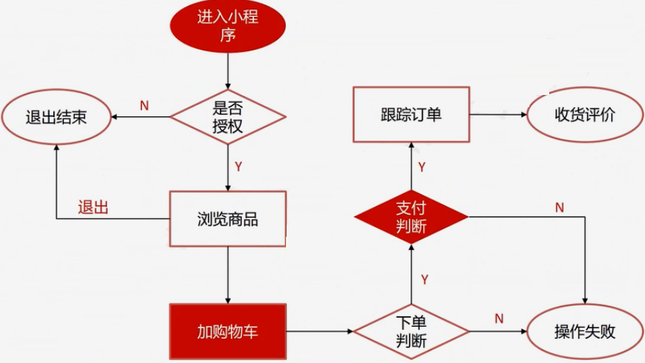
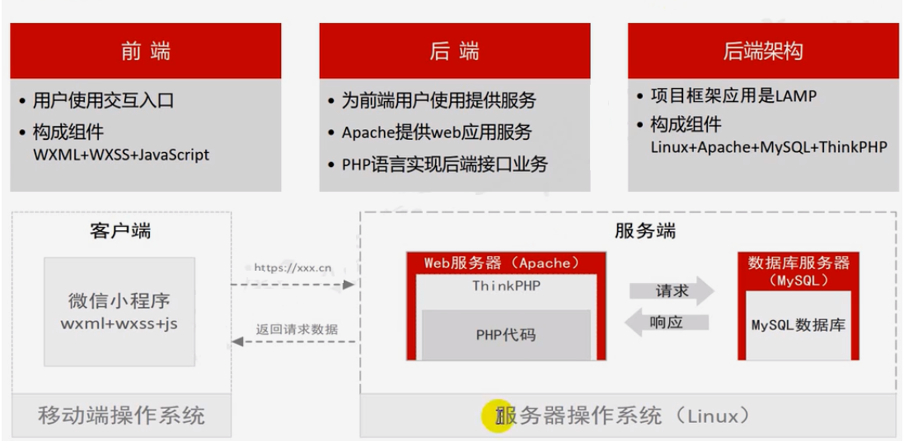

# 小程序项目

> 熟悉项目
>
> 熟悉业务
>
> 搭建测试环境

## 熟悉项目

> 项目是干什么的
>
> 项目是给谁用的
>
> 项目构成模块有哪些
>
> 项目的技术栈

## 熟悉业务

### 所有模块

### 不同模块介绍

### 核心业务流程

## 项目技术栈

## 搭建项目测试环境

### 测试工具

* 连接Linux

  * shell
* 连接数据库

  * Navcat
* 抓包工具

  * Fiddler

### 申请账号

> appId： 账号 标识小程序的合法性，唯一性
>
> appSecret: 密码  私有的信息

* 正式账号
  [微信公众号平台申请](https://mp.weixin.qq.com)
* 临时账号

  [微信开发社区申请](https://developers.weixin.qq.com/community/develop/mixflow)

## 微信小程序版本

### 体验版

### 正式版
