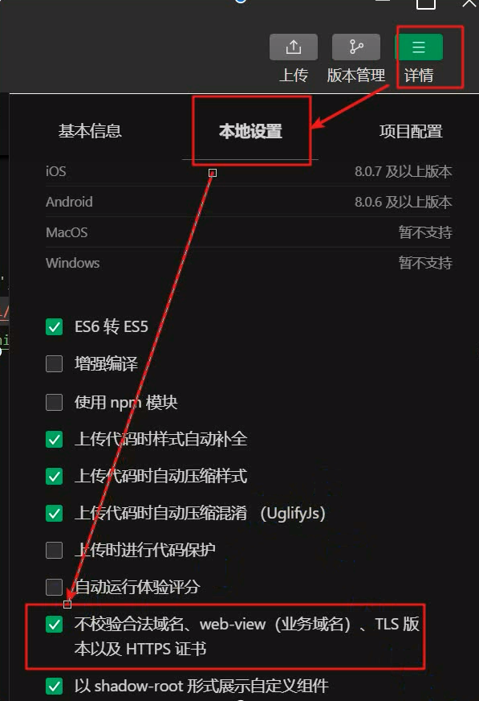

# 项目实战部署


## 项目部署准备

### 部署流程


### 组件要求及版本

* 前端

```bash
* 微信开发者工具
 -本地环境: 本地直接导入程序包进行测试
 -线上环境：生成二维码扫码

* 手机/手机模拟器
 -体验版 扫码（必须是开发者邀请的测试人员账号，然后扫码才能测试）
 
前端部署在本地电脑上
```

* 后端

```bash
操作系统： CentOS7.x
Web服务器： Apache2.4
数据库：Mysql5.7
开发框架: ThinkPHP 5。0

后端部署在Vmware创建的虚拟机上
```


## 后台部署流程步骤

### 本地部署检查

> 部署前检查本地网络及环境是否正常
>
> 后台相关应用的服务器是否通 使用ping命令
>
> 查看相关软件的版本是否符合要求，并安装相关软件

```shell
--使用虚拟器ping外网
ping baidu.com

--检查linux系统版本
cat /etc/redhat-release

```


### 安装应用服务

> 根据项目要求安装对应的组件服务器
>
> 比如文件服务器，缓存服务器，消息队列，数据库服务器，应用服务器，等等
>
> [安装服务器命令生成器](http://lnmp.org/auto.html)

```shell
#通过LAMP 一键安装部署系统服务器 
wget http://soft.vpser.net/Inmp/Inmp1.7.tar.gz -cO Inmp1.7.tar.gz && tar zxf Inmp1.7.tar.gz && cdInmp1.7&& LNMP_Auto="y" DBSelect="4" DB_Root_Password="123456" Installnnodb="y'
PHPSelect="5" SelectMalloc="1" ApacheSelect="2" ServerAdmin=".webmaster@example.com". install.shlamp


#启动服务
systemctl start 服务名

#重启服务
systemctl restart 服务名

#停用服务
systemctl stop 服务名

#禁用服务（慎用）
systemctl disable 服务名
```

* 验证服务器


* 查看apache运行状态

```shell
systemctl status httpd
```


* 查看mysql运行状态

```shell
systemctl status mysql
```


* 查看PHP运行状态

```shell
php -v
```


* 安装过程日志查看

```shell
cd /root 
#查看所有日志，结束查看不回显
less lnmp-install.log


#查询最后100行
tail -100 lnmp-install.log

#查看日志并回显
more lnmp-install.log
```

### 上传项目包

> 服务安装成功后上传后台项目文件包到服务器
>
> 项目源代码编译后的程序包，核心业务逻辑都在里面

```shell
cd /home/wwwroot/default/

将 egoser.zip  上传到该目录下

#解压zip文件
unzip -d /home/wwwroot/default/ egoser.zip
或
unzip egoser.zip

#给目录读写执行权限
chmod -R 777 egoser
```

### 数据库初始化

> 进行数据库数据初始化，达到基本使用
>
> 运行运行需要的基础数据进行导入并初始化

```shell
#在linux进入数据库(数据库密码)
mysql -u root -p

#查看当前mysql有哪些数据库
show databases;

#创建数据库egowx并设置编码方式和排序规则（utf8_general_ci)
create database egowx charset utf8 collate utf8_general_ci;

#方式一:恢复备份文件(在linux下面操作:需要输入数据库密码)
mysql -u root -p egowx < /home /wwwroot/default/egoser/ego.sql

#方式二:恢复备份文件(在mysql下面操作)
#使用(打开)数据库
use egowx ;

#导入备份好的sql文件
source /home / wwwroot /default/egoser / ego.sql;

#查看某数据库下有哪些表
show tables;

#退出数据库
exit;

```

### 修改配置文件

> 修改系统配置文件，达到系统运行时的最佳配置，进行服务器性能调优

```shell
#配置文件目录
/usr/local/apache/conf/extra

#配置文件
httpd-vhosts.conf

cat httpd-vhosts.conf

```

* httpd-vhosts.conf


* Apache配置文件

```shell
#Apache的配置文件路径
cd /usr/local/apache/conf/extra/

#重命名配置文件
mv httpd-vhosts.conf httpd-vhosts.confd

#上传已修改好的
httpd-vhosts.conf
rz

#重启Apache服务
systemctl restart httpd

```

* 修改服务端配置文件

```shell
#1.修改自己申请的APPID和APPsecret，文件路径:../egoser/application/extra/wx.php
    //小程序app_id
    'app_id' => 'wx04f7f3dabxxxxxx'，/小程序app_secret
    'app_secret' => 'd8876c664a0b12854705xxxxxx',

#2.修改图片加载位置../egoser/application/extra/setting.php
    'img_prefix'=>'http://e.cn/images',

```


### 重启应用服务

> 重启应用程序服务，使配置文件生效，

```shell
#重启apache
systemctl restart httpd

#重启mysql
systemctl restart mysql

#请求验证
http://ip/api/v1/banner/1

```

### 修改虚拟域名

> 使用SwitchHosts工具修改

```shell
127.0.0.1 e.cn
```


## 前端部署

### 修改前端配置文件

```shell
#1.修改APPID，更改为自己申请的APPID，根目录文件project.config.an，搜索"appid"，例如:"appid": "wxOxxxxxxxxxxxxxxxxxxx",
#2.修改API地址（请求后台服务器地址)，修改位置../utils/config.js,
例如:
Config.restUrl = 'http://e.cn/api/v1/';
```


### 关闭域名校验


