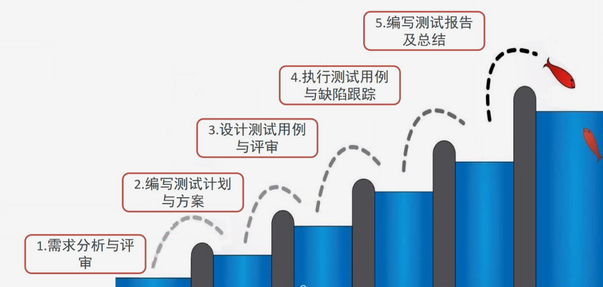

# 项目测试流程

## 测试流程



## 需求分析与评审

> 能看懂需求，能够理解
>
> 有疑问，进行确认
>
> 能够根据需求进行测试设计

### 评审目的

```
需求分析与评审
 - 根据需求说明书确保对于当前需求理解一致
 - 对于有异议地方及时和产品沟通确认
 - 已确定的需求能够指导测试执行
 - 对于已经确定的需求预估所需要的时间


评审人员
 - 产品人员·
 - 开发人员
 - 测试人员

评审形式
 - 会议

```

## 测试计划与方案

> 作用:为了保障测试工作的有效有序进行

### 测试计划

> 管理类型文档

* 测试目标与范围  到什么程度算达标?  做多少?
* 测试角色和职责  什么人干什么事?
* 测试进度与资源   花费的时间，所需要的资源
* 测试风险预估及对应措施  可能碰到的问题，以及如何解力
* 测试准入准出标准  测试开始和结束的标准

### 测试方案

> 技术型文档

* 测试方法策略  测试过程需要测试套路和方法
* 测试环境要求  具体开展测状工作需要的运行环境
* 测试工具选择  所需要的测试工具的选择

## 测试设计

### 设计用例

### 评审用例

### 跟踪缺陷

### 执行用例
