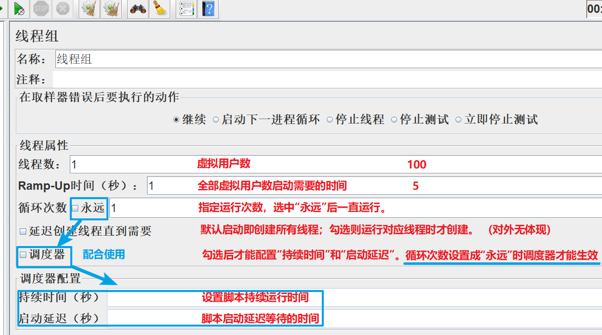
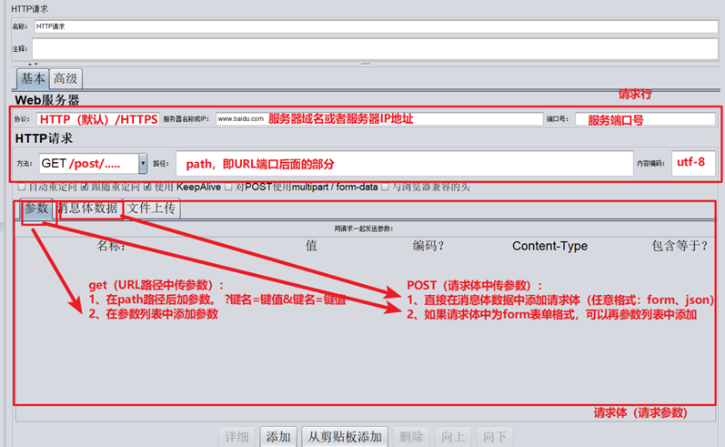
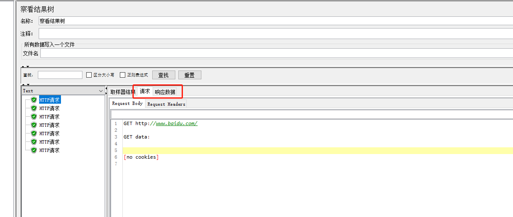

# Jmeter三个重要组件

## 线程组

> 控制jmeter用于执行测试的一组用户

### 线程组的分类

* Setup线程组
  * 预测试操作， 所有脚本之前执行
* 普通线程组
  * 执行测试用例，可以 有1个或者多个
* Teardown线程组
  * 测试后操作，所有脚本之后执行

### 线程组的属性

## HTTP请求

> 向服务器发送http 或 https 请求

## 查看结果树

