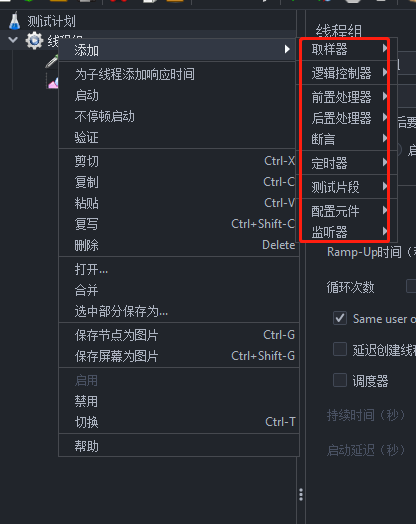
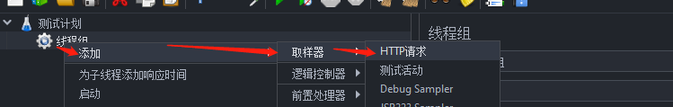
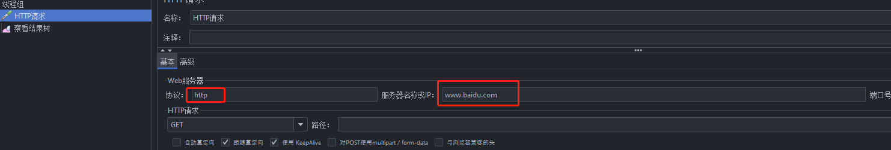
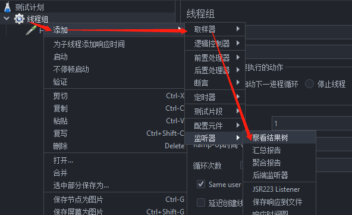
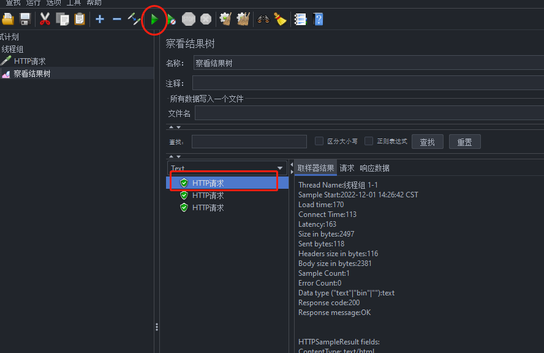

# Jmeter入门

# JMeter第一个案例

## 环境安装

### 下载

[Jmeter5 下载](https://jmeter.apache.org/download_jmeter.cgi)

### 安装JDK

### 配置环境变量

### 启动

> jmeter.bat

### 界面汉化

> jmeter.properties

```properties
language=zh_CN

sampleresult.default.encoding=UTF-8
```


## 元件及基本作用域

> 元件与组件的关系：
>
> 元件： 类似于类    组件： 类似于方法

### 基本元件



* 配置元件

```bash
初始化测试数据
```

* 前置处理器

```bash
对请求参数化进行赋值
```

* 取样器

```bash
调用GET/POST方法发送请求
```

* 后置处理器

```bash
提取响应中特定字段的值
```

* 断言

```bash
对提取出来的值与预期结果进行对比
```

* 监听器

```bash
在控制台查看脚本运行的结果
```

### 作用域的原则

* 取样器： 没有作用域
* 逻辑控制器： 只对其子节点中的取样器和逻辑控制器起作用
* 其他元件：
  * 如果是某个取样器的子节点，则该元件只对其父节点起作用
  * 如果其父节点不是取样器，则其作用域是该元件父节点下的其他所有后代节点

### 元件的执行顺序

* 在同一作用域（目录/级别/缩进）的不同元件的执行顺序：

配置元件 -> 前置处理程序 -> 定时器 -> 取样器 -> 后置处理程序 -> 断言 -> 监听器

## Helloworld

### 添加线程组

> 【测试计划】-【添加】-【线程（用户）】


### 添加Http请求、

> 【线程组】-【添加】-【取样器】-【HTTP请求】



* 填入请求的服务器地址



### 察看结果树

> 【线程组】-【添加】-【取样器】-【察看结果树】



### 运行查看结果

> 【察看结果树】 - 【绿三角】 - 查看请求结果


