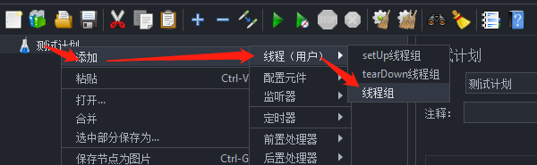
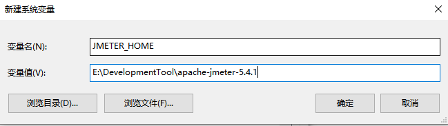
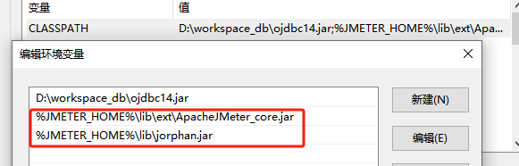
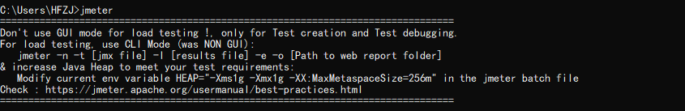

# Jmeter入门

## 简介

> Apache JMeter是Apache组织开发的基于Java的压力测试工具，是一款开源软件，并且是100%的纯java开发，可以在window和linux止面运行。

[Jmeter下载地址](https://jmeter.apache.org/download_jmeter.cgi)

### 安装jdk

> 因为Jmeter是java开发的，需要JRE来支持

### 配置Jmeter环境变量

* JMETER_HOME

* CLASSPATH

* path

### 验证

