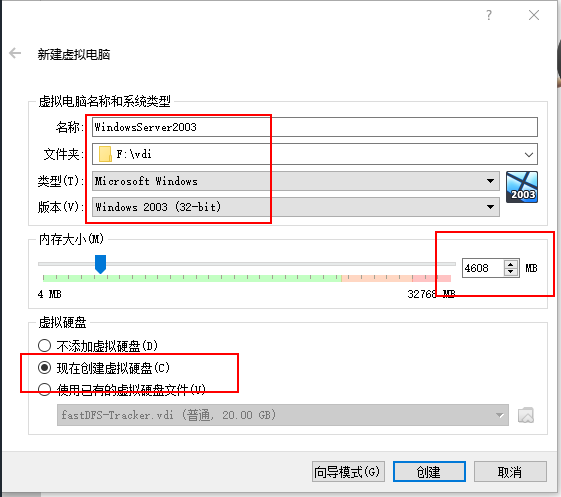
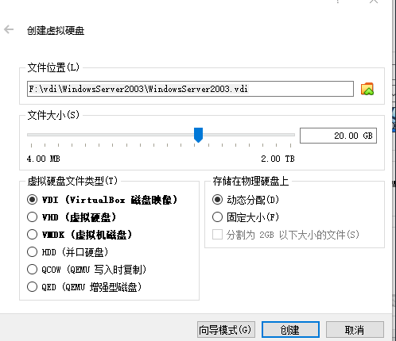
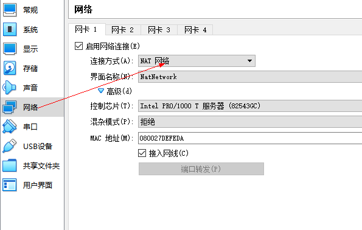
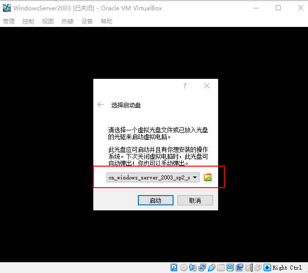

# QC

## 介绍（全称Qulity Center）

**是一个项目管理工具，可以管理项目的所有测试阶段**

```
* 需求
* 测试用例
* 执行测试是用例
* 提交缺陷
* 回归测试
```

> 背景 :
> 之前属于Mercury，该公司工具有：QTP、LoadRunner,后来被HP收购，（最新版本：ALM:Application LiferCycle Mangement）

## 学习目标

```
1.可以了解软件测试的基本流程
2.通过学习QC可以掌握其他缺陷管理工具的使用
3.可以自己制定缺陷的生命周期
举例：new新建-->open分配--->fixed修复--->reopen重开--->fixed修复--->close关闭
```

## QC安装前提

```
需要windows2003或者xp的操作系统
浏览器IE7以下
sql server--->微软
```

## QC安装前提(Windows2003)

**镜像下载**
[Windows Server 2003](https://pan.baidu.com/s/1NBUtIFSLGcgMt9Qnc9pfyQ)










## QC安装前提(IE6)

## QC安装前提(SqlServer)

* **安装过程**
* **查看安装的SQLServer**
* **身份验证**
* **查看SqlServer是否启动**
* **升级产品版本为RTM--->SP4**

## QC安装

## QC破解

## QC使用

* **登录**
* **创建项目**
* **添加用户**
* **项目其他操作**
* **练习**
