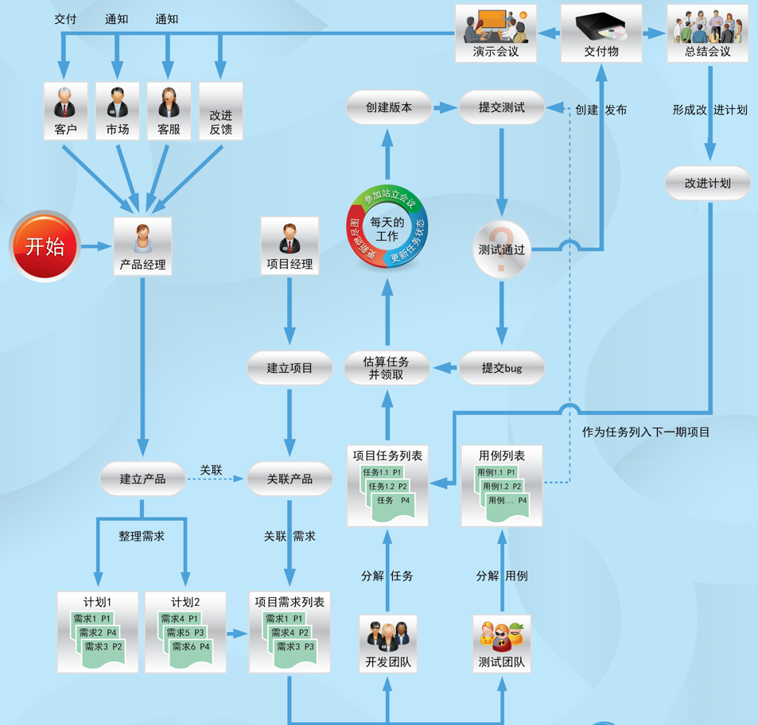
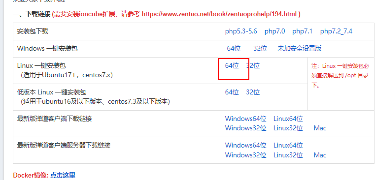

# 禅道

## 禅道项目管理流程

> 产品经理创建产品，并整理产品的需求
>
> 项目经理创建项目，并整理项目的需求 （产品与项目进行关联）
>
> 项目开始由开发团队和测试团队配合完成
>
> - 开发
>   1. 开发团队开会决定，对开发任务进行安排并把任务指派给开发人员
>   2. 开发领取开发任务并估算任务的开发周期
> - 测试

## 禅道安装与启动

### 安装

[下载官网](https://www.zentao.net/download/max3.0-80658.html)

* 下载

[Linux 64 禅道下载](https://dl.cnezsoft.com/zentao/max3.0/ZenTaoPMS.max3.0.zbox_64.tar.gz)

### 启动

### 注意事项

### 项目流程介绍

## 角色添加

## 产品-需求-模块

### 创建产品

### 创建模块

### 创建需求

## 需求

### 需求评审

### 需求变更

## 开发解决bug

## 创建
