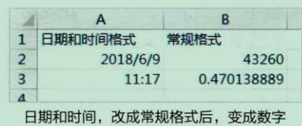

# 准确高效地获取数据

## 特殊数据的输入方法

### 输入编号前面的

> 很多编号为了确保位数统一，前面都有补0操作，但是在Excel中输入数字后，数字前面的0就会消失

* 效果图

* 操作步骤

          

### 输入身份证号码银行账号

> 字符超过12个显示就有问题，那么怎么正常显示呢

* 效果图

* 操作步骤

只需要将输入区域变成文本格式再输入即可

### 输入标准的日期

* 效果图

* 操作步骤

### 输入特殊符号

> 比如选择你的性别 通常使用 打钩的方式

* 效果图

* 操作步骤

## 数据格式和显示效果

### Excel中的3中数据类型

* 特殊数字
*

### 数字格式可以随意更改

* 效果图

* 操作步骤
  > 在“开始” 选项中可以修改单元格和区域的数字格式，从而改变数字的最终显示效果
  >

