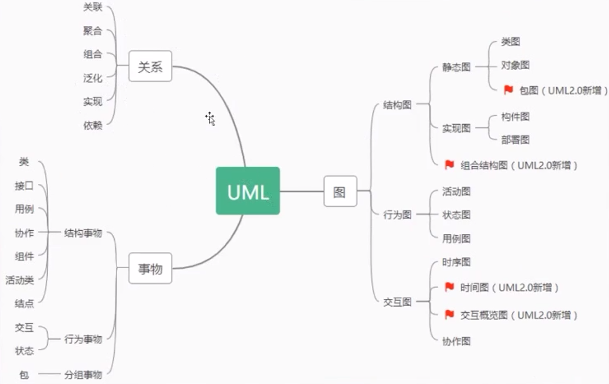

# UML介绍

## UML绘图规范

## 关系

* 关联
* 聚合
* 组合
* 泛化
* 实现
* 依赖

## 事务

### 结构事务

* 类
* 接口
* 用例
* 协作
* 组件
* 活动类
* 节点

### 行为事务

* 交互
* 状态

### 分组事务

* 包

## 图

### 结构图

* 静态图
* 实现图
* 组合结构图

### 行为图

* 活动图
* 状态图
* 用例图

### 交互图

* 时序图
* 时间图
* 交互橄榄图
* 协作图
