# VuePress

## 创建工程

```bash
mkdir mc_love_study && cd mc_love_study
```

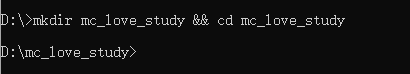

## 初始化项目

> 标注的地方一直回车就可以

```bash
npm init
```

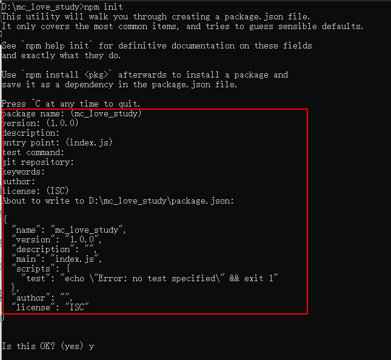

## 将VuePress安装为本地依赖

```bash
npm install -D vuepress
```

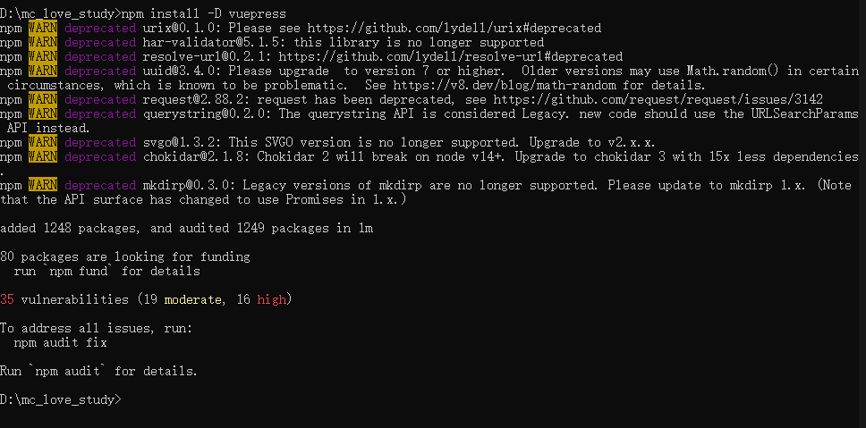

## 使用高级编辑器打开项目

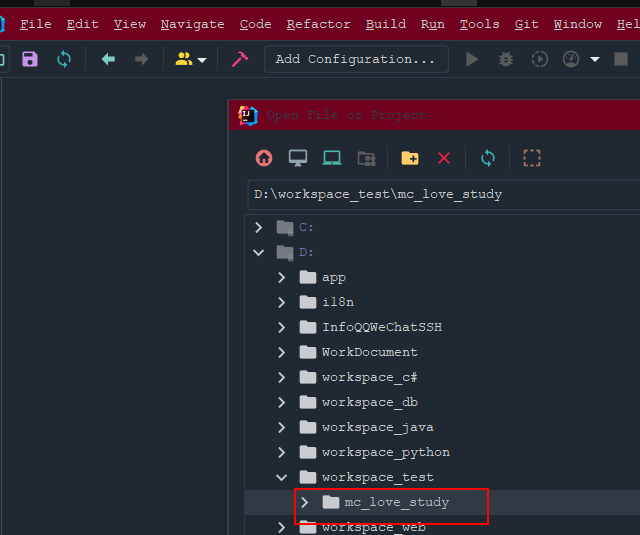

## 安装几个插件

**Atom Material Icons  /  Atom OneDark Theme**

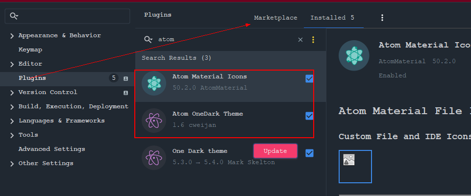

**Markdown Editor   /  Markdown**

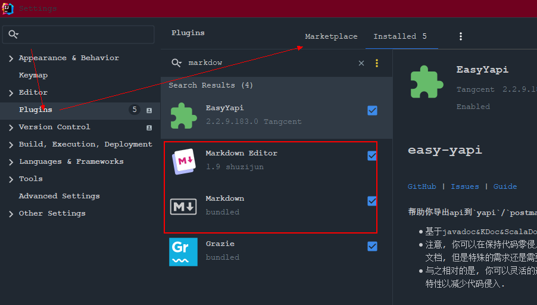

## 搭建基础配置

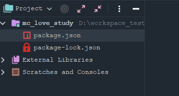

**修改package.json**

```json
  "scripts": {
    "start": "vuepress dev docs",
    "dev": "vuepress dev docs",
    "build": "vuepress build docs"
  },

```

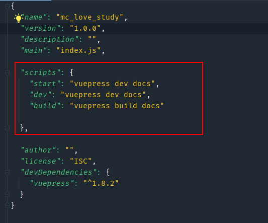

## 构建docs /.vuepress目录结构及内容

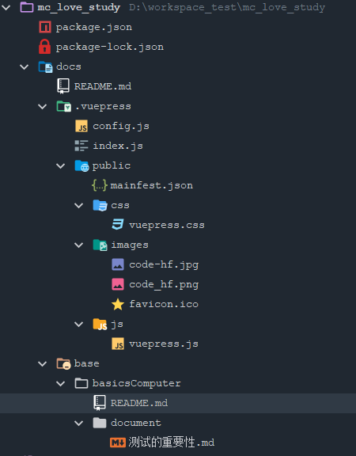

**config.js**

```js
module.exports = {
    title: '慕辰 爱 学习',
    description: '码农-娟姐',
    port : 3000,
    dest : "dist",
    head : [
        [
            'link', {
            rel : 'icon',
            href : '/images/favicon.ico'
        }

        ],
        [
            'link', {
            rel : 'stylesheet',
            href : '/css/vuepress.css'
        }
        ],
        [
            'script', {
            charset : 'utf-8',
            src : '/js/vuepress.js'
        }
        ]
    ],
    base: '',
    markdown : {
        lineNumbers : true
    },

    themeConfig : {
        sidebarDepth : 5,
        search : true,
        searchMaxSuggestions : 10,
        nav : [
            {
                text : '理论知识',
                items: [{
                    items : [
                        {
                            text : '计算机基础',
                            link : '/base/basicsComputer/'
                        },
                        {
                            text : '测试理论',
                            link : '/base/testTheory/'
                        }
                    ]
                }]
            },
            {
                text: 'Java开发',
                items: [
                    {
                        text: 'Java小白',
                        items : [
                            {text : 'Oracle', link : '/java/noob/oracle/'},
                            {text : 'Linux', link : '/java/noob/linux/'},
                        ],
                    },
                ],
            },
            {
                text : 'WEB页面基础',
                items: [{
                    items : [
                        {
                            text : 'HTML',
                            link : '/webPage/html/'
                        },
                        {
                            text : 'CSS',
                            link : '/webPage/css/'
                        }
                    ]
                }]
            },
            {
                text : '自动化测试',
                items: [{
                    items : [
                        {
                            text : '测试用例设计',
                            link : '/test/testCase/'
                        }
                    ]
                }]
            }
        ],
        sidebar : {
            '/base/basicsComputer/' : [{
                title : '计算机基础',
                collapsable : false,
                children : [
                    '',
                    'document/测试的重要性'
                ]
            }]
        }
    }
};


```

**index.js**

```js
export * from "./config";
```

**mainfest.json**

```json
{
  "name": "mc_love_study",
  "short_name": "mc_love_study",
  "start_url": "/index.html",
  "display": "standalone",
  "background_color": "#fff",
  "theme_color": "#3eaf7c"
}

```

**vuepress.css**

```css
.page {
    max-width: 1500px;
}

.home .hero img {
    max-height: 140px !important;
}

#app .navbar .home-link span:before {
    display: inline-block;
    content: '';
    width: 80px;
    height: 45px;
    margin-right: 6px;
    background: url(images/code_hf.png) no-repeat;
    background-size: 100% 100%;
    vertical-align: middle;
}

.getting-started .outbound, .nav-links .outbound, .icon.outbound {
    display: none !important;
}

.getting-started a img {
    margin-right: 8px !important;
}

.getting-started a img.no-margin {
    margin-right: 0px !important;
}


blockquote {
    font-size: 15px !important;
    color: #858585 !important;
    border-left: 0.25rem solid #42b983 !important;
    font-weight: 1000 !important;
}

.page-nav {
    max-width: 1070px !important;
}

.theme-default-content:not(.custom) {
    max-width: 1070px !important;
}

```

**vuepress.js**

```js
window.onload = function () {
    init();
}

function init() {
    console.info("aaa");
}
```

**拷贝图片**

* code-hf.jpg


* code_hf.png


* favicon.ico


## 编写docs/README.md

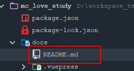

```markdown
home: true
heroImage: /images/code-hf.jpg
actionText: 快速开始 →
actionLink: /base/basicsComputer/

features:

- title: 计算机基础
  details: 计算机基础理论、软件测试理论。
- title: WEB页面基础
  details: Html、CSS、JS。
- title: 自动化测试
  details: 测试用例设计、测试计划与工具、企业环境搭建 、数据库操作、实战项目、Python编程基础、前端知识、web端自动化测试、单元测试、Shell脚本、接口及性能测试、移动端自动化、Redis、数据结构、_数据库综合演练
- title: 完全响应式布局
  details: 提供多终端适配：电脑、平板、手机等所有主流设备，提供多种不同风格的皮肤。页面美观，高端大气上档次。
  footer: MIT Licensed | Copyright © 2018-2021 xbzxit.com All Rights Reserved 码农-娟姐
```

## 构建具体页面内容

> 此目录结构为模板

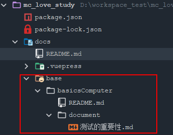

**README.md**

```markdown
# 计算基础理论

<h1 align="center">计算机理论</h1>

<p align="center">基础知识</p>

::: tip 提示
计算基础重中之重。

:::
```

**测试的重要性**

```markdown
# 测试的重要性
```

## 编译并运行

**编译**

```bash
npm run build
```

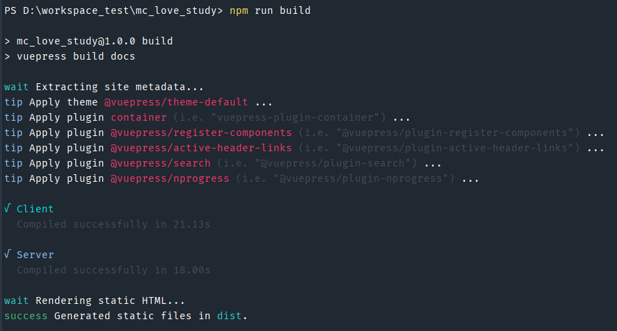

**运行**

````bash
npm run dev
```
````

**访问项目**

http://localhost:3000/


## vuePress全文搜索功能

> Fulltext-sarch

[Fulltext-sarch](https://github.com/leo-buneev/vuepress-plugin-fulltext-search)

### 安装

```bash
npm i vuepress-plugin-fulltext-search -D
# or
yarn add -D vuepress-plugin-fulltext-search -D
```

* 修改`docs/.vuepress/config.js`文件，添加插件`fulltext-search`

```js
// docs/.vuepress/config.js
module.exports = {
  plugins: ['fulltext-search'],
}
```

* 如果某个页面不想被搜索，可以在文档头部分添加`search: false`

```js
---
search: false
---

<!-- page content -->
```

### 修改高亮

* 默认情况下，搜索关键字的结果是下划线的，没有高亮。阅读下源码，可得知对搜索结果如何高亮，修改如下：

```css
.suggestions .highlight{
  color: #3eaf7c
  font-weight: bold
}
```

### 修改快捷键

> 通过源码阅读`SearchBox.vue`，有三个全局变量`SEARCH_MAX_SUGGESTIONS,SEARCH_PATHS,SEARCH_HOTKEYS`，
>
> * SEARCH_MAX_SUGGESTIONS 定义最大搜索结果数据
> * SEARCH_PATHS 搜索路径
> * SEARCH_HOTKEYS 快捷键

* 1.自定义js文件，放到`\.vuepress\public\js`目录下，命令为`pgmanor-self.js`

```js
// vuepress-plugin-fulltext-search 添加全局配置
SEARCH_MAX_SUGGESTIONS = 10;
SEARCH_PATHS = [];
SEARCH_HOTKEYS = ['s', 'i'];
```

* 2.在`config.js`中head中，将其添加引入

```js
module.exports = {
    head: [
        // 引入自定义js
        ["script", {"language": "javascript", "type": "text/javascript", "src": "/js/pgmanor-self.js"}]
    ]
}
```

**启动后，输入`s`或`i`验证，光标是否进入搜索框**
