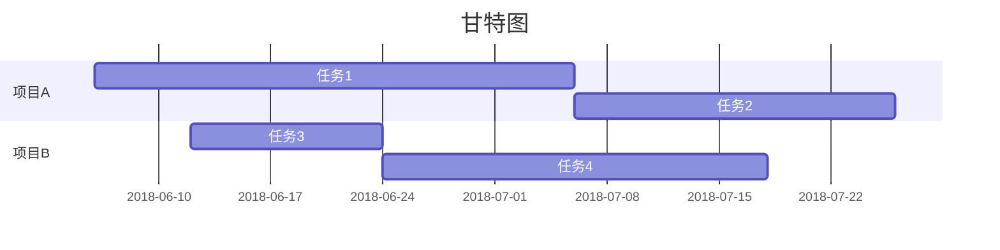
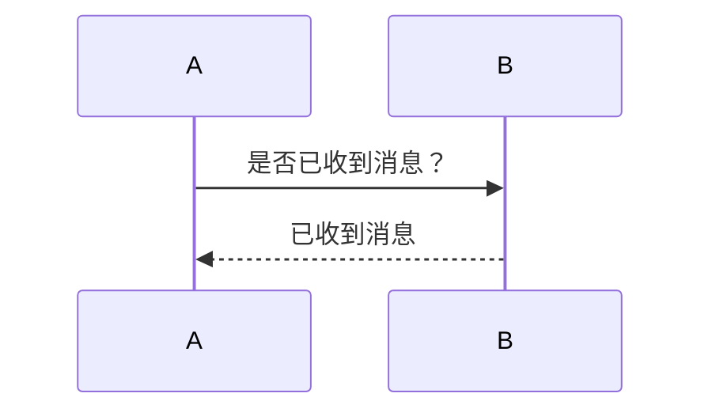
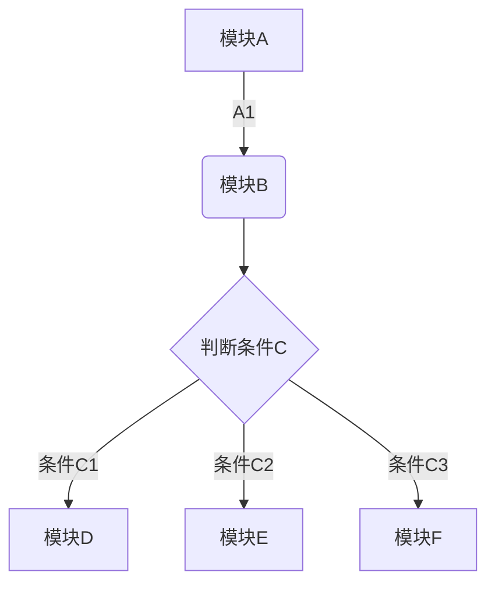

# MarkDown

标题

```
    # 1
    ## 2
    ### 3
```

**加粗**

```
**加粗**
```

*斜体*

```
*斜体*
```

<u>下划线</u>

```
<u>下划线</u>
```

~~删除线~~

```
~~删除线~~
```

分割线

---

```
***
```

`内嵌代码`

```
`内嵌代码`
```

> 引用

```
> 引用
```

<p>段落</p>
```
<p>段落</p>
```

换行
<br>

```
换行
```

```sh
脚本 sh
```

```xml
xml文件
```

```yaml
yml文件 
```

```html
html
```

```css
css
```

```javascript
javascript
```

```java
java
```

```json
json
```

```python
python
```


@w=300
@h=150
@w=200h=100
@h=100w=200

```

@w=300
@h=150
@w=200h=100
@h=100w=200
```

```

网址
<http://www.github.com>
```

[http://www.github.com](http://www.github.com)

添加视频

```html
<video id="video" controls="" preload="none" poster="封面">
      <source id="mp4" src="./assets/1647417879608.mp4" type="video/mp4">
</video>
```

```


::: tip提示
    提示信息
:::
```

::: tip提示
提示信息
:::

```


# 表格
| 参数                  | 描述                                             |
| --------------------- | ------------------------------------------------ |
| k1                 | v1                     |
| k2             | v2    |
```

# 表格


| 参数 | 描述 |
| ------ | ------ |
| k1   | v1   |
| k2   | v2   |

```

* 无序列表
```

* 无序列表

```

带层级的无序列表
+ a
    * a1
+ b 
    * b1
```

+ a
  * a1
+ b
  * b1

```

1.有序列表
2.有序列表

超链接
([http://www.baidu.com](http://www.baidu.com))
```

([http://www.baidu.com](http://www.baidu.com))

```

代办事项
* [x] 代办事项a
* [ ] 代办事项b
* [ ] 代办事项c
```

* [X]  代办事项a
* [X]  代办事项b
* [X]  代办事项c



时序图



流程图



数学公式

```math
e^{i\pi} + 1 = 0
```

图表

```flowchart
月份,预算,收入,花费,债务
June,5000,8000,4000,6000
July,3000,1000,4000,3000
Aug,5000,7000,6000,3000
Sep,7000,2000,3000,1000
Oct,6000,5000,4000,2000
Nov,4000,3000,5000,
```

```pie
title 每月收益
x.title: Amount
y.title: Month
y.suffix: $
```

::: tip
你可以点击 toolbar 中的 tip 来快速插入
:::

::: warning
这是一段警告
:::

::: danger
这是一个危险警告
:::

::: details
这是一个详情块，在 IE / Edge 中不生效
:::

::: tip 自定义标题
你也可以自定义块中的标题
:::

::: danger STOP
危险区域，禁止通行
:::
