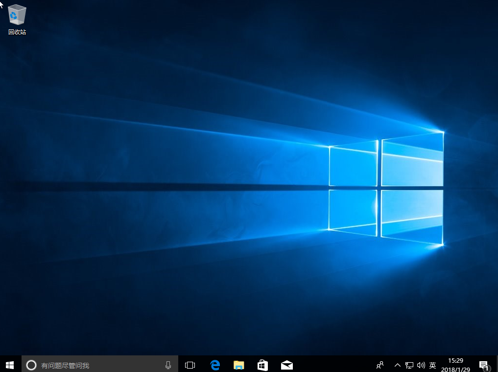

# 安装Win10系统

> 本教程主要讲述如何用U盘PE启动安装原版Win10系统（即MSDN下载的ISO），当原系统损坏、崩溃或Win10升级异常导致系统启动不了时，都可以使用U盘启动来修复/重装。
>
> U盘PE重装非常灵活，可以这么说学会灵活使用PE维护系统等于多一个撩小姐姐的技能（不管你信不信，反正我是懂了），下面搬运工以微PE为示范安装最新Win10原版。

## 前期准备

●  原系统重要文件备份（数据无价）

●  8G或以上容量U盘

●  微PE工具箱[下载](https://pan.baidu.com/s/1kQ5CH3P2oEBYsAZqLFECuQ)（工具不唯一，请务必使用纯净无捆绑的工具）

●  下载原版win10 iso映像文件  [立即下载 〉](http://www.xitongku.com/)

## 制作U盘PE

**连接一个空U盘**

**打开pe制作工具，选择安装方式为“U盘”**

**选择好“待写入U盘”，然后点击“立即安装进U盘”，其它默认即可**

>PS：
○ 制作U盘格式建议选择支持单文件大于4G的exFAT或NTFS
○ 请注意备份U盘资料

**这样U盘pe便顺利制作完成了（制作成功后U盘可用空间会变小）**

## 系统安装步骤
> 在下表查阅你的电脑对应的快捷启动热键，重启电脑时不停按启动热键（一般是F12、ESC），直到出现启动选择界面
（重要提醒：选择热键前，确保电脑连接着U盘）

**在弹出的启动界面中选择U盘启动盘，如搬运工用的是金士顿U盘制作的，此步如有疑问可拍照片联系我协助解决** 

**进入界面后打开“CGI备份还原”**

**依次选择安装的盘（一般为C盘）和镜像文件，然后点击“执行”**

**然后在弹出的窗口选择Win10的版本（新版win10镜像一般包含多版本）**

**选择是否保留原系统内容和自动重启，此时可拨掉U盘**

## 系统设置
> 前一步还原完成并重启后会进入系统部署过程，整个过程比较简单，详细可参考 原版Win10系统安装

**默认中国**

**选择你常用的输入法**

**根据电脑是公用还是私用进行设置**

**创建一个账号或使用已有的账号，可不填密码**

**年龄是个秘密，其实手机也是**

**设置自己想要的功能**

**请耐心等待，愿所有的美好如期而至**

**恭喜你，成功安装原版Win10，请尽情体验**

