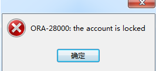

# 用户管理

## 解锁用户

### 场景



```sql
--然后使用命令来解锁
alter user scott account unlock；

--可以看到scott账户已经解锁，但是状态还是"expired”(密码过期)的意思。
select username,account_status from dba_users WHERE USERNAME='SCOTT'；

--给其赋一个新的口令
alter user scott identified by tiger；


```
