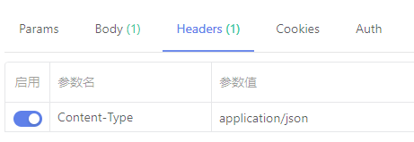
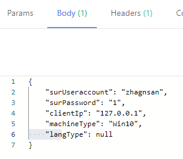
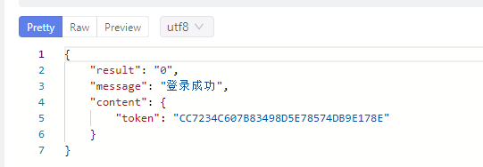
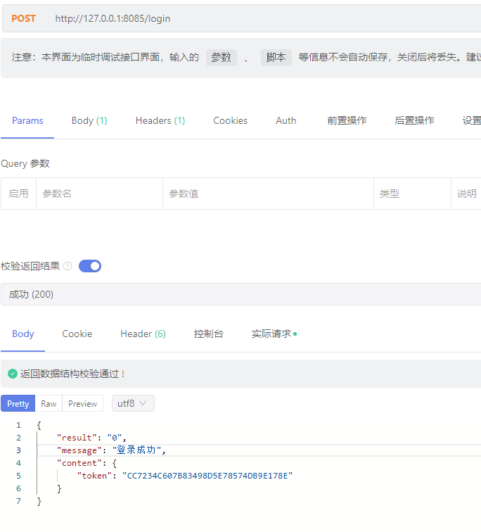

# 接口对接

> 通常都是http接口
> 接口一定要规范

## 接口的示例

> 请求接口如何操作 比如设置的header token param body

### url


### headers



### body



### response



## 接口必须必须通



## 接口相关数据详细

### url

接口请求的方式 POST

url 包含http协议+端口+路由 不带任何参数

### request

必须声明请求的数据格式是json

### response

> 完整的数据格式

```json
{
    "result": "0",
    "message": "登录成功",
    "content": {
        "token": "CC7234C607B83498D5E78574DB9E178E"
    }
}
```


| 属性           | 类型        | 举例        |
| ---------------- | ------------- | ------------- |
| surUseraccount | varchar(16) | zhangsan    |
| surPassword    | varchar(16) | Abc123@@x   |
| clientIp       | varchar(15) | 127.0.0.1   |
| machineType    | varchar(5)  | win10/macos |
| langType       | varchar(2)  | en/zh       |

## 调用接口的代码范例

### java

```java
@Service
public class RestApiService {

    @Bean
    public RestTemplate restTemplate () {
        return new RestTemplate();
    }

    /**
     * 通过restTemplate请求http接口
     * @param url         请求url
     * @param map         请求参数
     * @param httpHeaders 请求头
     * @param httpMethod  请求方式
     * @return
     */
    public String restHttp(String url, HashMap map, HttpHeaders httpHeaders, HttpMethod httpMethod) {
        HttpEntity<Map<String, Object>> entity = new HttpEntity<>(map, httpHeaders);
        String response = this.restTemplate().exchange(url, httpMethod, entity, String.class).getBody();
        return response;
    }

    /**
     * 包装请求头
     *
     * @return
     */
    public HttpHeaders getHeaders() {
        /*封装请求头*/
        HttpHeaders headers = new HttpHeaders();
        MediaType type = MediaType.parseMediaType("application/json; charset=UTF-8");
        headers.setContentType(type);
        return headers;
    }

}
```


```java
@Autowired
RestApiService restApiService;


@Test
public void resthttp() {
	HashMap hashMap = new HashMap();
	hashMap.put("request",obj);
	String url = "http://127.0.0.1:8085/login";
	HttpMethod get = HttpMethod.POST;
	String str = restApiService.restHttp(url,hashMap,restApiService.getHeaders(),get);
	System.out.println(str);
}
```
