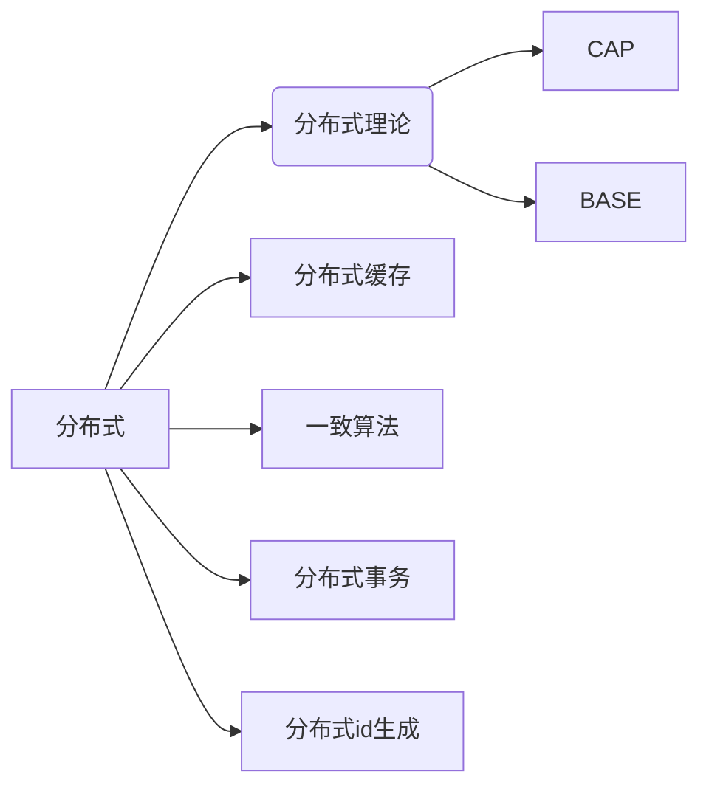

# Java高级

> 不满足于能做，而是通过更 深入 和 广泛 的学习，实现高质量的代码和更优秀的架构，培养解决问题的能力。

## 并发编程（21 天）

> 对 Java 后端开发程序员来说，懂得如何利用有限的系统资源来提高系统的性能是很重要的，也是大厂面试考察的重点，因此并发编程（尤其是 Java 并发包的使用）这块的知识很重要。
>
> 并发编程入门不难，依然是 先学会使用 基础的 Java 并发包， 再通过大量地实践和测试，了解一些原理，才能真正掌握何时使用、如何更合理地使用并发编程。
>
> 线程和进程
> 线程状态
> 并行和并发
> 同步和异步
> Synchronized
> Volatile 关键字
> Lock 锁
> 死锁
> 可重入锁
> 线程安全
> 线程池
> JUC 的使用
> AQS
> Fork Join
> CAS

### 视频

[⭐【尚硅谷】大厂必备技术之JUC并发编程2021最新版](https://www.bilibili.com/video/BV1Kw411Z7dF（特点是短、精、新）)

[黑马程序员全面深入学习Java并发编程](https://www.bilibili.com/video/BV16J411h7Rd（讲的很细、全面深入）)

### 书籍

* ⭐《Java并发编程实战》（国外的经典）
* ⭐《Java 并发编程艺术》（国人写的，理论思想内容较多，有时间建议反复看）

### 项目

[⭐ Java 并发知识点总结](https://github.com/CL0610/Java-concurrency)

## JVM（30 天）

> 想要深入理解 Java，探秘 Java 跨平台的奥秘，一定要了解 Java 底层的虚拟机技术。
>
> 了解虚拟机、掌握虚拟机性能调优方法，有助于你写出更高性能、资源占用更小的优质程序。
>
> JVM 的知识略显枯燥，建议先看视频，有实操的地方一定要实操！自己多去分析。
>
> 第一遍不理解没有关系，可以再看书来巩固，想要真正学好，《深入理解 Java 虚拟机（第三版）》一定要读。
>
> * JVM 内存结构
> * JVM 生命周期
> * 主流虚拟机
> * Java 代码执行流程
> * 类加载
>
>   * 类加载器
>   * 类加载过程
>   * 双亲委派机制
> * 垃圾回收
>
>   * 垃圾回收器
>   * 垃圾回收策略
>   * 垃圾回收算法
>   * StopTheWorld
> * 字节码
> * 内存分配和回收
> * JVM 性能调优
>
>   * 性能分析方法
>   * 常用工具
>   * 参数设置

### 视频

[⭐ 尚硅谷宋红康 - JVM 全套教程详解](https://www.bilibili.com/video/BV1PJ411n7xZ（讲得相当全面！附有实操）)

[【狂神说Java】JVM快速入门篇](https://www.bilibili.com/video/BV1iJ411d7jS（讲得有点浅，但都是面试重点，时间紧的小伙伴可以直接看这个）)

### 书籍

⭐《深入理解 Java 虚拟机（第三版）》  （有理论有实践，内容丰富，不可多得的 JVM 学习神书，就是有点废头发）

### 项目

[⭐ Java 虚拟机底层原理知识总结](https://github.com/doocs/jvm)

### 实战

[阿里云 JVM 实战](https://developer.aliyun.com/graph/java/point/64)

### 架构设计

