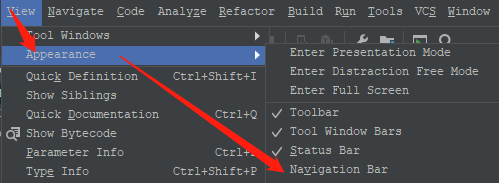
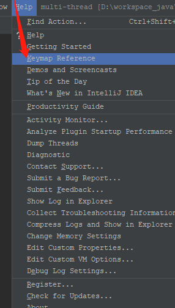

# IntellijIDEA

## 基础设置

### 设置入口


### 设置主题并自定义字体

> Ctrl + `


### 设置编辑器背景(不推荐)


### 建议关闭Tab页

> 可以查看最近编辑的文件 Ctrl + E / Ctrl+Shift+E


### 关闭导航条

> Alt+home 临时显示




## 编码技巧

### 跳到指定的文件

> double Shift


### 跳转到指令文件指定行

> Ctrl + Shift + N


### 移动分割线

> 先 `Alt +1` 聚焦到Project视图，再用 `Ctrl + Shift + ← /→`来移动


### 添加书签 ，显示书签


### 多行编辑功能

> 使用鼠标选中要修改的行， 再使用`Alt + Shift + Insert`操作
>
> 先用 `Ctrl + W` 选中需要修改的变量， 再使用 `Alt + J` 选中所有用到该变量的地方


### 编写JSON 自动转义，正则也支持

> 使用`Alt + Enter`开启


### Run Anything

> `运行任何命令<br/> 使用 <code>Double + Ctrl</code>`


### 查看类的继承关系图

> 使用`Ctrl + H` 查看继承关系

### 查看一个类的变量在哪些地方被调用

> 使用`Ctrl + Alt + F7` 查看继承关系

### 查看一个类中有哪些方法

> `Alt + 7` 或者 `Ctrl + F12`

### 查看一个类的实现方法

> 使用 `Ctrl + Alt + B` 查看

### 查看某个方法的调用关系

> 使用`Ctrl + Alt + H` 查看


## 常用快捷键

```b
* Ctrl+Shift+a：全局搜索 IDEA 的操作和设置
* shift+F6：重命名
* Ctrl+Alt+m：提取方法
* Ctrl+Alt+l：格式化代码
* Ctrl+Alt+o：优化导入类和包
* Ctrl+d：复制行
* Ctrl+y：删除行
* Ctrl+F4：关闭当前编辑面板
* Ctrl+Shift+Up/Down：代码向上/下移动
* Ctrl+/ 或者 Ctrl+Shift+/：注释「// 或者/.../ 」
* Alt+7：显示类结构
* Ctrl+W：选中代码，连续按会有其他效果
* Ctrl+Shift+加号「或者减号」：展开「或折叠」代码
* refactor 功能菜单：提取接口、接口与实现之间相互发代码
* Ctrl + Shift +F12 最大化编辑器
* Ctrl + B 进入光标所在地方其他地方的引用
* Ctrl + W 作用按照语法选择代码 反选 Ctrl + Shift + W
```




### 快捷键


## 自动补全


## 好用的插件


## 常用注释

@author 作者名

@date 日期

@version 版本标识

@parameter 参数及其意义

@since 最早使用该方法/类/接口的JDK版本

@return 返回值

@throws 异常类及抛出条件

@deprecated 引起不推荐使用的警告

@see reference 查看引用

@override 重写

## Javadoc注释的规范

**文件注释标签**

```java
/**
* <p>Title: ${file_name}</p>
* <p>Description: </p>
* <p>Copyright: Copyright (c) 2013</p>
* <p>Company: www.izhangheng.com</p>
* @author zhangheng
* @date ${date}
* @version 1.0
*/
```

**类型注释标签（类的注释）**

```java
/**
* <p>Title: ${type_name}</p>
* <p>Description: </p>
* <p>Company: www.izhangheng.com</p>
* @author zhangheng
* @date ${date}
*/
```

**字**段注释标签

```java
/** ${field}*/
```

**构造函数标签**

```java
/**
* <p>Title: </p>
* <p>Description: </p>
* ${tags}
*/
```

**方法标签**

```java
/**
* <p>Title: ${enclosing_method}</p>
* <p>Description: </p>
* ${tags}
*/
```

**重写方法标签**

```java
/* （非 Javadoc）
* <p>Title: ${enclosing_method}</p>
* <p>Description: </p>
* ${tags}
* ${see_to_overridden}
*/
```

## 快捷键
