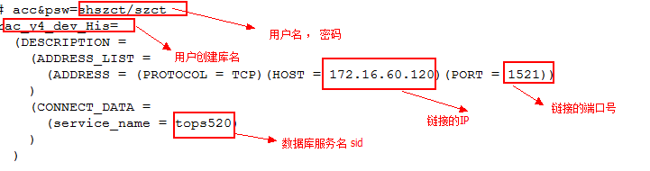
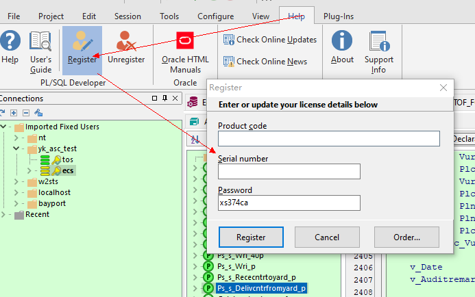

# PL/SQL Develoer

## PL/SQL乱码

pl/sql中文显示为乱码解决

在windows中创建一个名为“NLS_LANG”的系统环境变量，

设置其值为“SIMPLIFIED CHINESE_CHINA.ZHS16GBK”，

然后重新启动 pl/sql developer，这样检索出来的中文内容就不会是乱码了

## 保存登录用户名密码

1 保存用户名

tools -> Preferences -> User Interface - Options

勾选 Autosave username 。 保存

2 保存密码

tools -> Preferences -> Oracle  -> logon History  -> definition

勾选 store history  和 store with password

保存

## 连接串配置

## 序列号

> 备    注：最好关闭软件的自动更新功能^_^
>
> Product Code（产品代号）：4t46t6vydkvsxekkvf3fjnpzy5wbuhphqz
>
> serial Number（序列号）：601769
>
> password（密码）：xs374ca

