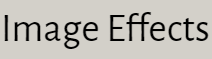

# 开发百宝箱

## 资源导航

     
 
        <a href="https://www.code-nav.cn/" target="_blank">
            

                

                    
编程导航

                

                

                    东半球最好的编程资源导航
                

            

        </a>
    

    
 
        <a href="https://yucongming.com" target="_blank">
            

                

                    
鱼聪明

                

                

                    智能 AI 助手，写书问答绘画。
                

            

        </a>
    

    
 
        <a href="https://codecopy.cn" target="_blank">
            

                

                    
代码小抄

                

                

                    简单易用的代码分享神器。
                

            

        </a>
    

## 常用搜索

     
 
        <a href="http://www.baidu.com/" target="_blank">
            

                

                    
百度

                

                

                    百度——全球最大的中文搜索引擎及最大的中文网站，全球领先的人工智能公司。
                

            

        </a>
    

    

        <a href="http://www.google.com/" target="_blank">
            

                

                    
Google

                

                
全球最大的搜索引擎公司

            

        </a>
    

    

        <a href="http://www.bing.com/" target="_blank">
            

                

                    
Bing

                

                
微软公司推出的用以取代Live Search的搜索引擎

            

        </a>
    

    

        <a href="https://magi.com/" target="_blank">
            

                

                    
Magi

                

                
Magi 是由 Peak Labs
                    研发的基于机器学习的信息抽取和检索系统，...
                

            

        </a>
    

    

        <a href="https://www.programcreek.com/java-api-examples/index.php" target="_blank">
            

                

                    
搜代码

                

                
不知道某个类如何使用? 来这里搜索Java 代码吧...

            

        </a>
    

## 代码托管

    
<a href="https://github.com" target="_blank">
        

            

                
Github

            

            
GitHub是一个面向开源及私有软件项目的托管平台

        

    </a>

    
<a href="https://gitee.com/" target="_blank">
        

            

                
Gitee

            

            
开源中国旗下的代码托管平台：码云

        

    </a>

    
<a href="https://coding.net" target="_blank">
        

            

                
Coding

            

            
一站式 DevOps，提升研发效能

        

    </a>

    
<a href="https://bitbucket.org/" target="_blank">
        

            

                
Bitbucket

            

            
Bitbucket is more than
                just Git code management.
            

        

    </a>

## 技术社区

    
<a href="http://www.csdn.net/" target="_blank">
        

            

                
CDSN

            

            
中国专业IT社区CSDN

        

    </a>

    
<a href="http://www.cnblogs.com/" target="_blank">
        

            

                
博客园

            

            
开发者的网上家园

        

    </a>

    
<a href="https://www.oschina.net" target="_blank">
        

            

                
OSChina

            

            
中国最大的开源技术社区

        

    </a>

    
<a href="https://segmentfault.com/" target="_blank">
        

            

                
知否

            

            
中国领先的开发者技术社区

        

    </a>

    
<a href="https://juejin.im" target="_blank">
        

            

                
掘金

            

            
掘金是一个帮助开发者成长的社区，是一个面向互联网技术人的内容分享平台
            

        

    </a>

    
<a href="https://www.51cto.com" target="_blank">
        

            

                
51CTO

            

            
中国领先的IT技术网站

        

    </a>

    
<a href="https://www.linuxidc.com/" target="_blank">
        

            

                
Linux公社

            

            
Linux系统门户网站

        

    </a>

    
<a href="https://www.ibm.com/developerworks/cn/" target="_blank">
        

            

                
IBM 开发者

            

            
IBM开发者社区

        

    </a>

    
<a href="https://stackoverflow.com" target="_blank">
        

            

                
StackOverflow

            

            
Stack Overflow是一个与程序相关的IT技术问答网站

        

    </a>

## 工具合集

    
<a href="https://c.runoob.com/" target="_blank">
        

            

                
菜鸟工具

            

            
菜鸟教程提供的工具集

        

    </a>

    
<a href="https://tool.oschina.net/" target="_blank">
        

            

                
工具

            

            
开源中国在线工具

        

    </a>

    
<a href="https://tool.lu/" target="_blank">
        

            

                
Tool工具箱

            

            
程序员的工具箱

        

    </a>

    
<a href="http://tools.jb51.net/" target="_blank">
        

            

                
脚本之家

            

            
脚本之家旗下的工具箱

        

    </a>

    
<a href="https://123.w3cschool.cn/webtools" target="_blank">
        

            

                
W3Cschool

            

            
W3Cschool旗下的工具箱

        

    </a>

    
<a href="https://gitee.com/explore/all" target="_blank">
        

            

                
Gitee开源

            

            
Gitee 开源项目推荐列表

        

    </a>

    
<a href="https://cloudconvert.com/" target="_blank">
        

            

                
云转换

            

            
在线转化压缩包、字体、图片、视频、电子书

        

    </a>

## 基础教程

    
<a href="https://www.runoob.com/" target="_blank">
        

            

                
菜鸟教程

            

            
菜鸟教程集合

        

    </a>

    
<a href="https://www.w3cschool.cn/tutorial" target="_blank">
        

            

                
W3Cschool

            

            

                w3cschool主要为初学者技术的人员提供在线学习教程和日常技术资料查询服务
            

        

    </a>

    
<a href="https://www.w3school.com.cn/" target="_blank">
        

            

                
W3School

            

            
W3School 是因特网上最大的
                WEB 开发者资源，...
            

        

    </a>

    
<a href="https://developer.mozilla.org/zh-CN/docs/Learn" target="_blank">
        

            

                
MDN

            

            
源于开发者，服务开发者

        

    </a>

    
<a href="https://www.javatpoint.com" target="_blank">
        

            

                
JavaPoint

            

            
The Best Portal to Learn
                Technologies
            

        

    </a>

## 文档工具

    
<a href="https://www.gitbook.com/" target="_blank">
        

            

                
Gitbook

            

            
一个先进可定制的文档格式工具

        

    </a>

    
<a href="https://docsify.js.org/#/zh-cn/" target="_blank">
        

            

                
Docsify

            

            
一个神奇的文档网站生成工具

        

    </a>

    
<a href="https://vuepress.vuejs.org/zh/" target="_blank">
        

            

                
VuePress

            

            
Vue 驱动的静态网站生成器, 本项目就是使用VuePress开发的
            

        

    </a>

## 后端开发

    
<a href="https://spring.io/projects/spring-boot" target="_blank">
        

            

                
Spring

            

            
Spring框架是一个开放源代码的J2EE应用程序框架

        

    </a>

    
<a href="https://mybatis.org/mybatis-3/zh/index.html" target="_blank">
        

            

                
MyBatis

            

            
MyBatis 是一款优秀的持久层框架，它支持定制化
                SQL、存储过程以及高级映射。
            

        

    </a>

    
<a href="https://mybatis.plus/">
        

            

                
MyBatis Plus

            

            
MyBatis 的增强工具，在
                MyBatis 的基础上只做增强不做改变，为简化开发、提高效率而生。
            

        

    </a>

    
<a href="https://mvnrepository.com/">
        

            

                
MavenRepo

            

            
Maven 仓库检索, 非常常用

        

    </a>

    
<a href="https://docs.gradle.org/current/userguide/userguide.html" target="_blank">
        

            

                
Gradle

            

            
基于Apache Ant和Apache
                Maven概念的项目自动化构建开源工具。
            

        

    </a>

## 前端开发

    
<a href="https://www.bootcss.com/" target="_blank">
        

            

                
BootStrap

            

            
简洁、直观、强悍的前端开发框架，让web开发更迅速、简单

        

    </a>

    
<a href="https://www.npmjs.cn/" target="_blank">
        

            

                
NPM

            

            
NodeJS 包管理文档

        

    </a>

    
<a href="https://cn.vuejs.org/" target="_blank">
        

            

                
Vue

            

            
渐进式JavaScript 框架

        

    </a>

    

        <a href="https://react.docschina.org/" target="_blank">
        

            

                
React

            

            
用于构建用户界面的 JavaScript 库

        

    </a>

    
<a href="https://www.angularjs.net.cn/" target="_blank">
        

            

                
AngularJS

            

            
AngularJS是一款优秀的前端JS框架

        

    </a>

    
<a href="https://pro.ant.design/index-cn" target="_blank">
        

            

                
AntDesignPro

            

            
开箱即用的中台前端/设计解决方案

        

    </a>

    
<a href="https://element.eleme.cn/#/zh-CN" target="_blank">
        

            

                
Element-UI

            

            

                Element，一套为开发者、设计师和产品经理准备的基于 Vue 2.0 的桌面端组件库
            

        

    </a>

    
<a href="https://www.iviewui.com/" target="_blank">
        

            

                
View UI

            

            
View UI 是一套基于 Vue.js 的高质量UI 组件库

        

    </a>

    
<a href="https://electronjs.org/" target="_blank">
        

            

                
Electron

            

            
Electron 是一个赋力前端进行跨平台开发的框架,让开发人员使...
            

        

    </a>

    
<a href="https://caniuse.com/" target="_blank">
        

            

                
can i use

            

            
前端常用网站了,查看不同属性和方法的兼容性

        

    </a>

## 动态图表

    
<a href="https://www.echartsjs.com/examples/zh/index.html" target="_blank">
        

            

                
Echarts

            

            
百度开发的可定制的数据可视化图表, 已经捐给Apache

        

    </a>

    
<a href="https://antv.vision/zh" target="_blank">
        

            

                
AntV

            

            

                蚂蚁金服全新一代数据可视化解决方案，致力于提供一套简单方便、专业可靠、无限可能的数据可视化最佳实践
            

        

    </a>

    
<a href="https://d3js.org/" target="_blank">
        

            

                
D3

            

            
用动态图形显示数据的JavaScript库

        

    </a>

    
<a href="https://threejs.org/" target="_blank">
        

            

                
ThreeJs

            

            
运行在浏览器中的3D 引擎

        

    </a>

    
<a href="https://www.highcharts.com/" target="_blank">
        

            

                
HighCharts

            

            
兼容 IE6+、支持移动端、图表类型丰富的HTML5交互性图表库

        

    </a>

    
<a href="https://www.chartjs.org/" target="_blank">
        

            

                
ChartJs

            

            
基于 HTML5 的 JavaScript 图表库

        

    </a>

    
<a href="http://www.flotcharts.org/" target="_blank">
        

            

                
FlotCharts

            

            
基于jQuery的Charts，Grafana就是用的它

        

    </a>

## 图片图标

    
<a href="http://fontawesome.dashgame.com/" target="_blank">
        

            

                
Font-awesome

            

            
完美的图标字体库

        

    </a>

    
<a href="https://squoosh.app/">
        

            

                
Squoosh

            

            
谷歌出品在线免费图片压缩工具 神器

        

    </a>

    

        <a href="http://zhitu.isux.us/">
        

            

                
智图

            

            
腾讯出品 在线图片压缩 支持转成 webP 处理静态图片时候很好用
            

        

        </a>
    

    
<a href="https://www.picdiet.com/zh-cn" target="_blank">
        

            

                
Picdiet

            

            

                Picdiet是一款在线批量压缩图片神器...。
            

        

    </a>

    
<a href="http://www.aigei.com/bgremover" target="_blank">
        

            

                
Bgremover

            

            
在线图片去底工具

        

    </a>

    
<a href="https://www.photopea.com/" target="_blank">
        

            

                
Photopea

            

            
网页版本 Photoshop，非常强大

        

    </a>

    
<a href="https://www.iconfont.cn/">
        

            

                
Iconfont

            

            

                阿里妈妈MUX倾力打造的矢量图标管理、交流平台。...。
            

        

    </a>

    
<a href="http://cssicon.space/">
        

            

                
Css Icon

            

            
所有的 icon 都是纯 css 画的 缺点：icon 不够多

        

    </a>

## css样式

    
<a href="http://sass.bootcss.com/" target="_blank">
        

            

                
SAAS

            

            
Sass 是成熟、稳定、强大的 CSS 扩展语言。

        

    </a>

    
<a href="https://stylus.bootcss.com/" target="_blank">
        

            

                
Stylus

            

            
富于表现力、动态的、健壮的 CSS

        

    </a>

    
<a href="https://less.bootcss.com/" target="_blank">
        

            

                
Less

            

            
给 CSS 加点料

        

    </a>

    
<a href="https://app.zeplin.io/">
        

            

                
zeplin

            

            

                前端和设计师神器，...
            

        

    </a>

    
<a href="http://apps.eky.hk/css-triangle-generator/" target="_blank">
        

            

                
CSS triangle

            

            
帮你快速用 css 做出三角形

        

    </a>
    

    
<a href="http://www.cssarrowplease.com/" target="_blank">
        

            

                
CSS Arrow

            

            
帮你做对话框三角的

        

    </a>

    
<a href="https://bennettfeely.com/image-effects/" target="_blank">
        

            

                
CSS Effects

            

            
图片CSS样式控制

        

    </a>

    
<a href="http://bennettfeely.com/clippy/" target="_blank">
        

            

                
clippy

            

            
在线帮你使用 css clip-path 做出各种形状的图形

        

    </a>

## 其它

    
<a href="https://app.zeplin.io/" target="_blank">
        

            

                
zeplin

            

            

                前端和设计师神器，有标注、Style Guide、版本管理、简单的团队协作...
            

        

    </a>

    
<a
            href="https://github.com/fkling/astexplorer" target="_blank">
        

            

                
astexplorer

            

            
一个在线 ast 生成器

        

    </a>

    
<a
            href="https://30secondsofcode.org/" target="_blank">
       

            

                
30 seconds of code

            

            
收集了许多有用的代码小片段

        

    </a>

    
<a href="https://jex.im/regulex/">
       

            

                
jex

            

            
正则可视化网站，配合上面的 Regular
                Expressions，写正则方便很多
            

        

    </a>

    
<a href="https://jsfiddle.net/" target="_blank">
       

            

                
jsfiddle

            

            
在线运行代码网站 很不错，可惜要翻墙

        

    </a>

    
<a href="https://codepan.net/" target="_blank">
       

            

                
codepan

            

            
在线运行代码网站 不用翻墙，可以自己部署

        

    </a>

    
<a href="https://fiddle.md/" target="_blank">
       

            

                
fiddle.md

            

            
一个方便的在线共享 markdown 在线笔试题一般都用这个

        

    </a>

    
<a href="https://www.jsdelivr.com/" target="_blank">
       

            

                
jsdelivr

            

            
cdn 服务

        

    </a>

    
<a href="https://unpkg.com/" target="_blank">
       

            

                
unpkg

            

            
常用的 cdn 服务

        

    </a>

    
<a href="https://coderpad.io/" target="_blank">
       

            

                
coderpad

            

            
远程面试的神器，可以让面试者远程写代码 不过需要翻墙

        

    </a>

    
<a href="http://www.icode.live/">
       

            

                
icode

            

            
有赞团队出品的 coderpad 可以互补，它不需要翻墙

        

    </a>

    
<a href="https://www.codeadvice.io/" target="_blank">
       

            

                
codeadvice

            

            
又一个让面试者远程写代码的网址

        

    </a>

    
<a href="https://snipper.io/" target="_blank">
       

            

                
snipper

            

            

                一个代码协同的网站。你新建一个代码片段，然后把网址分享给其他人，就可以看到他们的实时编辑。
            

        

    </a>

    
<a href="https://codesandbox.io/" target="_blank">
       

            

                
codesandbox

            

            
一个可以在线编辑且提供在线 demo
                的网站 支持 vue react angular 多种框架 神器
            

        

    </a>

    
<a
            href="https://tympanus.net/codrops/" target="_blank">
       

            

                
codrops

            

            
上面的交互都非常酷炫

        

    </a>

    
<a href="https://bestofjs.org/" target="_blank">
       

            

                
bestofjs

            

            
查看一个项目增长经历，Star 数变化的网站，辅助你判断这个库的质量
            

        

    </a>

## 搞学习

    
<a href="https://www.ted.com/" target="_blank">
        

            

                
TED

            

            

                TED
            

        

    </a>

## 找书籍

    
<a href="https://app.zeplin.io/" target="_blank">
        

            

                
zeplin

            

            

                前端和设计师神器，有标注、Style Guide、版本管理、简单的团队协作...
            

        

    </a>

## 冷知识 / 黑科技

    
<a href="https://app.zeplin.io/" target="_blank">
        

            

                
zeplin

            

            

                前端和设计师神器，有标注、Style Guide、版本管理、简单的团队协作...
            

        

    </a>

## 写代码

    
<a href="https://app.zeplin.io/" target="_blank">
        

            

                
zeplin

            

            

                前端和设计师神器，有标注、Style Guide、版本管理、简单的团队协作...
            

        

    </a>

## 资源搜索

    
<a href="https://app.zeplin.io/" target="_blank">
        

            

                
zeplin

            

            

                前端和设计师神器，有标注、Style Guide、版本管理、简单的团队协作...
            

        

    </a>

## 小工具

    
<a href="https://app.zeplin.io/" target="_blank">
        

            

                
zeplin

            

            

                前端和设计师神器，有标注、Style Guide、版本管理、简单的团队协作...
            

        

    </a>

## 导航页（工具集）

    
<a href="https://app.zeplin.io/" target="_blank">
        

            

                
zeplin

            

            

                前端和设计师神器，有标注、Style Guide、版本管理、简单的团队协作...
            

        

    </a>

## 看视频

    
<a href="https://app.zeplin.io/" target="_blank">
        

            

                
zeplin

            

            

                前端和设计师神器，有标注、Style Guide、版本管理、简单的团队协作...
            

        

    </a>

## 学设计

    
<a href="https://app.zeplin.io/" target="_blank">
        

            

                
zeplin

            

            

                前端和设计师神器，有标注、Style Guide、版本管理、简单的团队协作...
            

        

    </a>

## 搞文档

    
<a href="https://app.zeplin.io/" target="_blank">
        

            

                
zeplin

            

            

                前端和设计师神器，有标注、Style Guide、版本管理、简单的团队协作...
            

        

    </a>

## 找图片

    
<a href="https://www.logosc.cn/so/" target="_blank">
        

            

                
免费版权图片搜索

            

            

                免费版权图片搜索...
            

        

    </a>

    
<a href="https://www.sigoo.com/" target="_blank">
        

            

                
极像素

            

            

                极像素（超高清大图）
            

        

    </a>

    
<a href="http://pic.netbian.com/" target="_blank">
        

            

                
彼岸图网

            

            

                彼岸图网...
            

        

    </a>

