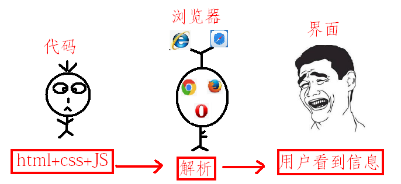

# JS认识

## 浏览器

> 浏览器是指可以显示网页服务器或者文件系统的HTML文件内容，并让用户与这些文件交互的一种软件。
> 通俗的讲:可以显示页面的一个软件,
> 国内网民计算机上常见的网页浏览器有，QQ浏览器、Internet Explorer、Firefox、Safari，Opera、Google Chrome、百度浏览器、搜狗浏览器、猎豹浏览器、360浏览器、UC浏览器、傲游浏览器、世界之窗浏览器等，浏览器是最经常使用到的客户端程序。

### 常用浏览器

常用的五大浏览器：chrome，firefox，Safari，ie，opera
我们用chrome(谷歌浏览器)

## 网页、网站和应用程序

网页：单独的一个页面
网站：一系列相关的页面组成到一起
应用程序：可以和用户产生交互，并实现某种功能。

## 演示JavaScript的强大

[impress.github](http://impress.github.io/impress.js/)

[naotu.baidu](http://naotu.baidu.com/)

[codecombat](https://codecombat.com/)
[ide.codemao](https://ide.codemao.cn/)

**需要翻墙**
[developers.google.com](https://developers.google.com/blockly/)
blockly迷宫
[blockly-games.appspot](https://blockly-games.appspot.com)

blockly迷宫不需要翻墙
[blockly.uieee](https://blockly.uieee.com/)

## JS介绍
