# Git常用命令

| 命令名称                            | 作用           | 例子                                           |
| ------------------------------------- | ---------------- | ------------------------------------------------ |
| git config --global username 用户名 | 设置用户签名   | git config --global username xbzxit            |
| git config --global useremail 邮箱  | 设置用户签名   | git config --global username xbzxit@163.com    |
| git config --global http.sslVerify false | ||
| git init                            | 初始化本地库   | 指定文件或目录使用git管理                      |
| git status                          | 查看本地库状态 |                                                |
| git add 文件名                      | 添加到暂存区   | git add a.txt  加入版本控制                   |
| git commit -m"日志信息”文件名      | 提交到本地库   | git commit -m"必须加注释"  修改内容的一些备注 |
| git reflog                          | 查看历史记录   |                                                |
| git reset --hard 版本号             | 版本穿梭       |                                                |

## 设置用户签名

> git config --global user.name xbzxit
>
> git config --global user.email xbzxit@163.com

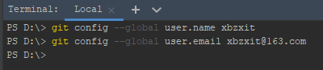

* C:/用户/HFZJ/.gitconfig

> 说明： 签名的作用是区分不同操作者身份。用户的签名信息在每一个版本的提交信息中能够看到，以此确认本次提交是谁做的。Git 首次安装必须设置一下用户签名，否则无法提交代码。

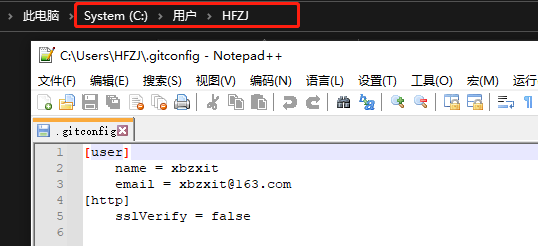

**※注意：这里设置用户签名和将来登录 GitHub（或其他代码托管中心）的账号没有任 何关系。**

## 初始化本地仓库

> git init

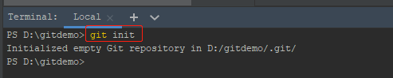

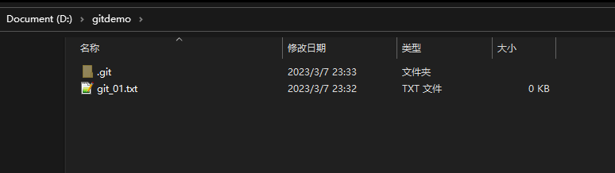

## 查看本地库状态

> git status

### 首次查看

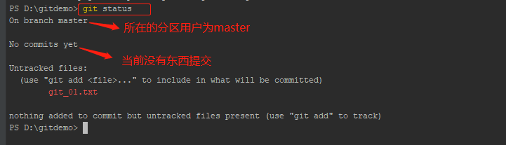

### 新增文件内容

> git_01.txt

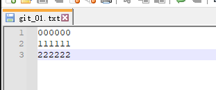

### 再次查看

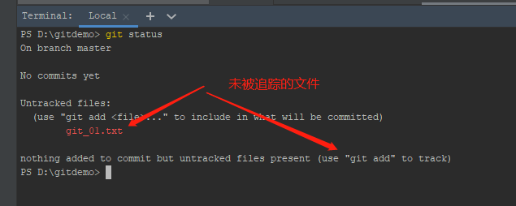

## 添加暂存区

> git add 文件名

### 提交文件并查看

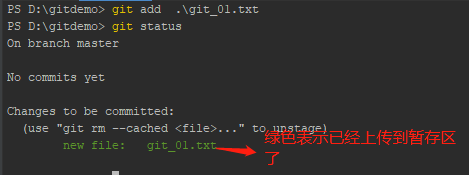

### 删除暂存区文件

> git rm --cached 文件名

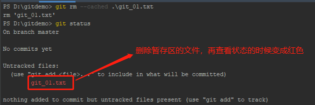

### 查看工作区的文件

> ls

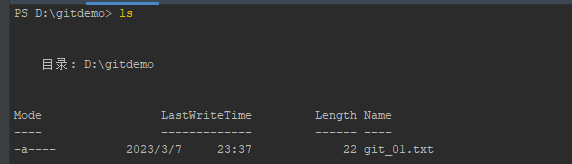

## 提交本地仓库

> git commit -m "提交新的文件" 文件名

### 提交文件

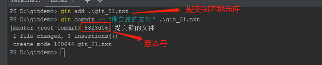

### 查看状态

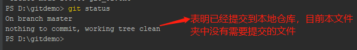

### 查看引用日记信息

> git reflog

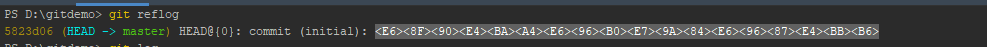

### 查看日记详细信息

> git log

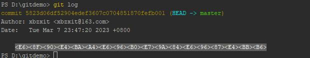

## 修改文件

### 对原来的文件进行修改

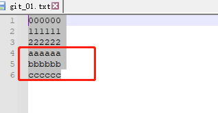

### 查看状态

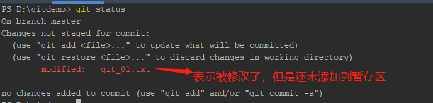

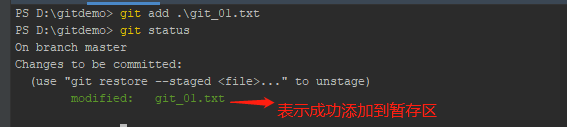

### 提交到本地仓库

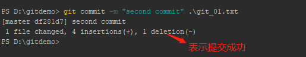

## 历史版本

> git reflog / git log

## 版本穿梭

> git reset --hard 版本号

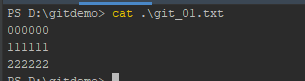
