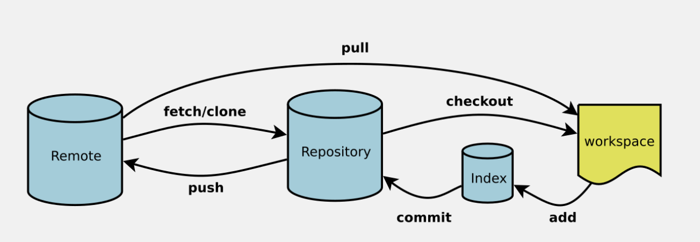

# Git概述

> Git 是一个免费的、开源的分布式版本控制系统，可以快速高效地处理从小型到大型的各种 项目。




```bash
1. 开发写好文件 使用 add 命令放入到暂存区
2. 在通过 commit 命令提交到 本地仓库
3. 通过 push 命令将文件推送到远程仓库
4. 可以通过clone 命令将远程的代码 下载到本地仓库
5. 可用过 checkout 将代码签出到本地
6. 可以直接通过pull 命令将代码从远程下载到本地
```
