# IDEA集成Git

## 忽略的文件

> *.idea
>
> target

### idea特有的文件

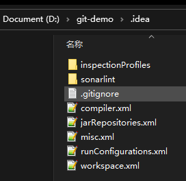

### class文件

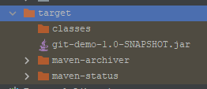

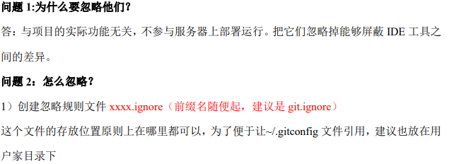

## git.ignore

> 存放位置 `C:/Users/HFZJ/git.ignore`

```properties
# Compiled class file
*.class
# Log file
*.log
# BlueJ files
*.ctxt
# Mobile Tools for Java (J2ME)
.mtj.tmp/
# Package Files #
*.jar
*.war
*.nar
*.ear
*.zip
*.tar.gz
*.rar
# virtual machine crash logs, see 
http://www.java.com/en/download/help/error_hotspot.xml
hs_err_pid*
.classpath
.project
.settings
target
.idea
*.iml
```

### .gitconfig

> .gitconfig 中引入  git.ignore

```properties
[user]
	name = xbzxit
	email = xbzxit@163.com
[http]
	sslVerify = false
[core]
	excludesfile = C:/Users/HFZJ/git.ignore
```

## IDEA集成Git

### IDEA中配置Git

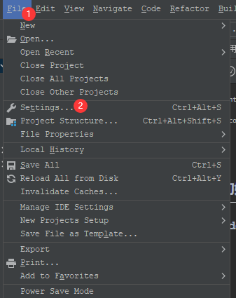

* 配置git 并测试git 是否成功

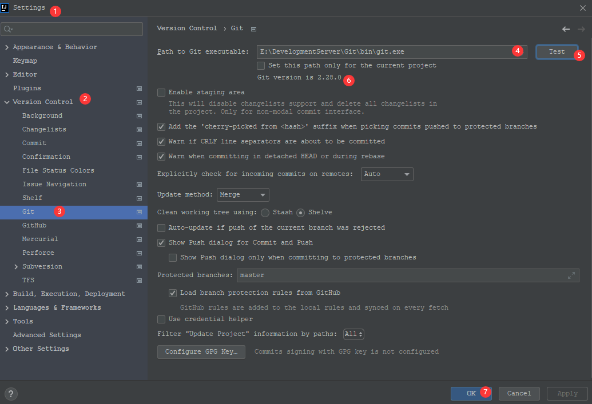


### 用Git做版本控制


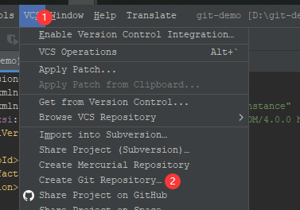


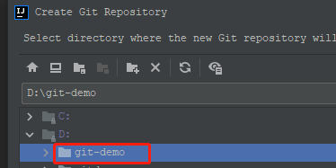


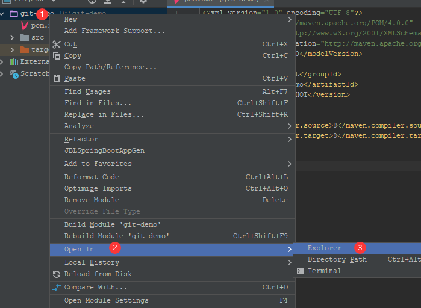


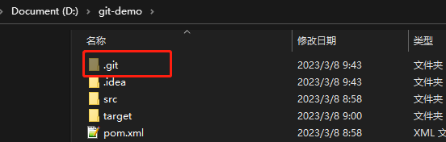

目录多了.git文件


### 添加到暂存区

### 添加之前

> 没有版本控制是红色

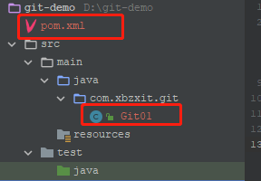

### 添加后

> 使用add命令变绿色

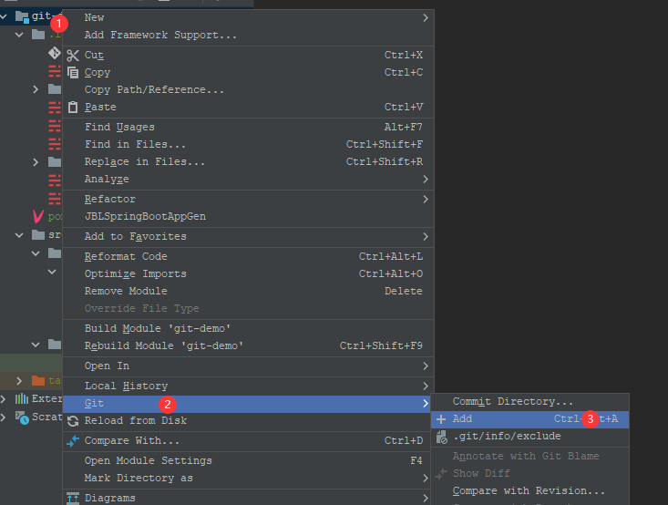

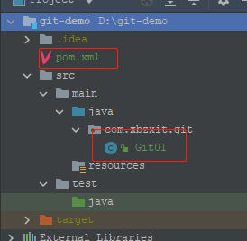


### 提交到本地仓库


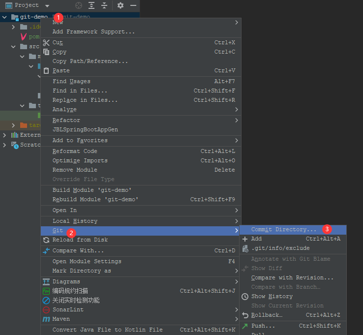

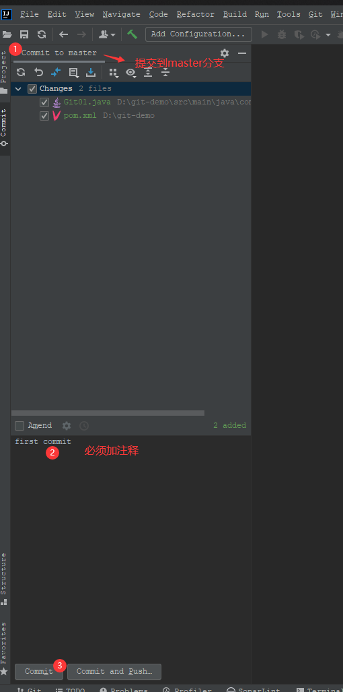


### 提交的仓库后

> 变白色

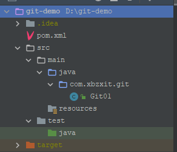

### 修改文件

> 变蓝色

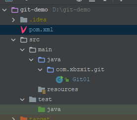


## 切换分支

### 查看当前分支

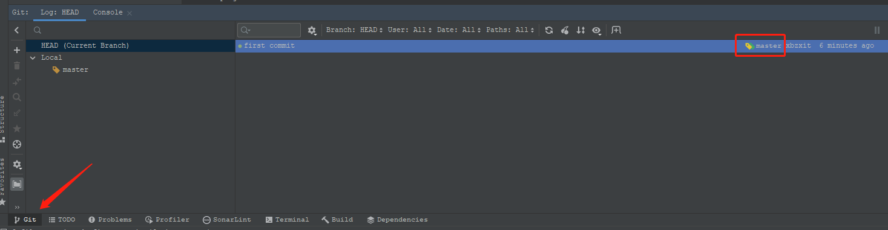

### 切换版本

> 分支- Checkout

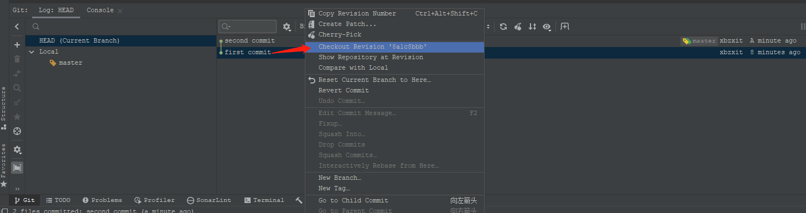

### 创建分支

> Git - New Branch...

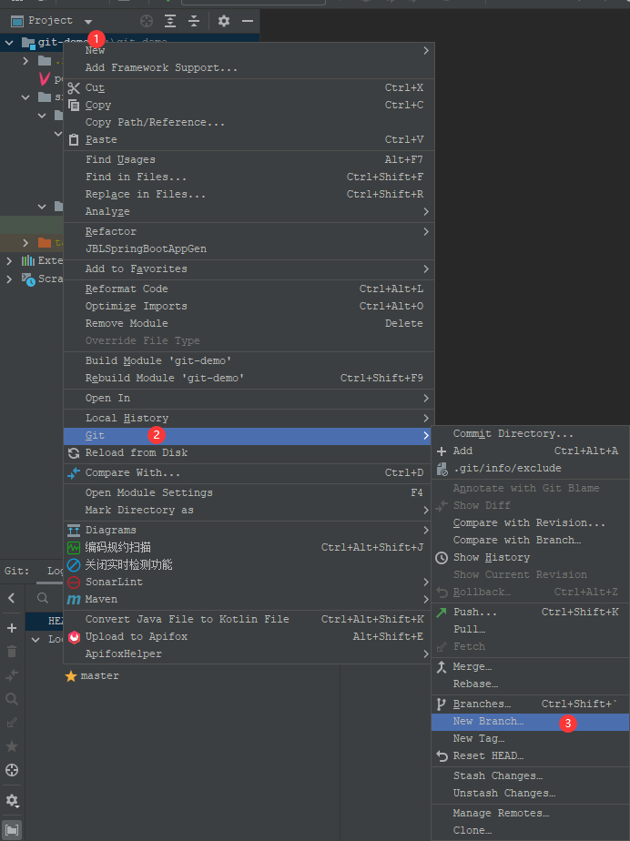

切换到新创建的分支

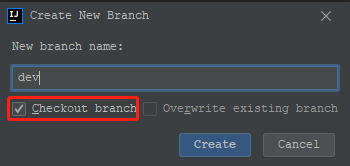

### 切换分支

* 右下角切换分支

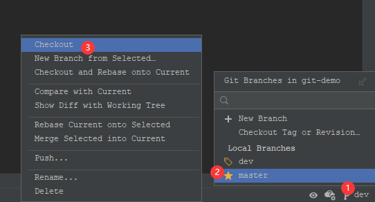

* 如果右下角没有

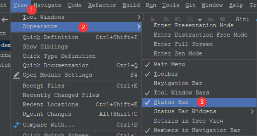

* 最下方右键


### 合并分支

> 就是将A 分支上的代码合并到B分支上

### master分支

> 黄色的是当前分支

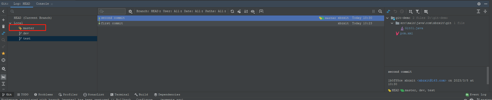

* 右下角切换分支

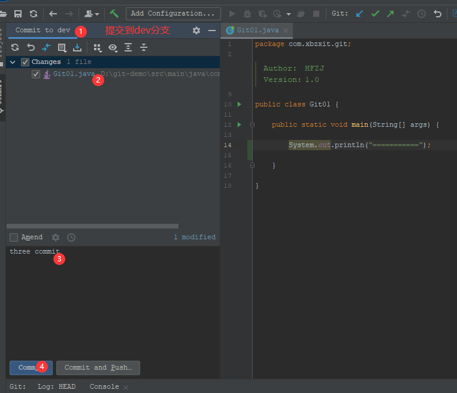

* 合并分支到master
  > Git - Branches - dev分支 - Merge Current into Current
  >

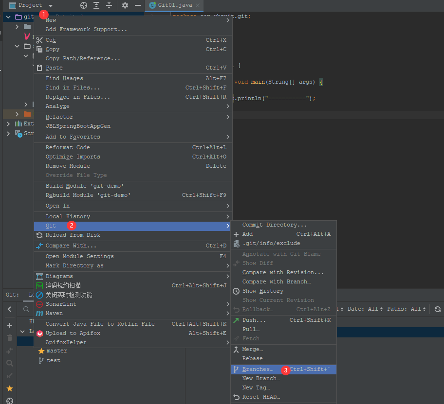

* 没有冲突时会自动合并

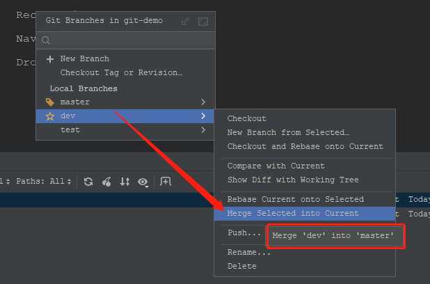

* 有冲突时要解决冲突再合并

> 分别切换到master, dev分支上 修改文件内容并提交
>
> 切换到master 分支上
>
> 将 dev 分支进行合并到master 上就会冲突

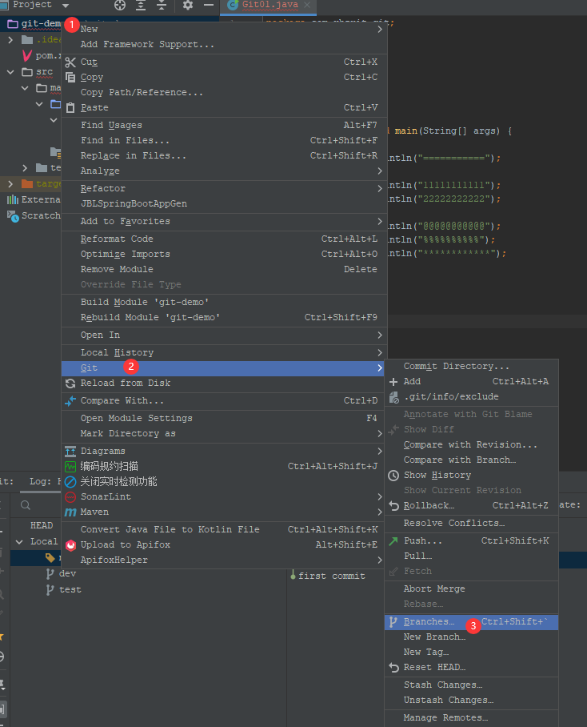

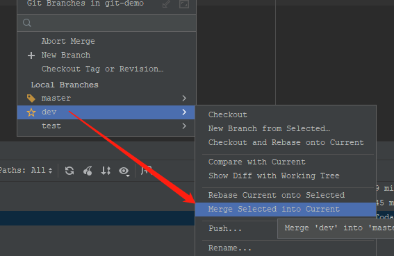

### 解决冲突

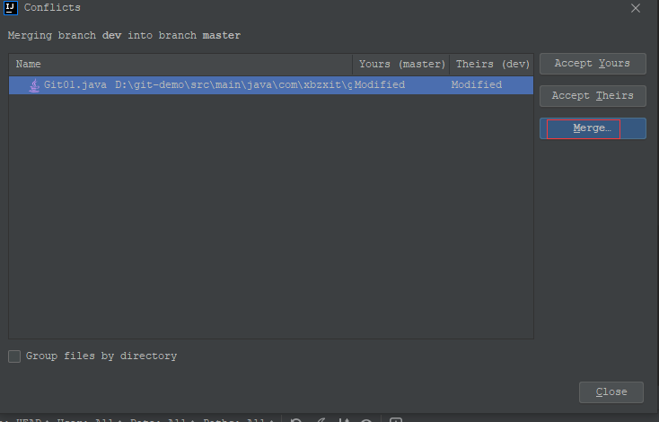

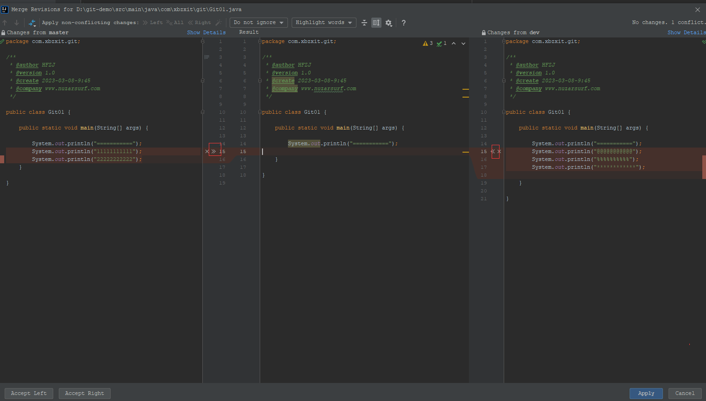

* 不解决冲突

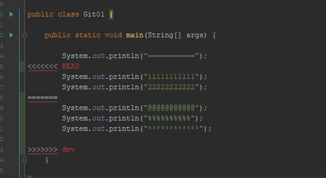


## Git分支详解

> 顾名思义，在git中，分支指的是从主线上分离出来进行另外的操作，既不影响主线，主线又可以继续干它的事，
>
> 它可用来解决临时需求；当分支做完事后可合并到主线上，而分支的任务完成可以删掉了。
