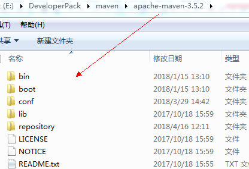
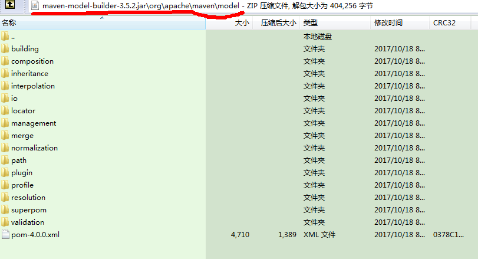
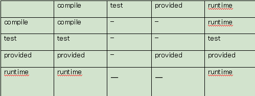
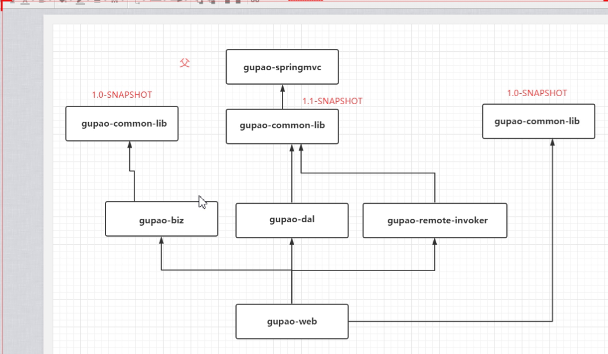
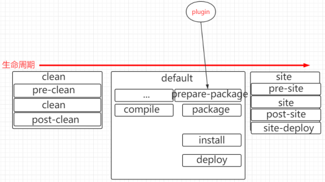
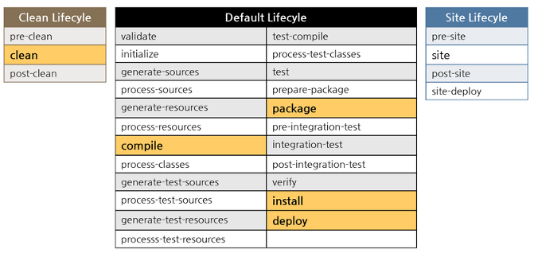

# Maven介绍

## Maven简介

### maven优势

* 约定优于配置 convention over configertion
* 简单
* 测试支持
* 构建简单
* CI
* 插件丰富


### 下载Maven

[下载maven](http://maven.apache.org/download.cgi)


### maven目录结构




### 超级Pom




## maven项目的gav

> groupId 是公司域名
>
> artifactId是模块名
>
> version 主版本号.次版本号.增量版本号-里程碑版本

```xml
<groupId>com.xbzxit</groupId>
<artifactId>javamaven</artifactId>
<version>1.1.1</version>
```

```xml
<dependency>
    <groupId>junit</groupId>
    <artifactId>junit</artifactId>
    <version>4.12</version>
    scope的存在的意义在于生产中不需要的jar 不要打包
        compile 编译
        test 测试
        provided 编译， 不会打包 servlet
        runtime 运行时 比如数据驱动类
        system 系统
       import
<systemPath>/demo/java</systemPath>-->


排除包
<exclusions>
    <exclusion>
        <groupId></groupId>
        <artifactId></artifactId>
    </exclusion>
</exclusions>-->
```





最短路径原则  （依赖短（少））

加载先后原则  （在pom.xml中的位置）


### dependencyManagement

> 只是管理版本号的
> 只能在父pom出现
> 统一版本号
> 声明
>
> dependencyManagement中的依赖，子工程是不会依赖的


## 声明周期

> lifecycle phase goal
>
> **1. A Build Lifecycle is Made Up of Phases( phases ----  clean  default  site)**
>
> **2. A Build Phase is Made Up of Plugin Goals()**  一个Phase是由多个Goals构建的。






```xml
<execution>
    <phase>package</phase>
    <goals>
        <goal>1</goal>
        <goal>2</goal>
    </goals>
</execution>
```

```bash
clean:help

clean:clean

冒号后面的就是goal

clean 就是phase
```


## 常用命令

```bash
compile 
clean  删除target
test  运行写的junit
package 打包
install    发布到本地仓库  
deploy  发布到私服

mvn dependency:tree > d.txt


mvn clean package -U(强制拉一次)


 mvn versions:set -DnewVersion=1.1


mvn version:set -DnewVersion=1.1-SNAPSHOT


mvn clean install -Dmaven.test.skip=true


repository  删除
```
