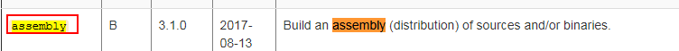

# Maven常见插件

## mvn插件库

[apache plugin]([http://maven.apache.org/plugin](http://maven.apache.org/plugin))

[mojohaus plugin]([http://www.mojohaus.org/plugins.html](http://www.mojohaus.org/plugins.html))

## 插件的使用

### 访问地址

[plugin]([https://maven.apache.org/plugins/index.html](https://maven.apache.org/plugins/index.html))

### 搜索插件


### 锁定插件



### example


[](https://)

## 查找静态代码的bug

> 该插件是建立在字节码上的， 第一次是不能用的， 要编译后才能使用。
>
> 该插件可以帮你解决一些静态代码的bug

```xml
<plugin>
  <groupId>org.codehaus.mojo</groupId>
  <artifactId>findbugs-maven-plugin</artifactId>
  <version>3.0.0</version>
  <configuration>
    <threshold>High</threshold>
    <effort>Default</effort>
    <findbugsXmlOutput>true</findbugsXmlOutput>
    <findbugsXmlOutputDirectory>target/site</findbugsXmlOutputDirectory>
  </configuration>
</plugin>
```

## 统一版本号

> 统一升级版本号
>
> mvn versions:set=DnewVersion=1.1

```xml
<plugin>
    <groupId>org.codehaus.mojo</groupId>
    <artifactId>versions-maven-plugin</artifactId>
    <version>2.3</version>
</plugin>
```

## 打包一个可执行的jar

> 可以将源码打包成一个可以执行的jar

```xml
<plugin>
    <artifactId>maven-assembly-plugin</artifactId>
    <version>3.0.0</version>
    <configuration>
        <archive>
            <manifest>
                <mainClass>com.test.Test</mainClass>
            </manifest>
        </archive>
        <descriptorRefs>
            <descriptorRef>jar-with-dependencies</descriptorRef>
        </descriptorRefs>
    </configuration>
    <executions>
        <execution>
            <id>make-assembly</id>
            <phase>package</phase>
            <goals>
                <goal>single</goal>
            </goals>
        </execution>
    </executions>
</plugin>
```

## 打包resource

> 可以将你的源代码打成带sources的jar

```xml
<plugin>
    <artifactId>maven-source-plugin</artifactId>
    <version>2.3</version>
    <executions>
        <execution>
            <id>attach-sources</id>
            <phase>install</phase>  <!-- 表示install的时候才会执行该插件 -->
            <goals>
                <goal>jar-no-fork</goal>
            </goals>
        </execution>
    </executions>
</plugin>
```

## 编译插件

> 编译Java源码，一般只需设置编译的jdk版本

```xml
<plugin>
    <groupId>org.apache.maven.plugins</groupId>
    <artifactId>maven-compiler-plugin</artifactId>
    <version>3.6.0</version>
    <configuration>
        <source>1.8</source>
        <target>1.8</target>
    </configuration>
</plugin>
```

```properties
<properties>
        <project.build.sourceEncoding>UTF-8</project.build.sourceEncoding>
        <maven.compiler.source>1.8</maven.compiler.source>
        <maven.compiler.target>1.8</maven.compiler.target>
</properties>
```

## 依赖文件单独打包

> 用于复制依赖的jar包到指定的文件夹里

```xml
<plugin>
    <groupId>org.apache.maven.plugins</groupId>
    <artifactId>maven-dependency-plugin</artifactId>
    <version>2.10</version>
    <executions>
        <execution>
            <id>copy-dependencies</id>
            <phase>package</phase>
            <goals>
                <goal>copy-dependencies</goal>
            </goals>
            <configuration>
                <outputDirectory>${project.build.directory}/lib</outputDirectory>
            </configuration>
        </execution>
    </executions>
</plugin>

```

## 指定运行的主类

> 打成jar时，设定manifest的参数，比如指定运行的Main class，还有依赖的jar包，加入classpath中

```xml
<plugin>
    <groupId>org.apache.maven.plugins</groupId>
    <artifactId>maven-jar-plugin</artifactId>
    <version>2.4</version>
    <configuration>
        <archive>
            <manifest>
                <addClasspath>true</addClasspath>
                <classpathPrefix>/data/lib</classpathPrefix>
                <mainClass>com.zhang.spring.App</mainClass>
            </manifest>
        </archive>
    </configuration>
</plugin>

```

## 在maven运行ant任务

> 在maven中运行Ant任务，比如在打包阶段，对文件进行复制

```xml
<plugin>
    <groupId>org.apache.maven.plugins</groupId>
    <artifactId>maven-antrun-plugin</artifactId>
    <version>1.7</version>
    <executions>
        <execution>
            <phase>package</phase>
            <goals>
                <goal>run</goal>
            </goals>
            <configuration>
                <target name="copy">
                    <delete>
                        <fileset dir="target" includes="*.properties"></fileset>
                    </delete>
                    <copy todir="target">
                        <fileset dir="files"></fileset>
                    </copy>
                </target>
            </configuration>
        </execution>
    </executions>
</plugin>

```

## 一键部署

> 用于一键部署，把本地打包的jar文件，上传到远程服务器上，并执行服务器上的shell命令

```xml
<plugin>
    <groupId>org.codehaus.mojo</groupId>
    <artifactId>wagon-maven-plugin</artifactId>
    <version>1.0</version>
    <configuration>
        <serverId>crawler</serverId>
        <fromDir>target</fromDir>
        <includes>*.jar,*.properties,*.sh</includes>
        <url>sftp://192.168.1.100/home/xbzxit</url>
        <commands>
            <command>chmod 755 /home/xbzxit/startup.sh</command>
            <command>/home/xbzxit/startup.sh</command>
        </commands>
        <displayCommandOutputs>true</displayCommandOutputs>
    </configuration>
</plugin>
```

## 远程部署

> 用于远程部署Java Web项目

```xml
<plugin>
    <groupId>org.apache.tomcat.maven</groupId>
    <artifactId>tomcat7-maven-plugin</artifactId>
    <version>2.2</version>
    <configuration>
        <url>http://59.110.162.178:8080/manager/text</url>
        <username>linjinbin</username>
        <password>linjinbin</password>
    </configuration>
</plugin>


<plugin>
    <groupId>org.apache.tomcat.maven</groupId>
    <artifactId>tomcat7-maven-plugin</artifactId>
    <version>2.2</version>
    <configuration>
        <port>8080</port>
        <path>/</path>
    </configuration>
</plugin>
```

## 多个jar包合成一个包

> 一般Java项目都会依赖其他第三方jar包，最终打包时，希望把其他jar包包含在一个jar包里

```xml
<plugin>
    <groupId>org.apache.maven.plugins</groupId>
    <artifactId>maven-shade-plugin</artifactId>
    <version>2.4.3</version>
    <executions>
        <execution>
            <phase>package</phase>
            <goals>
                <goal>shade</goal>
            </goals>
            <configuration>
                <transformers>
                    <transformer
                        implementation="org.apache.maven.plugins.shade.resource.ManifestResourceTransformer">
                        <manifestEntries>
                            <Main-Class>com.meiyou.topword.App</Main-Class>
                            <X-Compile-Source-JDK>${maven.compile.source}</X-Compile-Source-JDK>
                            <X-Compile-Target-JDK>${maven.compile.target}</X-Compile-Target-JDK>
                        </manifestEntries>
                    </transformer>
                </transformers>
            </configuration>
        </execution>
    </executions>
</plugin>

```

## 打包的详细配置

```xml
<plugin>
	<artifactId>maven-assembly-plugin</artifactId>
	<configuration>
		<!-- not append assembly id in release file name -->
		<appendAssemblyId>false</appendAssemblyId>
		<descriptors>
			<!--打包的详细描述，需要配置额外文件-->
			<descriptor>src/main/build/package.xml</descriptor>
		</descriptors>
	</configuration>
	<executions>
		<execution>
			<id>make-assembly</id>
			<phase>package</phase>
			<goals>
				<goal>single</goal>
			</goals>
		</execution>
	</executions>
</plugin>
```

### package.xml

```xml
<?xml version="1.0" encoding="UTF-8"?>
<assembly xmlns="http://maven.apache.org/plugins/maven-assembly-plugin/assembly/1.1.3" xmlns:xsi="http://www.w3.org/2001/XMLSchema-instance"
          xsi:schemaLocation="http://maven.apache.org/plugins/maven-assembly-plugin/assembly/1.1.3 http://maven.apache.org/xsd/assembly-1.1.3.xsd">
    <id>package</id>
    <formats>
        <!--压缩文件的类型-->
        <format>zip</format>
    </formats>
    <includeBaseDirectory>true</includeBaseDirectory>
    <fileSets>
        <!--需要包含的文件与输出的路径-->
        <fileSet>
            <directory>src/main/bin</directory>
            <outputDirectory>bin/</outputDirectory>
        </fileSet>
        <fileSet>
            <directory>src/main/resources</directory>
            <outputDirectory>/</outputDirectory>
        </fileSet>
        <fileSet>
            <directory>${project.build.directory}</directory>
            <outputDirectory>/</outputDirectory>
            <includes>
                <include>*.jar</include>
            </includes>
        </fileSet>
    </fileSets>
    <dependencySets>
        <dependencySet>
            <outputDirectory>lib</outputDirectory>
            <scope>runtime</scope>
            <excludes>
                <exclude>${groupId}:${artifactId}</exclude>
            </excludes>
        </dependencySet>
    </dependencySets>
</assembly>
```

## 版本升级

> 该插件可以更改父工程下所有model中pom.xml中父工程的版本

```xml
<build>
    <plugins>
        <plugin>
            <groupId>org.codehaus.mojo</groupId>
            <artifactId>versions-maven-plugin</artifactId>
            <version>2.1</version>
        </plugin>
    </plugins>
</build>
```
