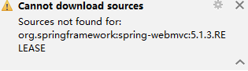
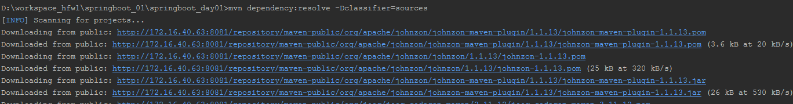
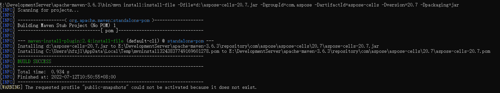

## Maven常见问题

## 解决.lastUpdated

> 出现.lastUpdated结尾的文件的原因：由于网络原因没有将Maven的依赖下载完整导致。

```json
1. 删除所有以.lastUpdate结尾的文件
切换到maven的本地仓库
在当前目录打开cmd命令行
执行命令：for /r %i in (*.lastUpdated) do del %i

2. 在项目上执行 Maven Update （Alt + F5）

```

## cannot download sources



**解决方案**



mvn dependency:resolve -Dclassifier=sources

## idea导入的项目无法识别

```bash
通过其他方式创建的maven项目，用IDEA打开时若没有识别，右键点击项目里的pom.xml文件，选择“add as maven project”即可。
不识别的原因可能是用IDEA打开的不是项目文件夹，项目文件夹还有个上级文件夹，IDEA打开上级文件夹时能载入项目文件，但识别不到这是个项目文件。
```

## 将第三方Jar打包到仓库

```bash
## 先进入到maven bin目录下，再打开命令行窗口
mvn install:install-file -Dfile=d:\setup\dubbo-2.8.4.jar -DgroupId=com.alibaba -DartifactId=dubbo -Dversion=2.8.4 -Dpackaging=jar
```


