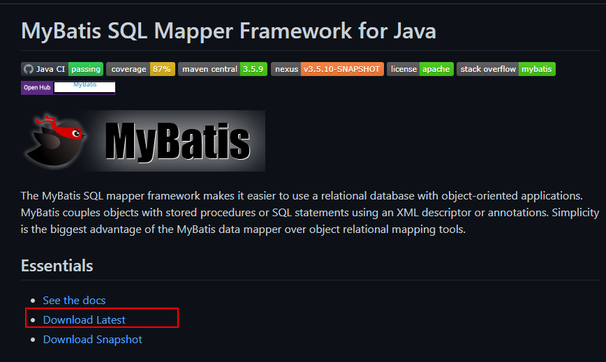
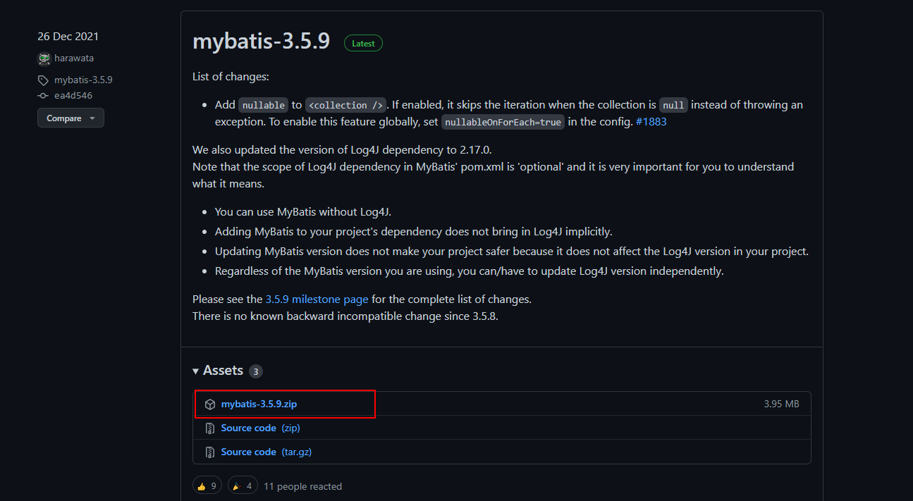
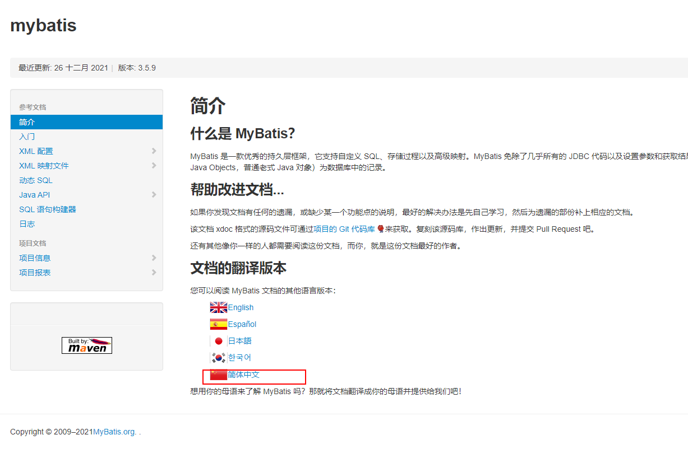
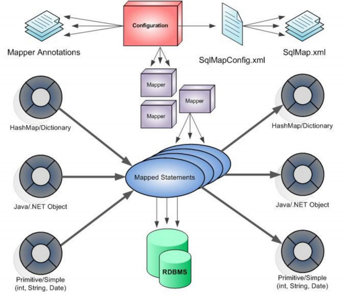
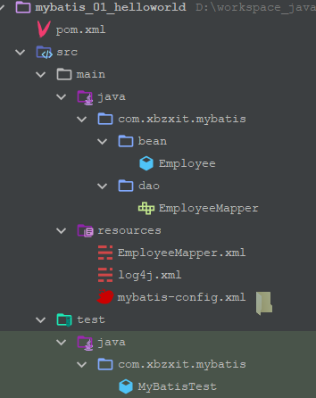

# Mybatis介绍

## 什么是mybatis

> MyBatis 是一款优秀的持久层框架，它支持自定义 SQL、存储过程以及高级映射。MyBatis 免除了几乎所有的 JDBC 代码以及设置参数和获取结果集的工作。MyBatis 可以通过简单的 XML 或注解来配置和映射原始类型、接口和 Java POJO（Plain Old Java Objects，普通老式 Java 对象）为数据库中的记录。

## 下载mybatis

[下载官网](https://github.com/mybatis/mybatis-3)   [官方文档](https://mybatis.org/mybatis-3/)








## Mybatis架构图




## 入门HelloWorld

### 项目结构



### 导入依赖 pom.xml

```xml
<?xml version="1.0" encoding="UTF-8"?>
<project xmlns="http://maven.apache.org/POM/4.0.0"
         xmlns:xsi="http://www.w3.org/2001/XMLSchema-instance"
         xsi:schemaLocation="http://maven.apache.org/POM/4.0.0 http://maven.apache.org/xsd/maven-4.0.0.xsd">
    <modelVersion>4.0.0</modelVersion>

    <groupId>com.xbzxit.mybatis</groupId>
    <artifactId>mybatis_01_helloworld</artifactId>
    <version>1.0-SNAPSHOT</version>

    <properties>
        <maven.compiler.source>8</maven.compiler.source>
        <maven.compiler.target>8</maven.compiler.target>
    </properties>

    <dependencies>
        <dependency>
            <groupId>org.mybatis</groupId>
            <artifactId>mybatis</artifactId>
            <version>3.5.7</version>
        </dependency>

        <dependency>
            <groupId>log4j</groupId>
            <artifactId>log4j</artifactId>
            <version>1.2.17</version>
        </dependency>

        <dependency>
            <groupId>mysql</groupId>
            <artifactId>mysql-connector-java</artifactId>
            <version>8.0.27</version>
        </dependency>

        <dependency>
            <groupId>junit</groupId>
            <artifactId>junit</artifactId>
            <version>4.13.2</version>
            <scope>test</scope>
        </dependency>
    </dependencies>
</project>
```

### 编写mybatis-config.xml

```xml
<?xml version="1.0" encoding="UTF-8" ?>
<!DOCTYPE configuration
        PUBLIC "-//mybatis.org//DTD Config 3.0//EN"
        "http://mybatis.org/dtd/mybatis-3-config.dtd">
<configuration>
    <environments default="development">
        <environment id="development">
            <transactionManager type="JDBC" />
            <dataSource type="POOLED">
                <property name="driver" value="com.mysql.jdbc.Driver" />
                <property name="url" value="jdbc:mysql://localhost:3306/mybatis" />
                <property name="username" value="root" />
                <property name="password" value="root" />
            </dataSource>
        </environment>
    </environments>
    <!-- 将我们写好的sql映射文件（EmployeeMapper.xml）一定要注册到全局配置文件（mybatis-config.xml）中 -->
    <mappers>
        <mapper resource="EmployeeMapper.xml" />
    </mappers>
</configuration>
```

### 编写日志文件

```xml
<?xml version="1.0" encoding="UTF-8" ?>
<log4j:configuration xmlns:log4j="http://jakarta.apache.org/log4j/">

    <appender name="STDOUT" class="org.apache.log4j.ConsoleAppender">
        <param name="Encoding" value="UTF-8" />
        <layout class="org.apache.log4j.PatternLayout">
            <param name="ConversionPattern" value="%-5p %d{MM-dd HH:mm:ss,SSS} %m  (%F:%L) \n" />
        </layout>
    </appender>
    <logger name="java.sql">
        <level value="debug" />
    </logger>
    <logger name="org.apache.ibatis">
        <level value="info" />
    </logger>
    <root>
        <level value="debug" />
        <appender-ref ref="STDOUT" />
    </root>
</log4j:configuration>
```

### 编写POJO

```java
package com.xbzxit.mybatis.bean;

/**
 * @author xbzxit
 * @version 1.0
 * @create 2022-03-27-15:07
 * @company www.xbzxit.com
 */

public class Employee {

    private Integer id;
    private String lastName;
    private String email;
    private String gender;


    public Integer getId() {
        return id;
    }
    public void setId(Integer id) {
        this.id = id;
    }
    public String getLastName() {
        return lastName;
    }
    public void setLastName(String lastName) {
        this.lastName = lastName;
    }
    public String getEmail() {
        return email;
    }
    public void setEmail(String email) {
        this.email = email;
    }
    public String getGender() {
        return gender;
    }
    public void setGender(String gender) {
        this.gender = gender;
    }
    @Override
    public String toString() {
        return "Employee [id=" + id + ", lastName=" + lastName + ", email="
                + email + ", gender=" + gender + "]";
    }

}
```

### 编写Mapper接口

```java
package com.xbzxit.mybatis.dao;

import com.xbzxit.mybatis.bean.Employee;

/**
 * @author xbzxit
 * @version 1.0
 * @create 2022-03-27-15:06
 * @company www.xbzxit.com
 */


public interface EmployeeMapper {

    public Employee getEmpById(Integer id);

}

```

### 编写Mapper.xml

```xml
<?xml version="1.0" encoding="UTF-8" ?>
<!DOCTYPE mapper
        PUBLIC "-//mybatis.org//DTD Mapper 3.0//EN"
        "http://mybatis.org/dtd/mybatis-3-mapper.dtd">
<mapper namespace="com.xbzxit.mybatis.dao.EmployeeMapper">
    <!--
    namespace:名称空间;指定为接口的全类名
    id：唯一标识
    resultType：返回值类型
    #{id}：从传递过来的参数中取出id值

    public Employee getEmpById(Integer id);
     -->
    <select id="getEmpById" resultType="com.xbzxit.mybatis.bean.Employee">
        select id,last_name lastName,email,gender from tbl_employee where id = #{id}
    </select>
</mapper>
```

### 编写测试类

```java
package com.xbzxit.mybatis;

/**
 * @author xbzxit
 * @version 1.0
 * @create 2022-03-27-15:06
 * @company www.xbzxit.com
 */

import com.xbzxit.mybatis.bean.Employee;
import com.xbzxit.mybatis.dao.EmployeeMapper;
import org.apache.ibatis.io.Resources;
import org.apache.ibatis.session.SqlSession;
import org.apache.ibatis.session.SqlSessionFactory;
import org.apache.ibatis.session.SqlSessionFactoryBuilder;
import org.junit.Test;

import java.io.IOException;
import java.io.InputStream;

/**
 * 1、接口式编程
 * 	原生：		Dao		====>  DaoImpl
 * 	mybatis：	Mapper	====>  xxMapper.xml
 *
 * 2、SqlSession代表和数据库的一次会话；用完必须关闭；
 * 3、SqlSession和connection一样她都是非线程安全。每次使用都应该去获取新的对象。
 * 4、mapper接口没有实现类，但是mybatis会为这个接口生成一个代理对象。
 * 		（将接口和xml进行绑定）
 * 		EmployeeMapper empMapper =	sqlSession.getMapper(EmployeeMapper.class);
 * 5、两个重要的配置文件：
 * 		mybatis的全局配置文件：包含数据库连接池信息，事务管理器信息等...系统运行环境信息
 * 		sql映射文件：保存了每一个sql语句的映射信息：
 * 					将sql抽取出来。
 *
 *
 * @author lfy
 *
 */
public class MyBatisTest {


    public SqlSessionFactory getSqlSessionFactory() throws IOException {
        String resource = "mybatis-config.xml";
        InputStream inputStream = Resources.getResourceAsStream(resource);
        return new SqlSessionFactoryBuilder().build(inputStream);
    }

    /**
     * 1、根据xml配置文件（全局配置文件）创建一个SqlSessionFactory对象 有数据源一些运行环境信息
     * 2、sql映射文件；配置了每一个sql，以及sql的封装规则等。
     * 3、将sql映射文件注册在全局配置文件中
     * 4、写代码：
     * 1）、根据全局配置文件得到SqlSessionFactory；
     * 2）、使用sqlSession工厂，获取到sqlSession对象使用他来执行增删改查
     * 一个sqlSession就是代表和数据库的一次会话，用完关闭
     * 3）、使用sql的唯一标志来告诉MyBatis执行哪个sql。sql都是保存在sql映射文件中的。
     *
     * @throws IOException
     */
    @Test
    public void test() throws IOException {

        // 2、获取sqlSession实例，能直接执行已经映射的sql语句
        // sql的唯一标识：statement Unique identifier matching the statement to use.
        // 执行sql要用的参数：parameter A parameter object to pass to the statement.
        SqlSessionFactory sqlSessionFactory = getSqlSessionFactory();

        SqlSession openSession = sqlSessionFactory.openSession();
        try {
            Employee employee = openSession.selectOne(
                    "com.xbzxit.mybatis.EmployeeMapper.selectEmp", 1);
            System.out.println(employee);
        } finally {
            openSession.close();
        }

    }

    @Test
    public void test01() throws IOException {
        // 1、获取sqlSessionFactory对象
        SqlSessionFactory sqlSessionFactory = getSqlSessionFactory();
        // 2、获取sqlSession对象
        SqlSession openSession = sqlSessionFactory.openSession();
        try {
            // 3、获取接口的实现类对象
            //会为接口自动的创建一个代理对象，代理对象去执行增删改查方法
            EmployeeMapper mapper = openSession.getMapper(EmployeeMapper.class);
            Employee employee = mapper.getEmpById(1);
            System.out.println(mapper.getClass());
            System.out.println(employee);
        } finally {
            openSession.close();
        }

    }
}
```

[](https://)
