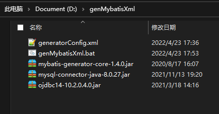
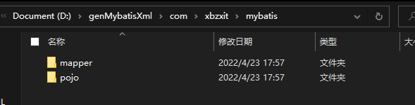
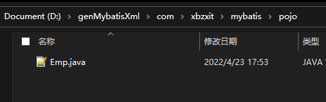
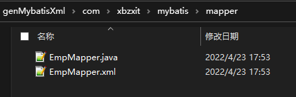

# 逆向工程

> mybatis 接口 实体类，xml 都是和数据库表的字段对应，纯手敲很麻烦，所以有自动帮我们生成代码的工具

## 新建工程

> 将下在的文件夹放在D盘的根目录



[下载代码生成工具](https://pan.baidu.com/s/1GA5Q73_A-0fqSNOyruDWAA?pwd=f2ng)

## generatorConfig.xml

> classPathEntry 根据不同的数据库选择不同的驱动
>
> jdbcConnection 根据不同的数据库选择不同的驱动类，链接串、
>
> javaModeGenerator 指定POJO所在的包路径
>
> sqlMapGenerator  指定Mapper.java所在的包路径
>
> javaClientGenerator  指定Mapper.xml所在的包路径
>
> tab 指定要生成的表

```xml
<?xml version="1.0" encoding="UTF-8"?>
<!DOCTYPE generatorConfiguration
        PUBLIC "-//mybatis.org//DTD MyBatis Generator Configuration 1.0//EN"
        "http://mybatis.org/dtd/mybatis-generator-config_1_0.dtd">

<generatorConfiguration>
  
    <!-- 如果数据库是mysql用该驱动 mysql-connector-java-8.0.27.jar -->
    <classPathEntry location="ojdbc14-10.2.0.4.0.jar" />

    <!-- targetRuntime = MyBatis3  生成会带example    MyBatis3Simple 不带example  -->
    <context id="ORACLE" targetRuntime="MyBatis3Simple" defaultModelType="flat">

        <!-- 自动识别数据库关键字，默认false，如果设置为true，根据SqlReservedWords中定义的关键字列表；
        一般保留默认值，遇到数据库关键字（Java关键字），使用columnOverride覆盖 -->
        <property name="javaFileEncoding" value="utf-8"/>
        <property name="autoDelimitKeywords" value="true"/>
        <property name="mergeable" value="true"/>
        <plugin type="org.mybatis.generator.plugins.SerializablePlugin"/>

        <!-- 是否取消注释 这个注释是生成代码自带的注释，没有任何意义，所有去掉-->
        <commentGenerator>
            <property name="suppressAllComments" value="true"/>
        </commentGenerator>
  
		<!-- 数据库链接URL、用户名、密码 -->
        <!-- mysql ：com.mysql.cj.jdbc.Driver jdbc:mysql://172.31.0.135:3306/mybatis_mysql -->
        <jdbcConnection driverClass="oracle.jdbc.OracleDriver"
                        connectionURL="jdbc:oracle:thin:@172.31.0.135:1521/orcl"
                        userId="scott"
                        password="tiger">
        </jdbcConnection>

        <javaModelGenerator targetPackage="com.xbzxit.mybatis.pojo" targetProject="./">
            <property name="enableSubPackages" value="false"/>
            <property name="trimStrings" value="true"/>
        </javaModelGenerator>

        <!-- 生成mapxml文件 -->
        <sqlMapGenerator targetPackage="com.xbzxit.mybatis.mapper" targetProject="./">
            <property name="enableSubPackages" value="false"/>
        </sqlMapGenerator>

        <!-- 生成mapxml对应client，也就是接口dao -->
        <javaClientGenerator targetPackage="com.xbzxit.mybatis.mapper" targetProject="./"
                             type="XMLMAPPER">
            <property name="enableSubPackages" value="false"/>
        </javaClientGenerator>

       <!-- table可以有多个,每个数据库中的表都可以写一个table，tableName表示要匹配的数据库表,也可以在tableName属性中通过使用%通配符来匹配所有数据库表,只有匹配的表才会自动生成文件 -->
        <!-- tableName="%"  %是匹配所有的表名    schema 是库名 schema="exchangeDb"-->
        <table tableName="EMP"  enableCountByExample="true" enableUpdateByExample="true" enableDeleteByExample="true" enableSelectByExample="true" selectByExampleQueryId="true" >
            <!-- useActualColumnNames   默认为false  ， false 表示数据库表名、字段使用下划线组成， 默认生成驼峰 ；  true  如果是true 表示生成java类和数据一模一样 （切记：设计数据库不用匈牙利命名和下划线汇合使用） -->
            <property name="useActualColumnNames" value="false"/>
        </table>
    </context>
</generatorConfiguration>
```

## 运行

> 点击批处理文件`genMybatisXml.bat`运行

```bash
cmd /k "cd /d D:\genMybatisXml && java -jar mybatis-generator-core-1.4.0.jar -configfile generatorConfig.xml -overwrite"
```

## 查看生成的代码






