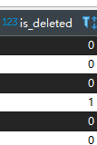

# 常用注解

## @TableName

> 指定表名， 默认是类名小写就是表名 ， 带下划线会自动替换并大写

### 表名为user

```java
@TableName("user")
public class User {
```

### 表名为t_user

```java
@TableName("t_user")
public class User {


@TableName("t_user")
public class TUser {

```

* 全局配置

```yaml
global-config:
 db-config:
   # 配置MyBatis-Plus操作表的默认前缀
  table-prefix: t_
```

## @TableId

> 主键生成策略 mybatis默认生成的id 是使用雪花算法

### value属性

> 表 主键为 uid

```java
@TableId(value="uid")


@TableId("uid")
```

### type属性

> 定义主键的生成策略

* 默认

```java
IdType.ASSIGN_ID

该策略采用雪花ID
```

* 自递

```java
IdType.AUTO

数据库主键必须设置了自增，  否则该策略无效
```

* 全局配置主键生成策略

```yaml
global-config:
 db-config:
   # 配置MyBatis-Plus的主键策略
  id-type: auto
```

## @TableField

### 指定数据库的列

```java
    @TableField("name")
```

### 列更新时值更新

```java
@TableField(fill = FieldFill.UPDATE)
```

### 列新增或者更新时值变化

```java
 @TableField(fill = FieldFill.INSERT_UPDATE)
```

### 忽略不是数据库的字段

```java
@TableField(exist = false)
```

## @TableLogic

> 逻辑删除

### 表新增一列 is_deleted




### 对应的属性加注解

```java
 @TableLogic
    private Integer isDeleted;
```


### 测试

> 删除为更新 is_deleted = 1
>
> 查询只会查询 删除标记为0的， 如果为1 或者 null 不查询

```java
    @Test
    public void testDel(){
        User user = new User();
        user.setId(7L);
        userService.removeById(user);
    }
```
