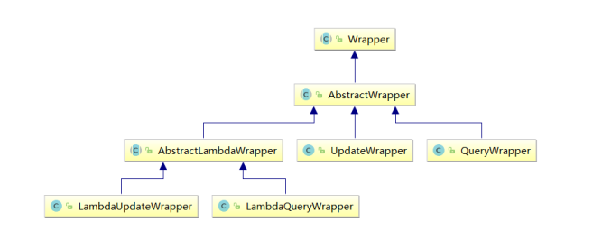

# 条件构造器

## wapper介绍



* Wrapper ： 条件构造抽象类，最顶端父类
  * AbstractWrapper ： 用于查询条件封装，生成 sql 的 where 条件
    * QueryWrapper ： 查询条件封装
    * UpdateWrapper ： Update 条件封装
    * AbstractLambdaWrapper ： 使用Lambda 语法
      * LambdaQueryWrapper ：用于Lambda语法使用的查询Wrapper
      * LambdaUpdateWrapper ： Lambda 更新封装Wrapper


## QueryWrapper

### 组装查询条件

```java
@Test
public void test01(){
  //查询用户名包含a，年龄在20到30之间，并且邮箱不为null的用户信息
  //SELECT id,username AS name,age,email,is_deleted FROM t_user WHERE is_deleted=0 AND (username LIKE ? AND age BETWEEN ? AND ? AND email IS NOT NULL)
  QueryWrapper<User> queryWrapper = new QueryWrapper<>();
  queryWrapper.like("username", "a")
     .between("age", 20, 30)
     .isNotNull("email");
  List<User> list = userMapper.selectList(queryWrapper);
  list.forEach(System.out::println);
}
```

### 组装删除条件

```java
@Test
public void test03(){
  //删除email为空的用户
  //DELETE FROM t_user WHERE (email IS NULL)
  QueryWrapper<User> queryWrapper = new QueryWrapper<>();
  queryWrapper.isNull("email");
  //条件构造器也可以构建删除语句的条件
  int result = userMapper.delete(queryWrapper);
  System.out.println("受影响的行数：" + result);
}
```

### 条件的优先级

```java
@Test
public void test04() {
  QueryWrapper<User> queryWrapper = new QueryWrapper<>();
  //将（年龄大于20并且用户名中包含有a）或邮箱为null的用户信息修改
  //UPDATE t_user SET age=?, email=? WHERE (username LIKE ? AND age > ? OR email IS NULL)
  queryWrapper
     .like("username", "a")
     .gt("age", 20)
     .or()
     .isNull("email");
  User user = new User();
  user.setAge(18);
  user.setEmail("user@atguigu.com");
  int result = userMapper.update(user, queryWrapper);
  System.out.println("受影响的行数：" + result);
}
```

### 组装select子句

```java
@Test
public void test05() {
  //查询用户信息的username和age字段
  //SELECT username,age FROM t_user
  QueryWrapper<User> queryWrapper = new QueryWrapper<>();
  queryWrapper.select("username", "age");
  //selectMaps()返回Map集合列表，通常配合select()使用，避免User对象中没有被查询到的列值为null
  List<Map<String, Object>> maps = userMapper.selectMaps(queryWrapper);
  maps.forEach(System.out::println);
}
```


### 实现子查询

```java
@Test
public void test06() {
  //查询id小于等于3的用户信息
  //SELECT id,username AS name,age,email,is_deleted FROM t_user WHERE (id IN (select id from t_user where id <= 3))
  QueryWrapper<User> queryWrapper = new QueryWrapper<>();
  queryWrapper.inSql("id", "select id from t_user where id <= 3");
  List<User> list = userMapper.selectList(queryWrapper);
  list.forEach(System.out::println);
}
```


### 组装排序条件

```java
@Test
public void test02(){
  //按年龄降序查询用户，如果年龄相同则按id升序排列
  //SELECT id,username AS name,age,email,is_deleted FROM t_user WHERE is_deleted=0 ORDER BY age DESC,id ASC
  QueryWrapper<User> queryWrapper = new QueryWrapper<>();
  queryWrapper
     .orderByDesc("age")
     .orderByAsc("id");
  List<User> users = userMapper.selectList(queryWrapper);
  users.forEach(System.out::println);
}
```

## UpdateWrapper

```java
@Test
public void test07() {
  //将（年龄大于20或邮箱为null）并且用户名中包含有a的用户信息修改
  //组装set子句以及修改条件
  UpdateWrapper<User> updateWrapper = new UpdateWrapper<>();
  //lambda表达式内的逻辑优先运算
  updateWrapper
   .set("age", 18)
   .set("email", "user@atguigu.com")
   .like("username", "a")
   .and(i -> i.gt("age", 20).or().isNull("email"));
  //这里必须要创建User对象，否则无法应用自动填充。如果没有自动填充，可以设置为null
  //UPDATE t_user SET username=?, age=?,email=? WHERE (username LIKE ? AND (age > ? OR email IS NULL))
  //User user = new User();
  //user.setName("张三");
//int result = userMapper.update(user, updateWrapper);
  //UPDATE t_user SET age=?,email=? WHERE (username LIKE ? AND (age > ? OR
email IS NULL))
  int result = userMapper.update(null, updateWrapper);
  System.out.println(result);
}
```


## condition

### 传统实现

```java
@Test
public void test08() {
  //定义查询条件，有可能为null（用户未输入或未选择）
  String username = null;
  Integer ageBegin = 10;
  Integer ageEnd = 24;
  QueryWrapper<User> queryWrapper = new QueryWrapper<>();
  //StringUtils.isNotBlank()判断某字符串是否不为空且长度不为0且不由空白符(whitespace)构成
  if(StringUtils.isNotBlank(username)){
    queryWrapper.like("username","a");
 }
  if(ageBegin != null){
    queryWrapper.ge("age", ageBegin);
 }
  if(ageEnd != null){
    queryWrapper.le("age", ageEnd);
 }
  //SELECT id,username AS name,age,email,is_deleted FROM t_user WHERE (age >= ? AND age <= ?)
  List<User> users = userMapper.selectList(queryWrapper);
  users.forEach(System.out::println);
}
```

### condition方式实现

```java
@Test
public void test08UseCondition() {
  //定义查询条件，有可能为null（用户未输入或未选择）
  String username = null;
  Integer ageBegin = 10;
  Integer ageEnd = 24;
  QueryWrapper<User> queryWrapper = new QueryWrapper<>();
  //StringUtils.isNotBlank()判断某字符串是否不为空且长度不为0且不由空白符(whitespace) 构成
  queryWrapper.like(StringUtils.isNotBlank(username), "username", "a")
     .ge(ageBegin != null, "age", ageBegin)
     .le(ageEnd != null, "age", ageEnd);
  //SELECT id,username AS name,age,email,is_deleted FROM t_user WHERE (age >=
? AND age <= ?)
  List<User> users = userMapper.selectList(queryWrapper);
  users.forEach(System.out::println);
}
```

## LambdaQueryWrapper

```java
    @Test
    public void test09() {
      //定义查询条件，有可能为null（用户未输入）
      String username = "a";
      Integer ageBegin = 10;
      Integer ageEnd = 24;
      LambdaQueryWrapper<User> queryWrapper = new LambdaQueryWrapper<>();
      //避免使用字符串表示字段，防止运行时错误
      queryWrapper
         .like(StringUtils.isNotBlank(username), User::getName, username)
         .ge(ageBegin != null, User::getAge, ageBegin)
         .le(ageEnd != null, User::getAge, ageEnd);
      List<User> users = userMapper.selectList(queryWrapper);
      users.forEach(System.out::println);
    }
```

## LambdaUpdateWrapper

```java
    @Test
    public void test10() {
      //组装set子句
      LambdaUpdateWrapper<User> updateWrapper = new LambdaUpdateWrapper<>();
      updateWrapper
       .set(User::getAge, 18)
       .set(User::getEmail, "user@qq.com")
       .like(User::getName, "a")
       .and(i -> i.lt(User::getAge, 24).or().isNull(User::getEmail)); //lambda
      User user = new User();
      int result = userMapper.update(user, updateWrapper);
      System.out.println("受影响的行数：" + result);
    }
```
