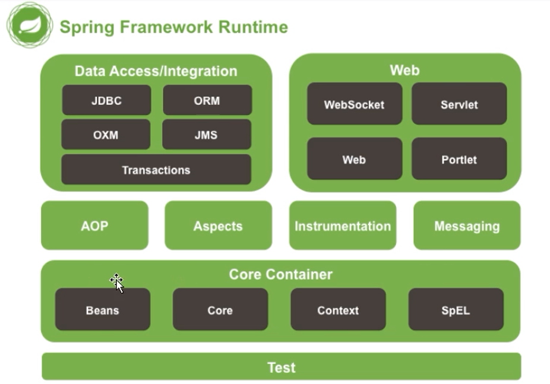

# 介绍

<h1 align="center">Spring</h1>

企业用的最多的业务层框架

::: tip 提示
Spring Framework 为现代基于 Java 的企业应用程序提供了一个全面的编程和配置模型 - 在任何类型的部署平台上。

- Spring是一个为简化企业级开发而生的**开源框架**。
- Spring是一个**IOC(DI)**和**AOP**容器框架。
- IOC全称：Inversion of Control【控制反转】
  - 将对象【万物皆对象】控制权交个Spring
- DI全称：(Dependency Injection)：依赖注入
- AOP全称：Aspect-Oriented Programming，面向切面编程

Spring 的一个关键元素是应用程序级别的基础设施支持：Spring 专注于企业应用程序的“管道”，以便团队可以专注于应用程序级业务逻辑，而无需与特定部署环境产生不必要的联系。

特征

核心技术：依赖注入、事件、资源、i18n、验证、数据绑定、类型转换、SpEL、AOP。

测试：模拟对象、TestContext 框架、Spring MVC 测试、WebTestClient.

数据访问：事务、DAO 支持、JDBC、ORM、Marshalling XML。

Spring MVC和 Spring WebFlux Web 框架。

集成：远程处理、JMS、JCA、JMX、电子邮件、任务、调度、缓存。

语言：Kotlin、Groovy、动态语言。

:::

