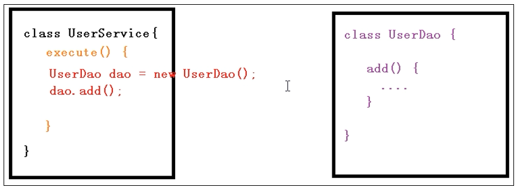
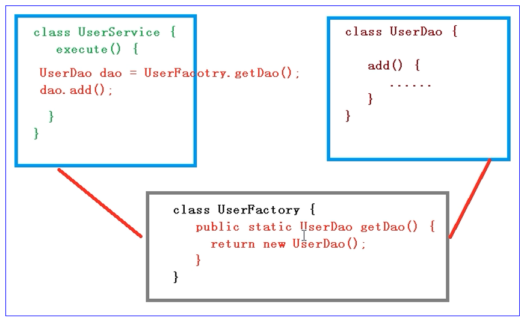
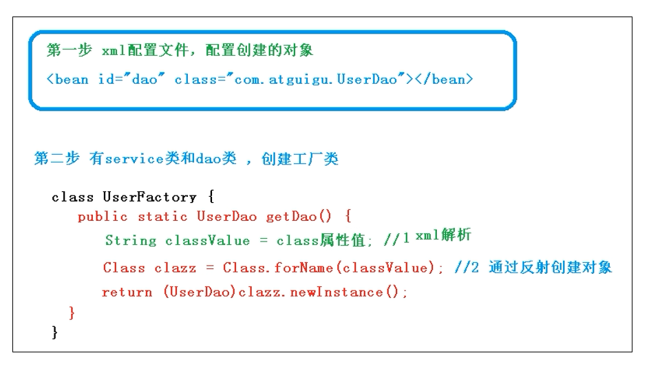
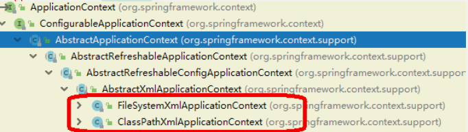

# IOC容器

## IOC底层原理

> 控制翻转 （Inversion of Control） 简称IOC

**什么是IOC**

1. 控制反转，把对象创建和对象之间的调用过程，交给Spring进行管理
2. 使用IOC目的，为了降低耦合度

**原始方式**



**工厂模式**



**IOC过程**



**IOC底层原理**

XML解析、 工厂模式 、反射。

## IOC接口（BeanFactory)

IOC容器的两种实现方式

**BeanFactory**

IOC容器基本实现，是Spring内部的使用接口，不提供开发人员进行使用，特点是：加载配置文件不会创建对象，再使用对象的时候才会创建。

**ApplicationContext**

BeanFactory接口的子接口，提供更多更强大的功能，一般由开发人员进行使用。



## IOC操作Bean管理（基于xml)

**基于XMl方式创建对象**

```xml
<bean id="user"  class="com.xbzxit.spring5.User"></bean>
```

* 在Spring配置文件中，使用bean标签，标签里面添加对应的属性，就可以实现对象创建
* bena标签有很多属性，介绍常用的属性
  * id属性： 唯一标签
  * class属性： 类全路径（包类路径）
* 创建对象的时候，默认也是执行无参数构造方法完成对象创建。

**基于XML方式注入属性**

* DI：依赖注入，就是注入属性

**第一种注入方式：使用set方法进行注入**

**第一种注入方式：使用有参数构造进行注入**

## IOC操作Bean管理（基于注解)
